# Some fundamentals by Dr Jen Wood

**An introduction to alpha and beta diversity analysis and the pitfalls you need to know**

By [Dr Jen WOOD](https://jenwoodmicro.wordpress.com) \| Microbial community ecologist\

**Microbial Diversity, how do you describe it?**

-   How many species (ASVs/ESVs) are there?

-   Which species are common and which are rare?

-   How many species do two communities share?

-   How many species do two communities have different?

-   Do two communities share the same common and rare species?

**Some terms and their synonyms**

-   Community = Microbial composition in each sample

-   Species = Operational Taxonomic Unit (OTU) = Amplicon Sequence Variant (ASV) = Exact Sequence Variant (ESV)

-   Individual = Read = Sequence read

## Alpha diversity

**Definition**: Alpha diversity is the diversity of each site (local species pool).

Common metrics such as Shannon-Wiener, Simpson diversity are affected by species **richness** and community **evenness**

### Richness

Number of species (ASVs/ESVs) in a community.\
The more species rich a community is the more diverse that community is.

-   **Not** affected by the number of INDIVIDUALS (READS/ABUNDANCE).

-   **Not** affected by taxonomy

\

Two lakes with identical species richness of 5\
Just one is more crowded than the other\

\

Two communities with an identical OTU richness of 4 but with NO species in common 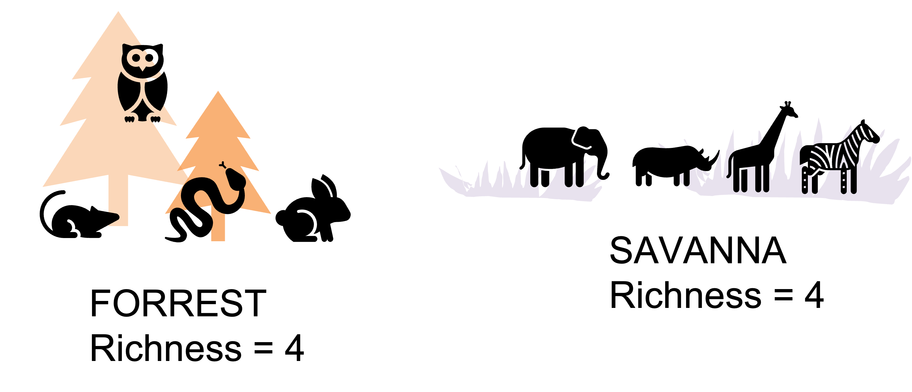\

### Evenness

How evenly individuals are distributed among the species in a community.\
The more even a community is the more diverse that community is.

-   **IS** affected by the number of individuals (Reads/Abundance).

-   **Not** affected by taxonomy\

Examples of how the number of individuals can be distributed among the species in a given community:\

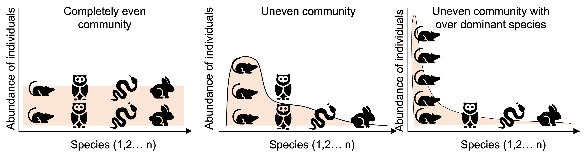

\

### Exercise

For each pair of communities - which is more diverse and why?

{width="550"}

\

**Answers**\
From the top:

-   A is more diverse because species distribution is more even.
-   A is more diverse because of it greater species richness.
-   None are more diverse. Both pairs have the same richness and evenness.

In general MORE richness = MORE diversity\
And MORE evenness = MORE diversity

### Shannon-Weiner Diversity

The Richness and Evenness of a community contribute to its Diversity.\
This is a score that can be calculated a number of ways.\
The Shannon-Weiner equation below is one of the most commonly used.

{width="350"}

\

For this pair of communities - which is more diverse and why?

{width="550"}

\

**Example 1**\

|     Species(i)     | Number of individuals (p) |  pi  | Ln(pi) | pi\*Ln(pi) | -pi\*Ln(pi) |
|:----------:|:----------:|:----------:|:----------:|:----------:|:----------:|
|   Geobacter spp.   |            52             | 0.84 | -0.18  |   -0.15    |    0.15     |
| Desulfovibrio spp. |             7             | 0.11 | -2.18  |   -0.25    |    0.25     |
|  Clostridium spp.  |             2             | 0.03 | -3.43  |   -0.11    |    0.11     |
|        Sum:        |            62             |      |        |            |    0.51     |

\

**Example 2**\

|      Species       | Number of individuals (p) |  pi  | Ln(pi) | pi\*Ln(pi) | -pi\*Ln(pi) |
|:----------:|:----------:|:----------:|:----------:|:----------:|:----------:|
|   Geobacter spp.   |            23             | 0.37 | -0.99  |   -0.37    |    0.37     |
| Desulfovibrio spp. |            27             | 0.44 | -0.83  |   -0.36    |    0.36     |
|  Clostridium spp.  |            12             | 0.19 | -1.64  |   -0.32    |    0.32     |
|        Sum:        |            62             |      |        |            |    1.05     |

\

## Beta diversity

**Definition**: The variation in species composition among sites.

Common metrics: (dis)similarity indices such as Bray-Curtis (BC), Unifrac, Aitchison\
Affected by **number** of ASVs/ESVs in common, number of ASVs/ESVs not in common and similarity of shared ASV/ESV **abundances** between plots (When data is abundance weighted and not binary transformed)\

\
E.g. Bray-Curtis dissimilarity:\
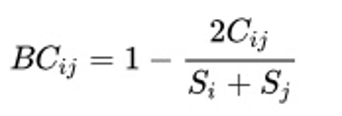{width="150"}\

Where:\
i & j are the two sites,\
S~i~ is the total number of specimens counted on site i,\
S~j~ is the total number of specimens counted on site j,\
C~ij~ is the sum of only the lesser counts for each species found in both sites.\
\

Two communities with identical richness, diversity and biomass can still be a bit dissimilar.\
{width="550"}\

\
Two communities with identical richness, diversity and biomass can be highly dissimilar.  {width="550"}\

\
Changes in beta diversity may not track with changes in alpha diversity. The variation in species composition among sites can arise from **species replacement** (i.e. community turnover) due to the tendency of species to replace each other over an ecological gradient.\
It can also come from **species differences** (i.e. community nestedness) due to one community having more species present than another.

\

### Species replacement

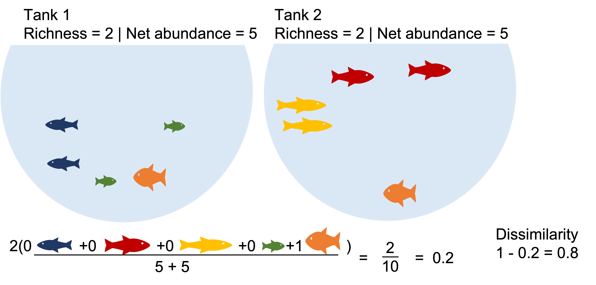{width="550"}\

### Species nestedness

{width="550"}\

 

### Beta diversity analysis workflow

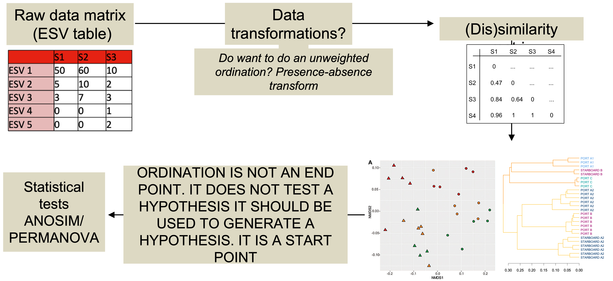\

**Visualisations**

\

#### NMNDs and PCoA

Exactly the same data in an NMDS and in a PCoA using Bray-Curtis metric: what's the difference?

\

**NMDS: non-Metric Multidimensional Scaling**

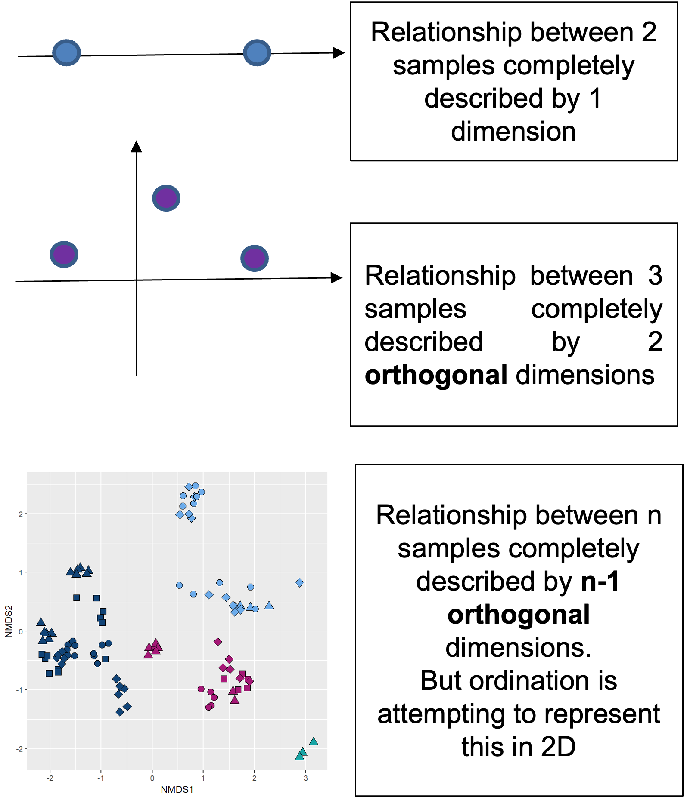{width="300"}\

**Process**

1.  A half matrix containing the dissimilarity scores between each pair of samples is calculated.\
2.  The dissimilarity relationship between all the samples can be explained in n-dimensional space. Where n = number of samples -1.\
3.  The computer iteratively tries to project this multidimensional relationship space into 2D. If it can do this and preserve the relationships, stress \< 0.2. If it can't do this stress \> 0.2 and the ordination is basically random collection of dots.

**Interpretation**\
The closer two points are in 2D space the more similar they are. i.e. we looking at grouping.

Axes are arbitrary.

Valid if Kruskal stress values \< 0.2.

**Pros:** lets the data "speak for itself". Way the ordination is drawn is completely analogous to the way ANOSIM/PERMANOVA stats are generated.

**Cons:** ordinations are not always valid.\

**PCoA: Principal Coordinates analysis**

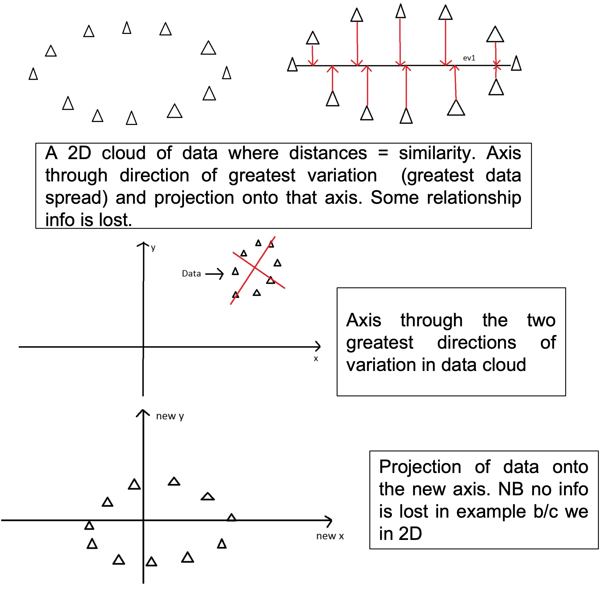{width="300"}\

**Process**

1.  A half matrix containing the dissimilarity scores between each pair of samples in calculated and 'placed' in n-dimensional space.\
2.  An axis is draw through the data in the dimension that has the largest variation.\
3.  Data is projected onto this axis.\
4.  The process is repeated for the direction through the data that has the second greatest amount of variation so the data are now projected onto these two new axis, the PCoA axis.

**Interpretation**\
Order of data along axis correspond to largest variation in data set.

Percentage of variation in the 'data cloud'.

**Pros:** Always valid - no stress values; may correlate treatment effect to a tangible level of variation in the data.

**Cons:** Axis don't always explain lots of variation; communities that have ASV/ESV values that introduce large amounts of variation strongly influence the ordination, making patterns of other communities less visible; may need to remove these communities.\

#### Binary transform

Tells us about the influence of rare members and abundance on beta-diversity scores. Binary transformation helps determine why a community is (dis)similar.

{width="400"}\
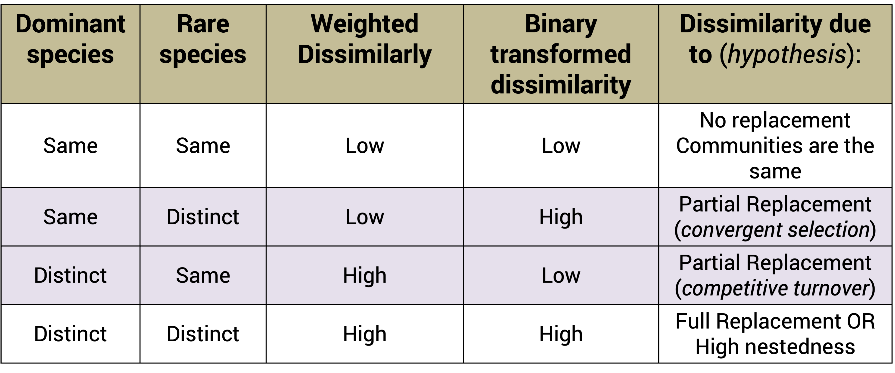{width="400"}\

**Example1:** Communities that share dominate species appear highly similar. What happen when we binary transform?

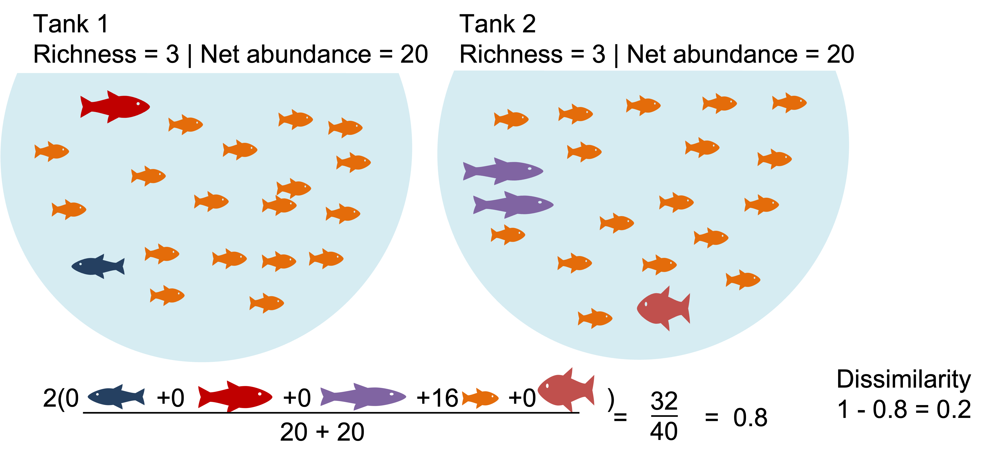{width="550"}\

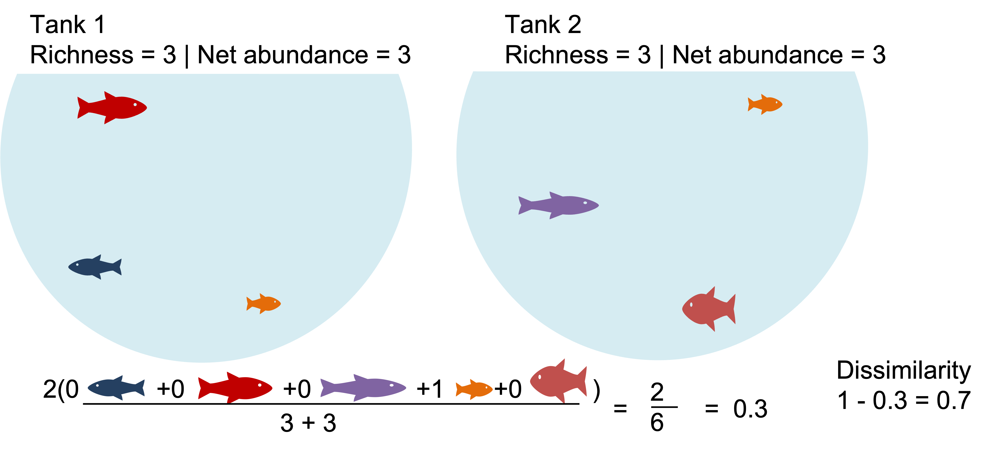{width="550"}\

**Example2:** The communities with identical richness and biomass are \>50% dissimilar due dominant species turnover. What happens when we binary transform?

{width="550"}\

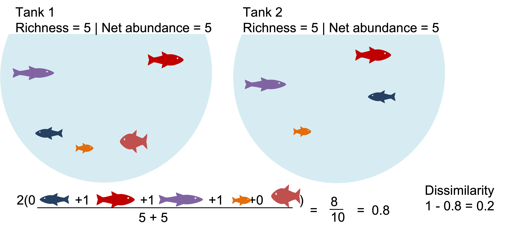{width="550"}\

#### Testing Beta diversity: Permanova

-   A non-parametric alternative to MANOVA (also called NPMANOVA)

-   Generates a pseudo-F stat and F table with p values (like an ANOVA)

-   Test hypothesis that there is no difference in group centriods

{width="400"}\

PERMANOVA is not done on the output of an ordination but rather on the underlying distance matrices.

{width="400"}\

Beta dispersion describes the spread of a set of points around a centroid.

PERMANOVA can be sensitive to difference in beta-dispersion (so test for this too).

{width="500"}\
