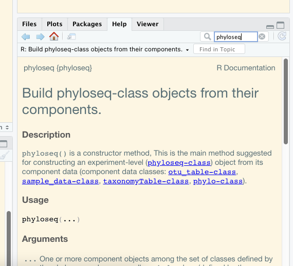
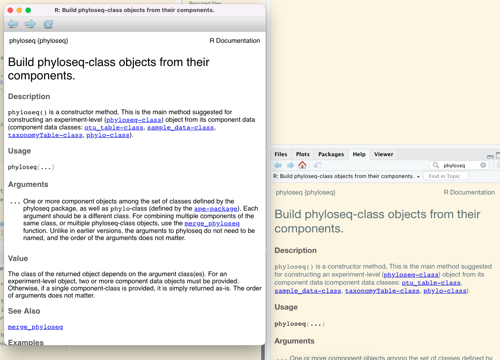
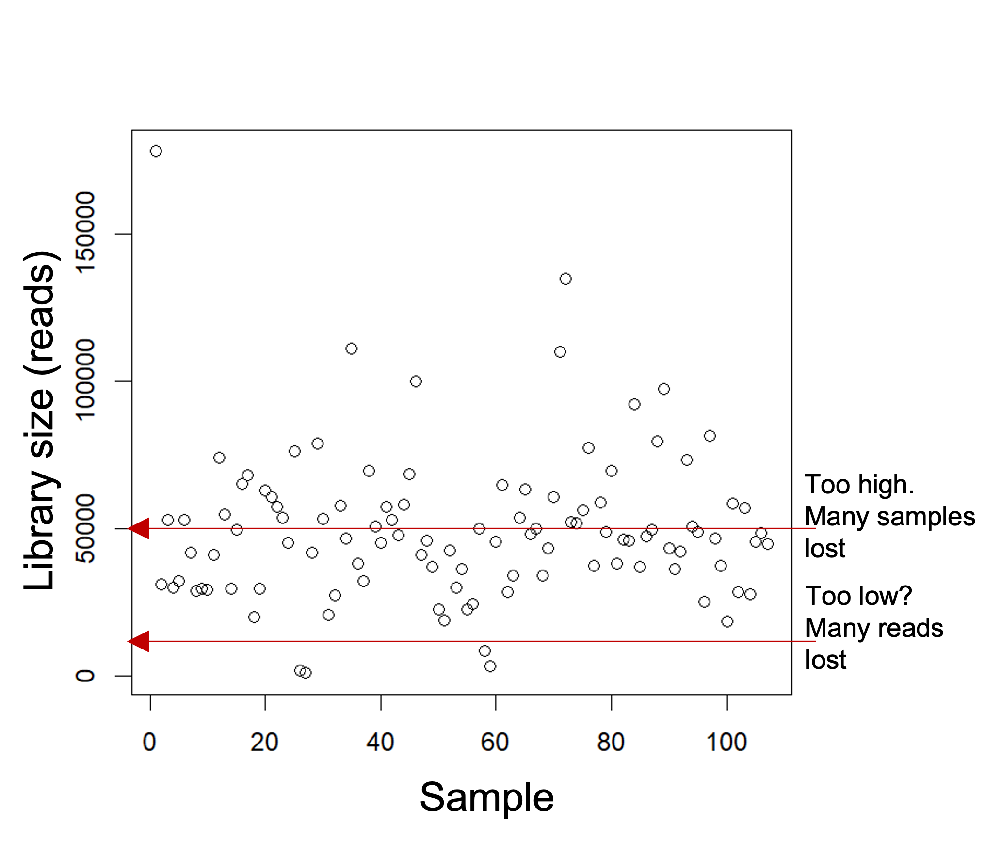

# Getting started {#gettingstarted}

## Before you can analyse

### Get access to computational resources

To process data you will need a personal computer or online computational resources with sufficient number of CPUs, working memory and storage. If you want to run most of the processing on a personal computer then I'd recommend a minimum of **4 CPUs, 16 Gb RAM and 500 Gb storage**. However, please note that some alignment tasks require more RAM, hence some of the steps (e.g. taxonomic classifications) may require a more powerful resource. The advantage of using a personal computer is that you can frequently update the latest packages without relying on a university administrator to do that for you. Furthermore, with a personal computer you wont need to share with others, making it easier to run the packages without a workload manager.

Some university may provide their own access to a high performance computer (HPC) for staff and students and likely have certain packages pre-installed. In such cases a batch workload manger such as Slurm may be used, to manage multiple users trying to run computationally heavy jobs. This works fine too but its a bit of a hassle and I would use such an HPC only if really necessary, i.e. smaller jobs on my personal computer and bigger jobs on the HPC.

In Australia the [ARDC Nectar Research Cloud](https://ardc.edu.au/services/nectar-research-cloud/){target="_blank"} provides free computational resources to students and staff at Universities. This is basically like providing access to an online Linux computer with complete freedom to install any packages as if it was your own. If you are a student you can [create a trial account](https://dashboard.rc.nectar.org.au/){target="_blank"} with your student email address (Using your ID only; without the student.edu.au) and check out how it all works, albeit with limited resources. The Nectar service also provides [tuturials for starters](https://tutorials.rc.nectar.org.au/){target="_blank"}. However, to get serious with Nectar, you have to request more resources, which is a fairly straight-forward process. Check out the [eligibilities](https://support.ehelp.edu.au/support/solutions/articles/6000068044-managing-an-allocation){target="_blank"} and chat to your supervisor if you are interested.

There are also commercial options, which probably offer very similar type of services to Nectar.

In addition, there is the awesome [Galaxy Australia platform](https://usegalaxy.org.au/){target="_blank"}, which is an open web-based resource that also contains many tutorials and workflows specific to bioinformatics. Definitely worth checking that out too.

This workbook will be based on using the Nectar Research cloud.

### Get file storage

Working with sequencing data may require you do handle large amounts of data. From experience, a run of a 600µl pool (6-10pM) of amplicons in 2x301 Miseq cycles may produce around 10-20 Gb of FASTQ files. [Much more](https://sapac.support.illumina.com/bulletins/2018/01/approximate-sizes-of-sequencing-run-output-folders.html){target="_blank"} can be expected for NextSeq runs or for long-read sequencing.

Once a Miseq run has finished it is typically available to download from the [Illumina Basespace](https://basespace.illumina.com/dashboard){target="_blank"} account. After a few runs, the data can accumulate quickly. Hence, **persistent storage space** may be required. With an Illumina Basespace account you get 1 TB of storage and you can keep a copy of the FASTQ file on your account. However, Basespace may delete your data if the account has been inactive for more than 6 months. But you will get reminder emails and all you need to do is to log in every now and then so Illumina wont delete your data. Alternatively, data can be upload onto a public repository for persistent storage, such as the [Sequence Reads Archives](https://www.ncbi.nlm.nih.gov/sra){target="_blank"}. If you have access to a research cloud or commercial computational resources then you may store data on those. Personally, I prefer a 1TB solid state harddrive.

### Learn some basic command Line

Many of the tools used are managed through command line. Cloud servers are also accessed through command line. That means there is no graphical user interphase and all commands, including installation and running of packages are done through lines of codes on a simple window interphase. This window is called Terminal (Mac, Linux) or Command Prompt application (Windows). There are lots of online sources to help you get started with command line. One example here: <https://towardsdatascience.com/a-quick-guide-to-using-command-line-terminal-96815b97b955>

### Get a data storage browser

To upload, download, move, rename files on any cloud computer or high performance computer (HPC) at your institution, you will also require a cloud storage browser, such as [Cyberduck](https://docs.cyberduck.io/){target="_blank"} (Mac) or [PuTTY](https://www.putty.org/){target="_blank"} (Windows).

### Get R and R studio

R has become an essential research language. If you want to progress in research it is almost inevitable for you to learn. Just do it. :). Perhaps start here if you dont know where else to start: <https://education.rstudio.com/learn/beginner/>. It lists some great step-by-step tutorials on how to install R and Rstudio and then explains the basics.

If you are like me, then you simply copy and paste code from other sites and see what happens. This book should provide you with the required information to enable you to follow the workflows. In case you get stuck, you can either chat to me directly or write on the GitHub Discussion Page for this GitBook ([chrismitbiz/ABlab-workflows/discussions/]((https://github.com/chrismitbiz/ABlab-workflows/discussions/))).

At the same time you will want to do short courses (eg. from edX [Data Science: R Basics](https://www.edx.org/course/data-science-r-basics){target="_blank"}) that delve a little deeper into different data structures such as data frames, matrices, lists and the syntax to arrange stuff. Over time you understand what different lines of code mean and can trouble shoot when things don't work. And things often don't work. You will get used to troubleshooting code :).

### Know what environment managers are

Package and environment managers are extremely useful for your workflows. They help to install and run software packages such as qiime2, into individual 'environments' independent of your operating system. The environment manager is installed once and from there you use it to install individual packages. The most commonly used environment manager is Conda. Learn more about it here: <https://docs.conda.io/projects/conda/en/latest/user-guide/getting-started.html>

Conda can be installed by either installing Anaconda or Miniconda. Boths works the same way. Anaconda requires 5 Gb of discspace and installs everything you can possibly need, while Miniconda is just the raw bones and lets you install things one by one.

Most of the commands to manage environments are done in command line using a terminal. There is also a graphical installer that makes handling the environments a little more visual. That would be my go to. Learn more here: www.anaconda.com.

Once conda installed you can always check what environments are installed with the command `conda env list`. In my case the output looks like this:\
\

There are several other environment managers. We are also using [Docker](https://www.docker.com/){target="_blank"} in our work but the learning curve is a bit steeper so we wont get into it here.

### Explore the help functions

Packages such as qiime2 have great resources to help you understand how to run any of the available commands. For example if you dont know what input parameters are available for the qiime command\
`qiime feature-classifier classify-sklearn`, you can simply enter this command into your Terminal (with the qiime environment activated, if it is installed with Conda) and add a `--help` at the end: `qiime feature-classifier classify-sklearn --help`.

Or you just want to know what other commands qiime has in its repertoire, you can run `qiime --help`.

For example, this

    conda activate qiime2-2022.2  
    qiime --help  

Gives\

Within R studio you can access the documentation of individual packages by searching for package or function names in the help windows.

For example looking for `phyloseq` in the Help window gives this:\

### Get a GitHub account

This GitBook, including all its files, is hosted on one of my GitHub repositories (<https://github.com/chrismitbiz/ABlab-workflows>). If you have any comments you can ask a question on the Discussion Page of this repository. You require a GitHub account to do that. It is free.

## A note on rarefying (normalising)

By Dr Jen Wood and Dr Chris Krohn:\
Data normalisation is necessary because it is very difficult to collect exactly the same number of sequence reads for each sample. There is an arbitrary total read depth imposed by the instrument, which is a major confounder for distance or dissimilarity calculations and multivariate ordinations derived from these distances.

Various data normalisation methods exist and opinions on their applicability diverge.

Example of normalisation methods:

-   Rarefying data

-   Transformation into relative abundances

-   Transformation into centered log-ratios

-   Cumulative Sum Scaling (CSS)

-   Upper Quantile (UQ)

-   edgeR-trimmed mean of M values (TMM)

-   DESeq-variance stabilizing transformation (VS)

There are others. Check out this link to learn more about the different types of normalisation methods: [MicrobiomeAnalyst: FAQs, What are the various normalization methods and which method should I choose?](https://www.omicsforum.ca/t/what-are-the-various-normalization-methods-and-which-method-should-i-choose/494){target="_blank"}.

Rarefying data is one of the more contested methods. Rarefying aims to reduce bias introduced by variable library sizes. Rarefying involves choosing a threshold of reads to which to normalize all your samples to (e.g. 20,000, min sample read depth).

Samples that fall below the threshold will be removed from your analysis. The goal is to choose a threshold that keeps the most reads whilst also retaining the most samples.

{width="300"}

We acknowledge that **rarefying data** (i.e. the random subsampling of abundances to usually the smallest library size) results in loss of data and statistical power and is thus **not recommended for differential abundance analyses**. Check out this well cited paper here to learn why: [Waste Not, Want Not: Why Rarefying Microbiome Data Is Inadmissible](https://journals.plos.org/ploscompbiol/article?id=10.1371/journal.pcbi.1003531){target="_blank"} (@McMurdie2014).

{width="570"}

However, rarefying still "*outperformed all the other normalization methods for producing accurate BC (Bray-Curtis) dissimilarities and subsequent PCoAs and PERMANOVAs.*" Paper here: [Methods for normalizing microbiome data: An ecological perspective](https://doi.org/10.1111/2041-210X.13115){target="_blank"} (@McKnight2019a).

For our workflows we may **rarefy data** before creating **alpha diversity** indices (Shannon, Simpsons etc) and **beta diversity** indices (Bray-Curtis dissimilarities).

Other types of normalisation methods should be considered for differential abundance analyses. My preference is to use **centred-log ratios** (Aitchison distances). The **compositional approach** and centred log-ratios are further discussed in the paper [Microbiome Datasets Are Compositional: And This Is Not Optional](https://doi.org/10.3389/fmicb.2017.02224){target="_blank"} (@Gloor2017). This type of transformation requires the removal of some of the rare ASVs to remove as many zeros from the abundance table as reasonable.

## Workflows from other lab groups

The following review "*should serve as a starting point for considering what options are available*": [Analysing microbial community composition through amplicon sequencing: from sampling to hypothesis testing](https://www.frontiersin.org/articles/10.3389/fmicb.2017.01561/full){target="_blank"} (@Hugerth2017a).

Furthermore, searching for "amplicon-sequencing" under "Topics" on GitHub gave 37 results.

-   nf-core/ampliseq\
    On the top of that list is the [nf-core/ampliseq](https://github.com/topics/amplicon-sequencing){target="_blank"} pipeline developed by the nf-core community. It is based on a software called [Nextflow](https://www.nextflow.io/){target="_blank"} which allows to put different processes into a pipeline. This is great for doing things a little more reproducible but it requires you to be fairly knowledgeable with Linux, container software, config files etc.. Not great to learn stuff for beginners.

-   Tools-Microbiome-Analysis\
    [Tools-Microbiome-Analysis](https://microsud.github.io/Tools-Microbiome-Analysis/){target="_blank"} is a websites containing a comprehensive list of R packages and, more importantly, tutorials related to analysis of microbial amplicons and ecology. Really good reference to go back to every now and then. **Highly recommended**.

-   grimmlab/MicrobiomeBestPracticeReview\
    Essential paper to read ([Current challenges and best-practice protocols for microbiome analysis, 2021](https://academic.oup.com/bib/article/22/1/178/5678919){target="_blank"} (@Bharti2021)) and a great [workflow resource](https://github.com/grimmlab/MicrobiomeBestPracticeReview){target="_blank"} on GitHub. **Essential read**. The Grimm lab in Munich published this paper as well as developed a python and R-based workflow that assists with the recommended best practices (amplicon as well as metagenomic workflows).

-   KasperSkytte/ampvis2\
    [Ampviz2](https://kasperskytte.github.io/ampvis2/articles/ampvis2.html){target="_blank"} is an R-package to visualise and analyse 16S rRNA amplicon data. It is always more convenient to have packages that have the details and optics worked out for you. Like phyloseq, the ampviz2 package combines different tables from data (E.g. otu table, taxonomic table, phylogenetic tree, sample data etc) and then provides different functions to apply to that combined object to visualise the data.
