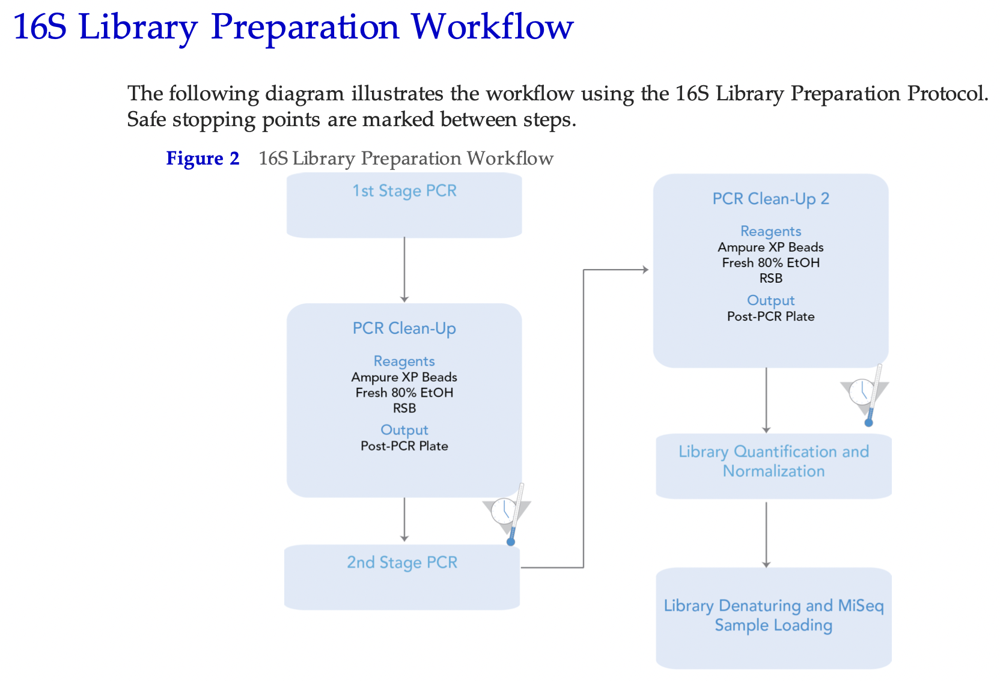
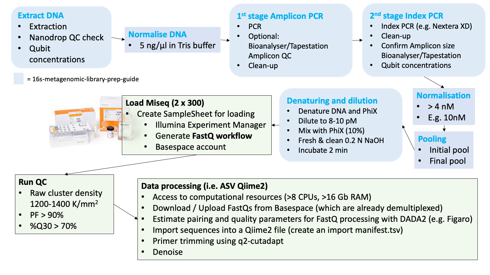

# Miseq library preps 

## Introduction  
  
**Some info on getting your run ready**
  
In our lab we usually prepare a 6-10 pM pool of libraries following the [16S Metagenomic Sequencing Library
Preparation](https://sapac.support.illumina.com/content/dam/illumina-support/documents/documentation/chemistry_documentation/16s/16s-metagenomic-library-prep-guide-15044223-b.pdf) protocol from Illumina with 10-30% Phix. **Download it, study it and refer to it throughout your labwork**. This protocol is not limited to 16S amplicons. You can use it for fungal (e.g. ITS) amplicons too. In the last section there are also valuable tips for pre‐PCR and post‐PCR lab procedures. There is also some additional Illumina guidance here: https://sapac.support.illumina.com/downloads/16s_metagenomic_sequencing_library_preparation.html
    
### Overview    
The protocol encompasses the following steps (copied out of the protocol):

    
  
  
Please note that only **one amplicon target** should be sequenced in each run. That means it is not recommended to sequence for example two different 16S amplicons or one 16S amplicon plus an ITS amplicon. Sequencing different amplicon lengths will result in reduced quality as the the Miseq flowcell will preferentially cluster shorter fragments. However, it is not impossible. We have tried to run four different amplicons on one flowcell before, although with mixed results.  
  
Labwork may take four weeks from DNA extraction to Miseq loading. Double that if you have not done it before. You probably realised that there is quite a bit of labwork required before you finally get FASTQ files and subsequent ASV/taxonomy tables to analyse - the ultimate goal here. The more samples are planned to be included into the pool, the more work and consumables are needed. Illumina recommends no more than 96 samples on one flowcell to get enough depths (i.e. > 100,000 reads per sample). But we have sequenced around 196 samples on one flowcell before, which captured sufficient reads and diversity. This depends on how much detail and rare taxa you want to capture. The less samples you include, the more data and depth for each sample. 
  
Also note that you will require over 20 boxes of tips (mostly 200 µl) for each 96-well plate, so plan your consumables ahead of time. Most of the tips will be used for the PCR clean ups. 
  
After all steps in the above protocol are completed, the Miseq will be loaded with a 600 µl pool, followed by 56 hours of run-time for 2x301 cycles before FASTQ files are available for download from BaseSpace.  
  
  
  
Throughout the 56 hours run you can check how things are tracking either on the BaseSpace website or the BaseSpace phone app. Understanding different QC metrics will help identifying potential problems with the pool or the instrument. It is important to note that this is a bit of a nerve-wrecking moment in the process, as it remains unclear until the metrics come through after around the 21st cycle, whether or not the run will be successful.  
  \
     
## Workflow  
### DNA extraction
  

  
We commonly extract DNA from soils or from wastewater sludges using the *DNeasy Powersoil Pro Kit* (Qiagen) for both, soil and sludge. It results in high quality DNA and includes a bead beating step to make sure the gram positive cells are sufficiently broken up. Although, I don't have evidence for that. In fact, please let us know on the [GitHub Discussion Page](https://github.com/chrismitbiz/ABlab-workflows/discussions) for this GitBook if you have any comments on that as we are always looking for ways to improve things. 
  
Soil  

* For soils, the protocol of the extraction kit is followed, weighing in 0.25 g of soil and making sure to record the exact weights used.  
* Also make sure to measure the water content of the soil to be able to report DNA concentrations per dry weight of soil. 
  
Sludge
  
* For DNA extraction of sludge, 0.5 ml is added into an empty 1.7 ml extraction tube (without extraction beads), then centrifuged at 5000 rpm for 5 minutes before removing the supernatent. 
* Extraction beads are then added and the Powersoil protocol followed. 
* Measure Total Solids (TS) of the sludge to report DNA concentrations per gram of TS.
     \
     \
  
### DNA quality and concentration 
  
Once you have extracted DNA it is necessary to confirm its quality and concentration. 
 
* Quality is assessed using a Nanodrop Spectrophotometer. You are aiming for **260/280 Ratio of 1.8 and a 260/230 Ratio of 2-2.2**. This is explained in the [T042‐TECHNICAL BULLETIN](https://dna.uga.edu/wp-content/uploads/sites/51/2019/02/Note-on-the-260_280-and-260_230-Ratios.pdf). The Nanodrop also estimates DNA concentrations but it is not recommended to use these concentrations measurements to normalise DNA. It is more accurate and consistent with a Qubit Fluorometer.  
* DNA concentrations are best measured using fluorescent dye-based methods such as the **Qubit Fluorometer**. It is easist to use the '*1X*' assays such as the *Qubit 1X dsDNA BR Assay Kit* or the *Qubit 1X dsDNA HS Assay Kit*  
    + Broad range (BR) Kit for quantifying extracted environmental DNA and afte the 2nd stage PCR. 
    + High Sensitivity (HS) Kit for quantifying the pool at the end.  
    

    
  
### DNA normalisation
  
The next step is to normalise all DNA extracts to 5 ng/µl.  
  
* Dilute DNA to equal concentrations, either in a fresh batch of PCR-grade 10mM Tris buffer (pH 8.5) or in PCR-grade water  
* Set a pre-define DNA volume, say 2µl for all extracts, and add Tris or water as calculated with  
$$ C_1V_1 = V_2 C_2 $$  
     \
  
  
### First and second PCR - Amplicon PCR and Indexing PCR 
  
Follow the [16S Metagenomic Sequencing Library
Preparation](https://sapac.support.illumina.com/content/dam/illumina-support/documents/documentation/chemistry_documentation/16s/16s-metagenomic-library-prep-guide-15044223-b.pdf) Guide. Include a negative control and sequence that as well. This allows you to assess background and cross contamination. The whole workflow is best done in 96-well plates, using multi-channel pipettes to avoid indexing mistakes across wells.  
  
Sample list and plate layout  
  
Ensure that all sample IDs, plate-layout and each unique Illumina index carefully planned and printed out before you start your PCRs. Perhaps, stick the layout onto the Bio-safety cabinet where you do most of the pipetting and keep checking you are on the right well and sample. Label all plates even if you discard them afterwards. Labwork can be stressful and you need to trace all your steps across each well of the plate because otherwise you risk that you have indexed the wrong samples and it will become impossible to know which sample you have sequenced.  
  
  
Primers  
  
Any primers you order for the Miseq will have to include the **Illumina overhang adapter**. The sequence of the overhang adapter is added **in front** of the gene-specific primer sequences. There are two overhang adapters; one for the forward primers and one for the reverse primer. Check out the relevant information on primers from page 3 the 16S Metagenomic Sequencing Library Preparation Guide.  
  
Clean-ups  
  
It is worth doing the clean-ups in a separate deep-well plate ("MIDI" plate, see consumables below) to avoid any blow-out of dried beads at the end of the clean-up. This process is explained in the above mentioned guide too. Tip: Handle the beads extremely carefully after the ethanol has dried. They blow out easily.  
  
Index Kits  
  
The index kits are expensive. Try to handle them with care and replace lids with the provided replacement lids, after every use. Multipipettes are absolutely essential to avoid loosing track on indexes used across the different wells on the plate. The use of the Illumina Plate Fixture comes in handy (see consumables below).  
  
Amplicon QC  
  
After the indexing-PCR products are cleaned it is recommended to run a gel on all samples to confirm that amplification was successful with enough DNA present and that it is the correct amplicon length. It also helps to identify any primer dimers, which may have to be cleaned out.  
  
If you have access to a **Tapestation or a Bioanalyzer** in your lab, perhaps run a random subset of the indexed samples on one of these instruments, just to accurately confirm the average length of the amplicon. This average basepair length of the amplicon is important, as it is the basis for  normalising your DNA to nM. In any case, after the index samples are normalised and pooled, it is highly recommended to run the pool on a Bioanalyser too. Otherwise it is too much guesswork in getting the concentrations right. This is further explained below.    
Repeat any samples that failed, i.e. that do not show any bands, and ensure you use the same indices.  
  
  \
  
### Normalisation of indexed amplicons
  
After you finished all PCR work it is time to do another round of Qubitting and normalisation of all samples into a new 96-well plate. The final pool should be 4 nM but we prefer to normalise DNA to a higher concentration first, say 10 nM, then pool and then dilute the pool to 4 nM afterwards.  
We are using a very handy excel sheet, which was kindly developed and provided by [Sarah Knowler](https://scholars.latrobe.edu.au/sknowler){target="_blank"} at La Trobe University to prepare and assist in normalisations, converting from ng/µl to nM using the formula:  
  
$$ concentrations~(ng/µl)  \over 660 g/mol~x~average~library~size$$
Contact us if you would like to get a copy of this very handy library preparation excel sheet.   
  
Some more information here: https://support.illumina.com/content/dam/illumina-support/documents/documentation/system_documentation/miseq/miseq-denature-dilute-libraries-guide-15039740-10.pdf. There’s also a pooling calculator here https://support.illumina.com/help/pooling-calculator/pooling-calculator.htm which may be helpful with your calculations.   
  \
  
### Pooling  
  
* Pipette equal volumes of the normalised DNA into one 1.5 ml tube.  
* Measure its concentration using the High Sensitivity (HS) Qubit 1X dsDNA HS Assay Kit.  
* Assuming the pool was created wtih normalised concentration that are higher than 4 nM, then you will need to dilute the pool down to 4nM. In order to do so you will need to accurately measure the average basepair length of your pool. Do not rely on the ladder on a gel. Always get an accurate read. See next point.      
* Measure the average base pair lengths of the pool with a **Bioanalyzer or Tapestation**. Use at least three replicates. The average basepair length is then used to calculate the final concentration required in ng/µl to get a 4 nM pool.  
* Dilute the pool to the concentration in ng/µl that reflect 4 nM.
  
  \
  
### Denaturing of pool and loading of the Miseq  
  
Now you are almost ready load the Miseq. The last steps are done right before you plan to load the instrument. First the pool DNA needs to be denatured and diluted further to your preferred loading concentration (6 - 10 pM) before it is mixed with PhiX. The final concentrations impact on cluster densities. That means you get more data with higher concentrations but that is at the expense of potential errors during sequencing at high cluster densities. We recommend to aim for a cluster density of around 900-1000 K/mm^2^, which may be achieved with a concentration of around 7-8 pM.  
  
The key for the final steps are that..  
  
* ..the reagent cartridge is properly thawed. Perhaps thaw in fridge 3 hours before starting the denaturing steps. Then put into icy water to ensure final and even thawing across the cartridge. Mix cartrige well at the end and ensure that no bubbles are visible before loading.  
* .. the 0.2 N sodium hydroxide (NaOH) is made fresh with biological grade NaOH. For example use the *BioUltra, for molecular biology, 10 M NaOH in H2O* from Sigma Aldrich to make a 0.2 N solution (N = Normality but it is equal to Molarity here because there is only one OH in NaOH). I have used analytical-grade NaOH pellets as well, which worked but the RNAse free solutions are safer in terms of inhibitors etc..  
* ..that the pool is cooled down immediately in ice or icy water right after the 2 minutes in the  96 degrees C heatblock and pretty much immediately loaded into the Miseq. The Miseq has to be prepped beforehand (I.e. maintenance wash and sample sheet loaded).  
* a sample sheet (or so-called manifest file) is created beforehand using the Illumina Experiment Manager Software.  This software assist in producing a `.csv` file that is then loaded into the Miseq instrument via a USB and ensures that the indexes you have used are linked to the relevant samples in your pool. Basically a list of sample IDs and index IDs. An example of a sample sheet from one of our runs is shown below.\
**IMPORTANT**: Make sure to specify the Workflow as **GenerateFastQ**.  
* you have a Illumina BaseSpace account.   
  
\
    

   
  
### Consumables  
  
All consumables and equipment required for the 16S Miseq library prep protocol are available from page 21 of the  above mentioned [16S Metagenomic Sequencing Library
Preparation](https://sapac.support.illumina.com/content/dam/illumina-support/documents/documentation/chemistry_documentation/16s/16s-metagenomic-library-prep-guide-15044223-b.pdf) Guide.  
The **magnetic stand** for 96-well plates and the TruSeq Index **Plate Fixture Kit** are essential. 
    
  
Here is what we typically include into our purchasing list. The combined total of the below list costs over AUD$ 10,000. 
  
```{r consumables, tidy=FALSE, echo=FALSE }
consumables <- read.csv("Consumables.csv")
knitr::kable(
  consumables, caption = 'Example of a consumables list we typically include for a Miseq run',
  booktabs = TRUE
)
```
  
  
