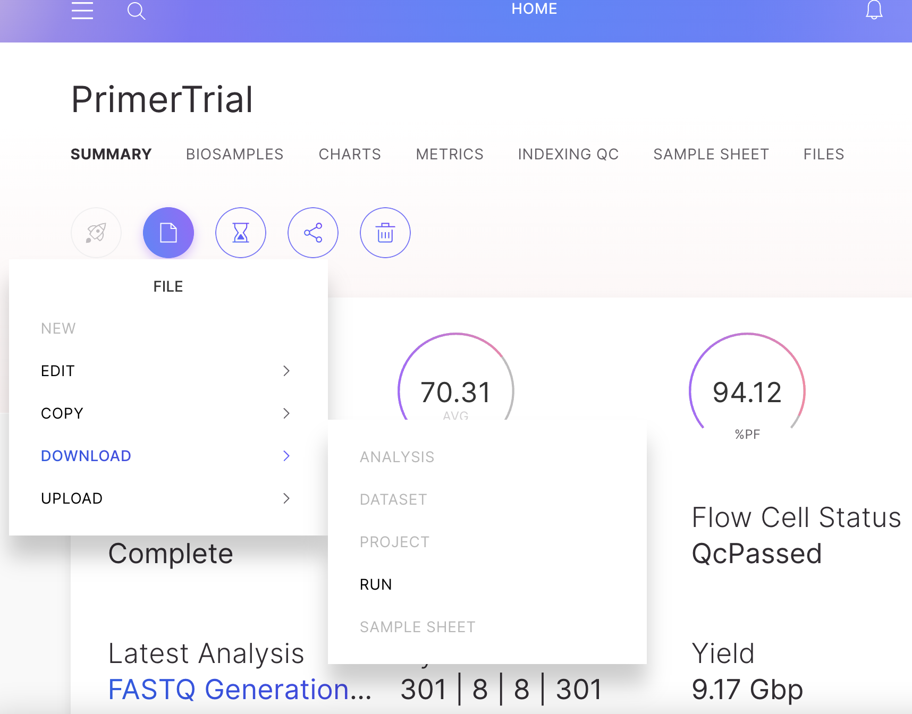
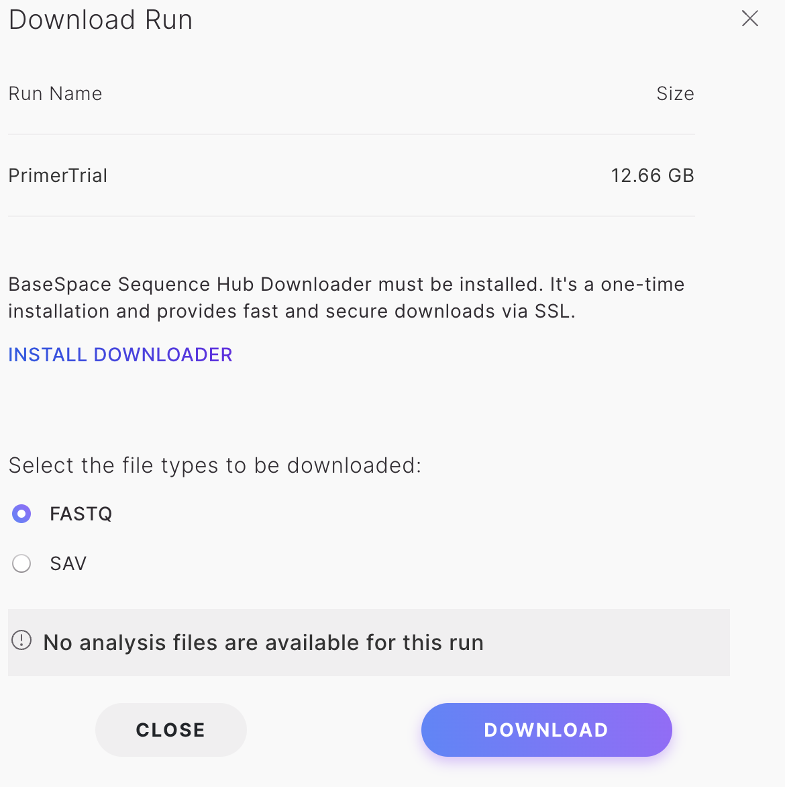
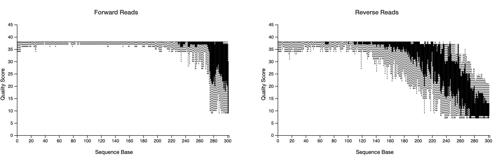

# From BaseSpace to Qiime2 and DADA2

In this chapter you will learn how to process the FASTQ files that are generated from an amplicon sequencing run on a Miseq instrument. We are using Qiime2. Please also refer to the extensive documentation and tutorials available at https://qiime2.org. You can learn almost everything there.  
  
  \
  
**Prerequisites**  
  
* FASTQ files available to download on BaseSpace. Two for each sample. One for read 1 (R1) and another for read 2 (R2). For example, `PT-01_S1_L001_R1_001.fastq.gz` and `PT-01_S1_L001_R2_001.fastq.gz` contains all sequences for sample PT-01.
* Personal computer or cloud computational resources with > 4 CPUS,  > 16 RAM, > 100 GB storage recommended.  
* Cloud storage browser installed (example Cyberduck or PuTTYm see Chapter \@ref(gettingstarted)).  
* Qiime2 installed. Always use the latest version.  
* All required files in correct format and file extension (see below).  
* The BaseSpace Downloader software (available on the BaseSpace page. You will be prompted to download once you go to your files).   

  
  \
  
**Download FASTQ files**  
  
In this example, Fastq files were produced from sequencing 16SrRNA marker genes on an Illumina Miseq instrument. If you ran your own library on your own BaseSpace account, the files should be available to download from that BaseSpace account. If the run was created by another user, that person can invite you to the run, which gives you access to download the files too.   
  
Log in to BaseSpace and into your project. Go to files, run and download FastQ.  You will  be asked to install a downloader software. Follow instructions accordingly.  
  
  
  
  \
  
The FASTQ files will come in separate folders for each sample. It is necessary to move all files into just ONE folder. That folder will then be used to import the sequences into a qiime object (described below). 
  
  \
  
**Required Files**  
  
`Qiimeimportmanifest.tsv` - A tab separated file with three columns where the first column is the sample ID (The exact same ID that was used in the manifest file for loading the Miseq).  The second and third columns are the absolute paths to the forward and reverse FASTQ files, respectively. If you are working on a cloud computer then the FASTQ files should be uploaded to that, and the path needs to contain the full path to the relevant folder, including the full name of the file itself. If you process those files on your local drive then the paths need to change to your local folder containing the FASTQ files. In the below example table, the files are located on a Linux cloud computer (Nectar Research Cloud).  
  
It might take some time to compile the import manifest. Each file path has to exact. However, in case you made a mistake in the file names etc, Qiime is generally pretty good at reporting where the error occured.  
  
  
```{r qiimeimport, message=FALSE, warning=FALSE, tidy=FALSE, echo=FALSE}
library(tidyverse)
manifest <- readr::read_tsv("qiimeimportmanifest.tsv")
knitr::kable(head(manifest), digits = 2, caption = "Example of a qiime import manifest.tsv file")  %>% kableExtra::kable_styling(full_width = F, bootstrap_options = c( "condensed"), font_size = 10 )
```
   
  \
  
`samplesheet.tsv` - file containing sample metadata. This file should contain all other environmental measurements you may have done on each sample (pH, EC...), which you want to relate to microbial taxonomy and composition. The same file and format will be used to import metadata into the R package Phyloseq later too.    
  
```{r metadata, message=FALSE, warning=FALSE, tidy=FALSE, echo=FALSE }
library(tidyverse)
samplesheet <- readr::read_tsv("samplesheet.tsv")
knitr::kable(head(samplesheet), digits = 2, caption = "Example of a samplesheet.tsv file") %>% kableExtra::kable_styling(full_width = F, bootstrap_options = c( "condensed"), font_size = 10 )
```
  
\
  
IMPORTANT: Create the `.tsv` file as a tab separated `.csv` file in Excel first and then manually change the file name from `.csv` to `.tsv`. Not sure how else to easily build the `.tsv` file.
 
  \
  
`scriptfile.txt` - A text file that contains your qiime2 scripts. Example below. Code is compiled here and then only the file itself is executed to run any commands in that text. The hash (#) in front of any line of code stops it from being executed. That means all code is normally 'hashed'. If one wants to run the code the lines are 'un-hashed' and the text file is executed in the command line to run the 'un-hashed' code. On the Linux cloud computer the command would be: `sh scriptfile.txt`. 
  
Note that a script file is meant to make life easy and the process replicable. But you could run each of the processes directly by adding the commands into the terminal without a script file.  
  

  
  \
  
Briefly on script files for cloud-based high performance computers (HPC) that are using Slurm to manage multiple user runs. If the HPC at your institution is using Slurm, then the script file has to be called with `sbatch scriptfile.txt`. The script files for HPCs using slurm contains a header that determins the allocations (number of CPUs, RAM etc..) for your task. The first lines of the .txt file typically look similar to this:
```
#!/bin/bash
#SBATCH --cpus-per-task=6
#SBATCH --mem-per-cpu=6000
#SBATCH --time=24:00:00
#SBATCH --partition=compute
#SBATCH --job-name=Q_fun
```
  
Commands, such as this:
```
echo "Starting at: $(date)"
echo "Finished at: $(date)"
```  
.. are less important but help to report the start and end times of the executed commands from beginning (where the `echo` command is placed at the beginning of the script) to end (`echo`... placed at the end of the script) into the Terminal Windows. They dont affect the qiime commands in any way.   
  
Slurm and `sbatch` are not needed if you manage your own computer or your 'own' cloud computer. In the example below we are using a Linux cloud computer, provided by the Nectar Research Cloud so we dont need Slurm. 
  
  \
  
**Paired end manifest import (Step 1)**  
   
Go to the folder that contains all the FASTQ files (all files in one folder). I.e. in Unix/Linux use `cd path/to/folder/` to navigate to it. The scriptfile.txt should also be located here. The following qiime command that will look for the files and then create a qiime object using the sequences found in each FASTQ file. The `--output-path` instructs qiime where to place and how to name the output file, here demux-paired-end.qza is placed into the same directory (or create a second script file containing the remaining commands).    
Remove any # in front of your code (already removed in the below example) and execute the scriptfile.txt with `sh scriptfile.txt` (or `sbatch scriptfile.txt` in case you are using Slurm).  
  
```
qiime tools import --type 'SampleData[PairedEndSequencesWithQuality]' \
  --input-path Qiimeimportmanifest.tsv \
  --output-path demux-paired-end.qza \
  --input-format PairedEndFastqManifestPhred33V2
```
  
  \
  
**Cutadapt (Step 2)**  
   
If all goes well you should now have a demux-paired-end.qza file in the same directory as your FASTQ files , which contains all your sequences. You could move demux-paired-end.qza to another folder and continue all other steps there if you wish. The FASTQ files are not needed anymore.  Dont forget to move your script file to where it is most convenient for executing the commands. If you moved the demux-paired-end.qza to another folder it is probably easiest to also move the script file that the same directory.  
  
Go to the folder containing demux-paired-end.qza and use cutadapt to trim out the primer sequences. Unhash relevant lines in your script file, which should be located in the same folder. Run `sh scriptfile.txt`.   
  
In this example we used the V4 primers. Change primer sequence to the exact primers that you used in the amplicon PCR.
  

```
qiime cutadapt trim-paired \
  --i-demultiplexed-sequences demux-paired-end.qza \
  --p-front-f GTGARTCATCGAATCTTTG \
  --p-front-r TCCTCCGCTTATTGATATGC \
  --o-trimmed-sequences trimmed_demux-paired-end.qza
```
  \
  
**Visualise the output with a .qzv file**  
  
The .qza files can be visualised by 'converting' them into .qzv files.  
Here we take the trimmed_demux-paired-end.qza and create a trimmed_demux-paired-end.qzv.   
**NOTE:** View any .qzv file on https://view.qiime2.org. Drag and drop the qzv file into the browser window and inspect the results.  
  
```
qiime demux summarize \
  --i-data trimmed_demux-paired-end.qza \
  --o-visualization trimmed_demux-paired-end.qzv
```
  
Go to https://view.qiime2.org and drag and drop to visualise your .qzv file in the browser.  
  

  \
  
  
**STOP HERE**. Inspect the visualisation and decide on location and maximum expected error.   
From the output decide where to truncate the forward and reverse reads with `p-trunc-len-f`, `p-trunc-len-r`,`--p-max-ee-f` and `--p-max-ee-r` in DADA2 below.  

  
It can take some trial and error to get these setting right. We are using a docker-based package called FIGARO to help us estimate those parameters (Not shown here). But essentially you want to capture high quality reads and be confident about the Amplicon Sequence Variants (ASV), while also capture sufficent depth of ASVs and reads without unnecessarily filtering out too much. In the below example, we have trimmed the forward reads at 272 base pairs with a maximum expected error (max-ee) of 2 (which is the default) and the reverse reads at 151  with a max-ee of 3.  I  think it is o.k. to relax the max-ee for the reverse reads (which are ALWAYS lower in quality) as I feel more confident about the fact that the reverse reads are paired with the forward reads. Pairing in itself provides increased confidence that the reads do in fact represent a biological relevant sequence. As always please comment on our [GitHub discussion page](https://github.com/chrismitbiz/ABlab-workflows/discussions/) if you have any suggestions here. Thanks!        
  
A minimum overlap between the forward and reverse primer of 20 base pairs is recommended. To overlap can be calculated as following:   

 
$$length~of~forward~read + length~of~reverse~read - length~of~amplicon - trimmed~basepairs~in~forward~read -  trimmed~basepairs~in~reverse~reads = overlap$$
  
  
So, for example, if we picked `--p-trunc-len-f 272` and `--p-trunc-len-r 151`, we get 
$$301 + 301 - 292 - 29  - 150 = 131~bp~overlap$$  
  
  \
  
In cases where the quality of the reverse reads is very poor, or the amplicon is too long for pairing to work, it is also acceptable to import, trim and denoise only the forward reads. The V4 primer of this example, is nice and short at 292 basepairs, so is great for pairing even at lower reverse-read qualities.  
  

  
  
  \
  
**Denoise paired end sequences with dada2 (Step 3)**  
  
Once the trimming and max-ee parameters are decided, it is time to run the DADA2 function.  This may take a while, depending on total number of samples.  
  
The output will be a feature_table.qza and sample_rep_seqs.qza, containing the ASV abundances and their sequences respectively.  
  
```
qiime dada2 denoise-paired \
  --i-demultiplexed-seqs trimmed_demux-paired-end.qza \
  --o-table feature_table.qza \
  --o-representative-sequences sample_rep_seqs.qza \
  --p-trim-left-f 0 --p-trim-left-r 0 \
  --p-trunc-len-f 271 \
  --p-trunc-len-r 151 \
	--p-max-ee-f 2 \
	--p-max-ee-r 3 \
  --output-dir dada2 \
  --verbose
```
  
Summarise and visualise the ASV abundances (feature_table.qza) in a .qzv file.   
  
```
qiime feature-table summarize \
  --i-table feature_table.qza \
  --o-visualization feature_table.qzv \
  --m-sample-metadata-file metadata.tsv
```
**Note:** Look at the feature_table.qzv and record median reads per sample
  
  

  
  \
  
**Taxonomic classifier and assignment (Step 4)**  
  
The next step is to assign taxonomies to the sequences in the denoised sample sequences. Here, we use a pre-trained classifier that is based on the Silva database. This pre-trained classifier is available on the data resource page of Qiime (Most current link at the time of writing: https://docs.qiime2.org/2022.2/data-resources).  
  
However, in case you used a different primer you would have to create the classifier yourself. Again there is great resource avaiable on https://docs.qiime2.org. The process is fairly straight forward but takes a computational time. Briefly, extract reference reads from a database (i.e. Silva here) based on the primers used. Then use those extracted sequences and fit or train them onto a taxonomy. Basically, predict which amplicon sequence should be what phylym/class/order/family/genus etc....  This trained file becomes a 'classifier' that is used to assign taxonmies on your sequences. 
  
Here we have a pre-trained classifier, silva-132-99-515-806-nb-classifier.qza: 
The output is a file called taxonomy_silva.qza and taxonomy_silva.qzv in this case.  
  
```
qiime feature-classifier classify-sklearn \
  --i-classifier silva-132-99-515-806-nb-classifier.qza \
  --p-reads-per-batch 10000 \
  --i-reads sample_rep_seqs.qza \
  --o-classification taxonomy_silva.qza \
  --quiet

# Then summarise and visualise the output into a .qza file

qiime metadata tabulate \
--m-input-file taxonomy_silva.qza \
--o-visualization taxonomy_silva.qzv
```
  
**IMPORTANT:** The `taxonomy_silva.qzv` is loaded into https://view.qiime2.org/ to dowload the `.tsv` file for later import into R.
  
  \
  
    
**Build phylogenetic tree (Step 5)**  
  
The next step is not essential but really good to have. Creating a phylogenetic tree from the amplicon sequences.  
  
In this case we are using the insertion tree method. See https://library.qiime2.org/plugins/q2-fragment-insertion/16/ for more information in this method.  
  
As not all ASVs will be inserted we will filter the feature_table.qza again to keep only those ASVs that are in the tree. You will need the reference file from silva or greengenes. In this case we are using `sepp-refs-silva-128.qza`. 
  
```
qiime fragment-insertion sepp \
  --i-representative-sequences sample_rep_seqs.qza \
  --i-reference-database sepp-refs-silva-128.qza \
  --o-tree insertion-tree.qza \
  --o-placements insertion-placements.qza

qiime fragment-insertion filter-features \
  --i-table feature_table.qza \
  --i-tree insertion-tree.qza \
  --o-filtered-table feature_table_insertiontreefiltered.qza \
  --o-removed-table removed_features.qza
```
  
Done!  
  
Everything else including further quality filtering happens with `phyloseq` in R where we will import the following files:
`feature_table_insertiontreefiltered.qza`,
`taxonomy_silva.qza` and
`insertion-tree.qza`.
  
This will be covered in the next chapter.  
  
  
   
**All steps combined**  
 
Copy and paste this into your script file if needed. 
  
```
# Manifest Import
qiime tools import --type 'SampleData[PairedEndSequencesWithQuality]' \
  --input-path manifest.tsv \
  --output-path demux-paired-end.qza \
  --input-format PairedEndFastqManifestPhred33V2

# Cutadapt
qiime cutadapt trim-paired \
  --i-demultiplexed-sequences demux-paired-end.qza \
  --p-front-f GTGARTCATCGAATCTTTG \
  --p-front-r TCCTCCGCTTATTGATATGC \
  --o-trimmed-sequences trimmed_demux-paired-end.qza

qiime demux summarize \
  --i-data trimmed_demux-paired-end.qza \
  --o-visualization trimmed_demux-paired-end.qzv

# Denoise
qiime dada2 denoise-paired \
  --i-demultiplexed-seqs trimmed_demux-paired-end.qza \
  --o-table feature_table.qza \
  --o-representative-sequences sample_rep_seqs.qza \
  --p-trim-left-f 0 --p-trim-left-r 0 \
  --p-trunc-len-f 270 \
  --p-trunc-len-r 235 \
  --output-dir dada2 \
  --verbose

# Taxonomic assignment
qiime feature-classifier classify-sklearn \
  --i-classifier silva-132-99-515-806-nb-classifier.qza \
  --p-reads-per-batch 10000 \
  --i-reads sample_rep_seqs.qza \
  --o-classification taxonomy_silva.qza \
  --quiet

# Phylogenetic tree
qiime fragment-insertion sepp \
  --i-representative-sequences sample_rep_seqs.qza \
  --i-reference-database sepp-refs-silva-128.qza \
  --o-tree insertion-tree.qza \
  --o-placements insertion-placements.qza

# Final filtering
qiime fragment-insertion filter-features \
  --i-table feature_table.qza \
  --i-tree insertion-tree.qza \
  --o-filtered-table feature_table_insertiontreefiltered.qza \
  --o-removed-table removed_features.qza

```

Qiime2 reference:  
Bolyen E, Rideout JR, Dillon MR, Bokulich NA, Abnet CC, Al-Ghalith GA, Alexander H, Alm EJ, Arumugam M, Asnicar F, Bai Y, Bisanz JE, Bittinger K, Brejnrod A, Brislawn CJ, Brown CT, Callahan BJ, Caraballo-Rodríguez AM, Chase J, Cope EK, Da Silva R, Diener C, Dorrestein PC, Douglas GM, Durall DM, Duvallet C, Edwardson CF, Ernst M, Estaki M, Fouquier J, Gauglitz JM, Gibbons SM, Gibson DL, Gonzalez A, Gorlick K, Guo J, Hillmann B, Holmes S, Holste H, Huttenhower C, Huttley GA, Janssen S, Jarmusch AK, Jiang L, Kaehler BD, Kang KB, Keefe CR, Keim P, Kelley ST, Knights D, Koester I, Kosciolek T, Kreps J, Langille MGI, Lee J, Ley R, Liu YX, Loftfield E, Lozupone C, Maher M, Marotz C, Martin BD, McDonald D, McIver LJ, Melnik AV, Metcalf JL, Morgan SC, Morton JT, Naimey AT, Navas-Molina JA, Nothias LF, Orchanian SB, Pearson T, Peoples SL, Petras D, Preuss ML, Pruesse E, Rasmussen LB, Rivers A, Robeson MS, Rosenthal P, Segata N, Shaffer M, Shiffer A, Sinha R, Song SJ, Spear JR, Swafford AD, Thompson LR, Torres PJ, Trinh P, Tripathi A, Turnbaugh PJ, Ul-Hasan S, van der Hooft JJJ, Vargas F, Vázquez-Baeza Y, Vogtmann E, von Hippel M, Walters W, Wan Y, Wang M, Warren J, Weber KC, Williamson CHD, Willis AD, Xu ZZ, Zaneveld JR, Zhang Y, Zhu Q, Knight R, and Caporaso JG. 2019. Reproducible, interactive, scalable and extensible microbiome data science using QIIME 2. Nature Biotechnology 37: 852–857. https://doi.org/10.1038/s41587-019-0209-9


 
