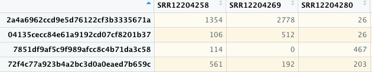
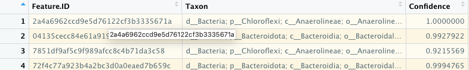

# From Qiime2 into R - Initial diagnostics {#Qiime2R}
  
## Introduction
In this chapter you will learn how to import Qiime2-produced ASV tables, taxonomy tables and tree files into R. For this exercise we will us publicly available FastQ files that were generated by a research group in Denmark. The files are available in the Sequence Read Archives (SRA) under accession number PRJNA645373.  
Reference: [1] C. Jiang, S.J. McIlroy, R. Qi, F. Petriglieri, E. Yashiro, Z. Kondrotaite, P.H. Nielsen, Identification of microorganisms responsible for foam formation in mesophilic anaerobic digesters treating surplus activated sludge, Water Res. 191 (2021) 116779. https://doi.org/10.1016/j.watres.2020.116779.  
  
Sample IDs  
You decide on the samplesIDs before you start your library prep and sequencing. For this chapter we use a different dataset to the previous chatper and its sampleIDs are longer, e.g. "SRR12204258" and "SRR12204269", compared to "PT-01", "PT-02" in the previous chapter. It does not matter how you label each of your indexed samples as long as the IDs are unique.  And each unique sample ID in the `samplesheet.csv` needs to match the sample IDs of the `feature_table.qza`. You may recall those IDs originate from your Miseq run and are the same sample IDs that are used on the loading manifest file to prepare the run. They subsequently are part of the FastQ filenames and flow through into any relevant Qiime2 data. If a sample ID does not match or if there is a different number of samples between these  two input files, then phyloseq will complain.   
  \
  
Here the first three Sample IDs ("SRR12204258" and "SRR12204269" etc..) in the ASV table from this data set.:  
   
  \
  
ASV IDs   
The same principle applies to each ID of the ASVs. The ASVs IDs have to match between the `feature_table.qza` and the `taxonomy_silva.qza`.  
  
Following the first ASV IDs (Feature ID) and related taxon assignments in taxonomy_silva.qza of this dataset:  
 
    
  \
    
NOTE: After the denoising, taxonomic classification and tree alignments in Qiime2, I prefer to do all subsequent analysis in R. However, it is also possible to do much of the diversity analysis in Qiime2. In fact, some  interesting plug-ins and functions in Qiime2 are not available as packages in R, hence for some specific tasks you may need to keep using Qiime2. It is up to the goals and preferences of the investigator.  
  
Now let's work in R!  
  
  
**Required files**  
  
* `samplesheet.tsv` - same file that was used in the visualisation steps in Qiime2  
* `feature_table.qza` - if you created a phylogenetic tree from the sequences as described in the previous chapter then the ASVs in the feature table were filtered to match the ASVs in the tree. Hence the files was named `featuretable-insertiontree-filtered.qza` to differentiate it.  
* `taxonomy_silva.qza`  
* `insertion-tree.qza`  
  
  \

## Workflow  
### Packages
  
First install the required packages. Some packages are stored on 'remote' repositories such as GitHub, hence before you can install them you need helper packages such as `remotes`. Other packages, such as `phyloseq` are managed by BioConductor project. They provide their own package manager package for R called `BiocManager`, which helps to install from the same release.  
  
Learn more about phyloseq here: https://joey711.github.io/phyloseq/  
  
Both, remotes and BiocManager are already installed in the below example.  
Once the packages are installed, load them into your working space.   
  
```{r packages, include=TRUE, echo=TRUE, warning=FALSE, message=FALSE}
# install.packages("remotes")
# if (!requireNamespace("BiocManager", quietly = TRUE))
#  install.packages("BiocManager")
# remotes::install_github("jbisanz/qiime2R")
# BiocManager::install("phyloseq")

library(qiime2R)  # to import qiime.qza into an R object
library(phyloseq) # To combine all relevant data objects into one object for easy data management
library(tidyverse) # Compilation of packages for data management 
library(stringr)  # to change some of the strings in taxonomic names 
library(vegan)   # A commonly used package for numerical ecology

```
  
  \
  
### Import qiime-files and create a phyloseq object
  
Now that packages are loaded we can import the Qiime2 `.qza` and the `.tsv` files. The aim is to import everything as R objects, which are then combined into one phyloseq object. Once we have a phyloseq object, any filtering and visualisations can be run from the one object.  
  
In the previous chapter, we used a `samplesheet.tsv` to visualise and summarise the `feature_table.qza`. That exact same samplesheet.tsv is imported here and slightly changed to make it phyloseq friendly. In this example, all relevant Qiime2 outputs were copied into a folder named 'qiimefiles'.   
  
  
```{r psobject, include=TRUE, echo=TRUE,warning=FALSE, message=FALSE}

# Sample sheet
metadata <- read_tsv("qiimefiles/samplesheet.tsv")  # lets call the R object 'metadata' to reflect its purpose 
# Inspect the metadata object. The second row is qiime-specific information and has to be removed. 

metadata2 <- metadata[c(2:nrow(metadata)),] %>%     # remove the top row and convert characters to factors
  rownames_to_column("spl")%>% # this just adds the rownames to a column and calles in "spl"
  mutate_all(type.convert) %>%
  mutate_if(is.factor, as.character) %>%  # reformatting columns to avoid any problems with factors at this stage
  column_to_rownames("spl") %>%  # this puts the column "spl" back into rownames
  as_tibble() %>% 
  column_to_rownames("#SampleID")

# str(metadata2)  # use the `str` command to inspect the data

# Then decide which of the columns you want to be factors and in which order these factors should go. This will determine the order in which ggplot will plot them. You can include the levels = c("level1", "level"...)  command to determine the order, which is not done here. 
metadata2  <- metadata2 %>% 
  mutate(Reactor = factor(Reactor)) %>%  # replace column Reactor with the same values but made a factor. 
  mutate(Location = factor(loc))     # create a new column 'Location', which is a factor of 'loc'

# Qiime import                      
SVs <-  qiime2R::read_qza("qiimefiles/featuretable-insertiontree-filtered.qza")
ASVtable <- as.data.frame(SVs$data)   # extract the data table, this has to be a dataframe

# Taxonomy
taxonomy <- qiime2R::read_qza("qiimefiles/taxonomy_silva.qza") # import the qiime object
taxonomy <- taxonomy$data  # extract the taxonomy data
## re-format the taxonomy file to split the taxonomy into columns
## remove the confidence column
taxtable <- taxonomy %>% as_tibble() %>%
  separate(Taxon, sep=";", c("Kingdom","Phylum","Class","Order","Family","Genus","Species"))  %>%
  dplyr::select(-Confidence) %>%
  column_to_rownames("Feature.ID") %>%
  as.matrix()

# Tree
tree <- read_qza("qiimefiles/insertion-tree.qza")
tree <- tree$data  #extract data

# Create the phyloseq object 
ps <-phyloseq(
  otu_table(ASVtable, taxa_are_rows = T), 
  sample_data(metadata2),
  phyloseq::tax_table(taxtable),
  phyloseq::phy_tree(tree)
)

# ps  (not run)
# phyloseq-class experiment-level object
# otu_table()   OTU Table:         [ 4218 taxa and 51 samples ]
# sample_data() Sample Data:       [ 51 samples by 14 sample variables ]
# tax_table()   Taxonomy Table:    [ 4218 taxa by 7 taxonomic ranks ]
# phy_tree()    Phylogenetic Tree: [ 4218 tips and 4217 internal nodes ]

# remove things out of the R environment you dont need. 
rm(metadata, metadata2, SVs, taxonomy, taxtable, tree, ASVtable)

## Remove those annoying short codes in front of taxa names (i.e. p__ etc) as they
## dont look good in visualisation
tax_table(ps)[, "Kingdom"] <- str_replace_all(tax_table(ps)[, "Kingdom"], "d__", "")
tax_table(ps)[, "Phylum"] <- str_replace_all(tax_table(ps)[, "Phylum"], " p__", "")
tax_table(ps)[, "Class"] <- str_replace_all(tax_table(ps)[, "Class"], " c__", "")
tax_table(ps)[, "Order"] <- str_replace_all(tax_table(ps)[, "Order"], " o__", "")
tax_table(ps)[, "Family"] <- str_replace_all(tax_table(ps)[, "Family"], " f__", "")
tax_table(ps)[, "Genus"] <- str_replace_all(tax_table(ps)[, "Genus"], " g__", "")
tax_table(ps)[, "Species"] <- str_replace_all(tax_table(ps)[, "Species"], " s__", "")

```
From the output of the `ps` object we can see that there are 4281 ASVs in 51 samples and associated with 14 variables in the metadata.  
  
If you wish, you can access each individual data set from the ps object with functions `otu_table(ps)@.Data`, `sample_data(ps)` `tax_table(ps)@.Data` or `phy_tree(ps)`.  This can become handy if you want to change something, such as adding columns to the sample_data or changing them to a factor etc..  
  
```{r, psobject2, include=TRUE, echo=TRUE,warning=FALSE, message=FALSE}

ASVs <- otu_table(ps)@.Data
metadata <- data.frame(sample_data(ps))
taxtable <- data.frame(tax_table(ps)@.Data)
tree <- phy_tree(ps)

# Inspect individual objects in your own time. 
```
  
  \

### Save the `ps` object as an `.rds` file into your working directory     
Optional  
This step allows you to save and store the R object as a RDS file and load it back into any future R environment, should you require it.  This would be helpful if your workflow is separated into different  Rscripts and you want to just load in the RDS file instead of having to import qiime files and create the phyloseq object every time.  
  
```{r saverds, include=TRUE, echo=TRUE,warning=FALSE, message=FALSE}
saveRDS(ps, file = "ps_ProjectX_2022July")

# to load the file back into your R environment:
# ps <- readRDS(file = "ps_ProjectX_2022July")

```
   
### Initial filtering    
  
Keep the orginal `ps` object unchanged. Create new objects for subsequent filtering steps.   
  
Often we simply filter out any ASVs that have less than x number of reads and are present in less than x number of samples. This helps to reduce noise and the overload of zeros in the dataset, which some differential abundance tests can't deal with. Perhaps, it also helps with removing ASVs that were incorrectly denoised with DADA2 in the first place. However, it also means that rare ASVs with a low prevalence are not considered. So filtering has to be done with consideration to the intended analysis.  
   
Then filter out any phyla that came up as uncharacterized and taxa that came up as mitochondria and chloroplast.  
  
```{r filtering, include=TRUE, echo=TRUE, warning=FALSE, message=FALSE}
# filter as needed. This will be your final otu-table.
# Although you can still filter for specific analysis if needed.
# minimum of reads per feature
ps.flt = prune_taxa(taxa_sums(ps) >= 5, ps) #minimum reads per feature

# ps.flt (not run)
# phyloseq-class experiment-level object
# otu_table()   OTU Table:         [ 3911 taxa and 51 samples ]
# sample_data() Sample Data:       [ 51 samples by 14 sample variables ]
# tax_table()   Taxonomy Table:    [ 3911 taxa by 7 taxonomic ranks ]
# phy_tree()    Phylogenetic Tree: [ 3911 tips and 1694 internal nodes ]

#filter any "NA"-phyla that have not been classified i.e. 
# contain nothing in the phylum column of the taxtable (just a <NA>)

ps.flt  = subset_taxa(ps.flt , !is.na(Phylum) & !Phylum %in% c(""))

# ps.flt (not run)
# phyloseq-class experiment-level object
# otu_table()   OTU Table:         [ 3892 taxa and 51 samples ]
# sample_data() Sample Data:       [ 51 samples by 14 sample variables ]
# tax_table()   Taxonomy Table:    [ 3892 taxa by 7 taxonomic ranks ]
# phy_tree()    Phylogenetic Tree: [ 3892 tips and 1687 internal nodes ]
  
# Filter out non-bacteria, mitochondia and chloroplast taxa
ps.flt <- ps.flt %>%
  subset_taxa(Kingdom == "Bacteria" & Family  != "Mitochondria" & Class   != "Chloroplast")

# ps.flt (not run)
# phyloseq-class experiment-level object
# otu_table()   OTU Table:         [ 3853 taxa and 51 samples ]
# sample_data() Sample Data:       [ 51 samples by 14 sample variables ]
# tax_table()   Taxonomy Table:    [ 3853 taxa by 7 taxonomic ranks ]
# phy_tree()    Phylogenetic Tree: [ 3853 tips and 1673 internal nodes ]

# We can filter more for running beta diversity or differential abundance analysis later. This will be shown in later chapters
# For example: 
# minimum presence in x% of samples (51 * 0.04 = 2 samples)
# ps.flt = filter_taxa(ps.flt, function(x) sum(x > 0) > (0.04*length(x)), TRUE) 
# Would result in 
# phyloseq-class experiment-level object
# otu_table()   OTU Table:         [ 1674 taxa and 51 samples ]
# sample_data() Sample Data:       [ 51 samples by 14 sample variables ]
# tax_table()   Taxonomy Table:    [ 1674 taxa by 7 taxonomic ranks ]
# phy_tree()    Phylogenetic Tree: [ 1674 tips and 1673 internal nodes ]
  
```
  
  \
  
### Proportion of ASVs identified  
  
Check what proportion of ASVs could be identified on phylum and genus-level. This is best done with the handy phyloseq function `ntaxa()`, which gives the number of taxa present in the phyloseq object.  
  
This will indicate how many reads you would be discarding, in case you remove ASVs, which were not assigned a taxon.  
  
It is also an indicator of how well the database you have been using (e.g. Silva here) has performed.You could compare that with other databases if you wish.   

```{r taxapct, include=TRUE, echo=TRUE, warning=FALSE, message=FALSE, error=FALSE}

#  percent of phyla identified
ps.flt  = subset_taxa(ps , !is.na(Phylum) & !Phylum %in% c(""))
# percent of phyla identified
ntaxa(ps.flt) / ntaxa(ps)

ps.flt  = subset_taxa(ps , !is.na(Genus) & !Genus %in% c(""))
# percent of phyla identified
ntaxa(ps.flt) / ntaxa(ps)
  
```
  
  
### Rarefaction curve
  
Check if you cover enough depth for diversity analyses. Some samples may have low species richness, including a negative or samples that failed during PCR for example. The rarefaction curve will help assess which samples you may have to exclude from subsequent diversity calculations. It also provides a general view if samples cover enough of the potential richness (Number of ASVs).      
  
The curve shows you the number of 'Species' (i.e. ASVs) on the y axis and the total reads on the x axis for each sample. So basically, it shows how rich each sample is and indicates if the number of reads that are captured in a samples covers enough of the ASVs. If the curve flattens, it indicates that the sample would not get any richer even with more reads...  
  
I typically use the rarefaction curve to check if there are samples that need removing before establishing alpha diversity metrics. In this example, the vertical line helps identify the sample with lowest number of reads. We can check that by running `min(colSums(otu_table(ps.flt)))`, which tells us that they are 9690 reads in the sample with lowest reads. If this sample is kept in and we measure subsequent alpha diversity metrics, where each of the sample-reads are randomly resampled to the lowest read-number (here 9690), then we may not capture the diversity of samples with higher richness. The grey horizontal lines indicate how much richness we may lose if we include the sample with lowest number of reads (the difference between grey horizontal line and the curve of each sample at the highest number of reads on x-axis).    
  
   \
```{r rarefaction, include=TRUE, echo=TRUE,warning=FALSE, message=FALSE}

vegan::rarecurve(t(otu_table(ps.flt)), 
                 step=200, sample = min(colSums(otu_table(ps.flt))), 
                 label = FALSE, xlab = "Sample Size after filtering") 

# show the lowest and highest number of sample reads.  
max(colSums(otu_table(ps.flt)))
min(colSums(otu_table(ps.flt)))

# Filtering options
# filter options (not run), you can filter out specific sample or treatments from the phyloseq objects. 
# `%notin%` = Negate(`%in%`)  # create a %notin% filter operator for filtering

# Filtering out treatments, e.g. any sample that was labeled "Negative" in the metadata
# ps.flt.flt <-  prune_samples(sample_data(ps.flt)$Treatment %notin% c("Negative"), ps.flt)

# Filtering out any taxa that have zero reads because they were only present in the removed samples.  
# ps.flt.flt <- prune_taxa(taxa_sums(ps.flt.flt) != 0, ps.flt.flt)
```
    
  
Once you identified the samples you would like to remove (e.g. samples with too few reads), you can filter out these specific samples or treatments from the phyloseq objects. For example, with the  `prune_samples(sample_data(ps.flt)$Treatment %notin% c("Negative"), ps.flt)` command here we would sample out any samples labeled as "Negative" in the metadata. Afterwards make sure to sample out any taxa that now contain zero reads because they were only present in the removed samples. Perhaps, create new phyloseq objects to differentiate from your different filtered object `ps.flt.flt <- prune_taxa(taxa_sums(ps.flt) != 0, ps.flt)`. See also Chapter \@ref(plottingtaxa) where the phyloseq object is pre-filtered before ggplotting.  
   
In this example, we are keeping the sample with lowest reads. No further filtering required at this stage.   
  
  \
  
### Prevalence table  
  
Create a prevalence table to get an overview of phyla with low to high prevalence.   
  
The output is a dataframe showing all phyla in order of total abundance. The mean prevalence defines how often the phylum appears across all samples on average. E.g. a mean prevalence of 10.22 means that ASVs in this phylum were present on average in 10.22 samples. Higher values indicates a 'core' relevance to the sum of samples.  
  
This table is handy to decide if you want to remove certain phyla from some visualisations as they may not contribute to the overall analysis. It also allows for a comparison with filtered and unfiltered data for due diligence. Here it is apparent that phyla that were unclassified (i.e. <NA> ) contributed 3,522 reads to the total of 1,299,791 reads. That is `3522 / sum(phyloseq::otu_table(ps)) * 100` = 0.27%. Chances are that these NA sequences may just be noise and may not represent biological relevant amplicons. Hence, I would keep them out of any further analysis.  
However, in environments where you get higher contributions of unknown amplicons, it may indicate that the taxonomic database does not capture your samples well. In that case it would be wise to keep the NAs in for measuring alpha and beta diversity.   
  
```{r prevalence, include=TRUE, echo=TRUE,warning=FALSE, message=FALSE}
prevalencedf = apply(X = phyloseq::otu_table(ps.flt),
                       MARGIN = 1,
                       FUN = function(x){sum(x > 0)})

prevalencedf  = data.frame(Prevalence = prevalencedf ,
                            TotalAbundance = taxa_sums(ps.flt),
                            phyloseq::tax_table(ps.flt))

prevalencedf <- prevalencedf %>%
    dplyr::group_by( Phylum ) %>%   # choose phylym level
    dplyr::summarise(Mean_prevalence = mean(Prevalence),
                     Total_abundance = sum(TotalAbundance)) %>%
    dplyr::mutate(Rel_abundance = (Total_abundance / sum(Total_abundance) *100)) %>%
    arrange(desc(Total_abundance)) %>%
    dplyr::mutate(Cumulated = cumsum(Rel_abundance))

# print table from highest to lowest abundance 
knitr::kable(prevalencedf, digits = 1) %>% 
  kableExtra::kable_styling(bootstrap_options = c("striped", "condensed", "responsive"), full_width = F, font_size = 10)


## Compare with the original, unfiltered ps object
prevalencedf = apply(X = phyloseq::otu_table(ps),
                       MARGIN = 1,
                       FUN = function(x){sum(x > 0)})

prevalencedf = data.frame(Prevalence = prevalencedf,
                            TotalAbundance = taxa_sums(ps),
                            phyloseq::tax_table(ps))

prevalencedf <- prevalencedf %>%
    dplyr::group_by( Phylum ) %>%   # choose phylym level
    dplyr::summarise(Mean_prevalence = mean(Prevalence),
                     Total_abundance = sum(TotalAbundance)) %>%
    dplyr::mutate(Rel_abundance = (Total_abundance / sum(Total_abundance) *100)) %>%
    arrange(desc(Total_abundance)) %>%
    dplyr::mutate(Cumulated = cumsum(Rel_abundance))

knitr::kable(prevalencedf, digits = 1) %>% 
  kableExtra::kable_styling(bootstrap_options = c("striped", "condensed", "responsive"),full_width = F, font_size = 10)

```
  
  
### Export ASV and taxa tables to Excel
 
This might be useful if you would like to share your abundance and taxa tables with someone that does not use R.  
  
```{r exportexl, include=TRUE, echo=TRUE,warning=FALSE, message=FALSE}

# extract ASV table from ps object
ASVs <- data.frame(otu_table(ps.flt)) %>% 
  rownames_to_column("FeatureID")

# extract taxonomy table from ps object
taxtable <- data.frame(tax_table(ps.flt))
# combine the taxonomy levels into one colum, separated by a ;
taxtable <- taxtable %>%
  rownames_to_column("FeatureID") %>% as_tibble() %>%
  unite(Taxon, sep=";", c("Kingdom","Phylum","Class","Order","Family","Genus","Species"))
# combine ASVs and taxatable into one object
ASVTable <- ASVs %>% left_join(taxtable, by = "FeatureID")

# write .csv file
# write.csv(ASVTable, "ASVTable.csv") not run

```
  
     
**Note:**  
This code is an amalgamation from various sources. Apart from putting it together into this workflow I do not take credit for it.
