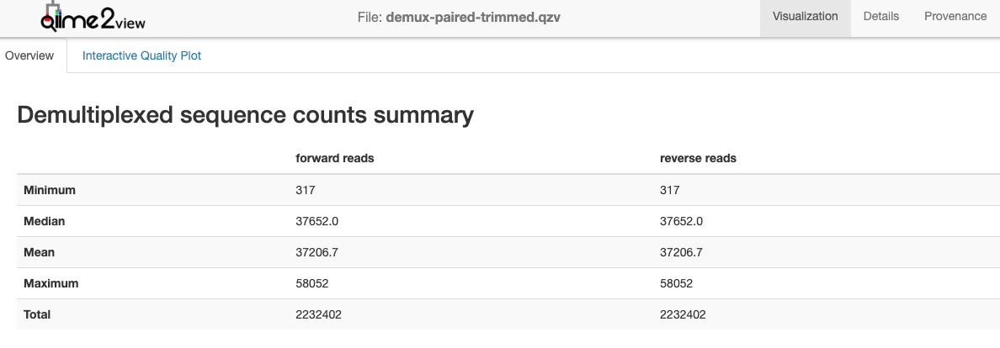
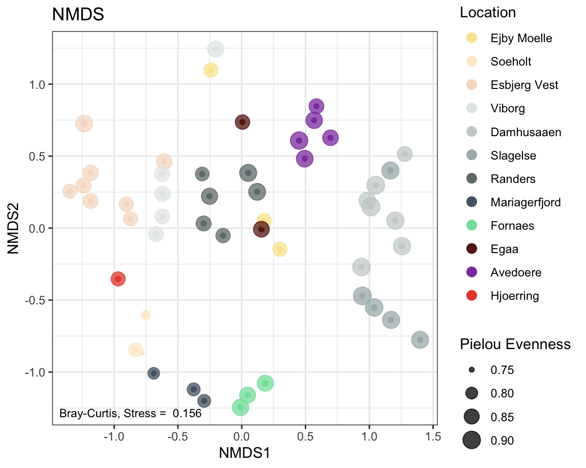

--- 
title: "Workflows for processing microbial amplicon sequences"
author: "[Christian Krohn, PhD, RMIT University](https://www.rmit.edu.au/contact/staff-contacts/academic-staff/k/krohn---christian)"
date: "`r Sys.Date()`"
description: "This GitBook contains bioinformatic workflows from raw microbial amplicon-sequence
  reads generated with a Miseq instrument to pre-processing reads with packages such
  as Qiime2, followed by applying various packages within the R Environment."
documentclass: book
github-repo: "chrismitbiz/ABlab-workflows"
link-citations: yes
bibliography:
- book.bib
- packages.bib
site: bookdown::bookdown_site
biblio-style: apalike
---

<!--"Using GitBooks to create Open course materials"-->
# About this GitBook {#about}


This GitBook contains workflows for students who want to get started with sequencing microbial amplicons on a Miseq instrument and then process and analyse ASV-based data. It is a compilation of workflows that I have gotten accustomed to during my PhD at La Trobe University with help of many amazing students and colleagues over the years. But it is by no means comprehensive.
  
One of the biggest hurdles for students that embark on sequencing environmental DNA for the first time, is the effort that is required to understand the various coding languages, file types and formats, packages or platforms that are involved (think Unix, Linux, Slurm, Qiime, R, RMarkdown, python, conda, ggplot, docker, GitHub, data instances...) before they even can start looking at exploring the data for biological meaning and producing publishable output. 

For example, this GitBook is made in [Rstudio](https://rstudio.com), using the [`rmarkdown` markup language](https://rstudio.com/wp-content/uploads/2016/03/rmarkdown-cheatsheet-2.0.pdf), rendered using the [`bookdown` package](https://bookdown.org/yihui/bookdown/get-started.html), and hosted on [GitHub](https://github.com/). It took me at least five years before I was ready to create and host this content for students. And even then I needed this awesome [Bookdown template](https://cjvanlissa.github.io/gitbook-demo/index.html) from Dr. Caspar van Lissa to get started with Bookdown. So it is really helpful to have something to start with. 

It was not easy to get over the initial hurdles for me too, so I thought I'd try to compile my workflows. This may help students to get a head start but also helps to scrutinise my approach in the hope that others can point me to better ways of doing things. 

**Browse to your level**

Everyone is at a different level in the journey to exploring microbial diversity. Some have absolutely no idea where to start and others have created their first phylogentic trees with ggtree or similar. The most important prerequisites are patience and persistence... :). Just  explore the different chapters and see where it takes you. In fact you will be amazed how much you can achieve with mininal coding knowledge. 

**Get in touch**  
  
We work at the Andy Ball lab, RMIT University, Bundoora, Melbourne. Email me or comment on the discussion section of the [GitHub repository](https://github.com/chrismitbiz/ABlab-workflows/discussions/) for this GitBook. You will need to get a GitHub account to join the discussion. Its free. 

<a rel="license" href="http://creativecommons.org/licenses/by/4.0/"></a><br />This work is licensed under a <a rel="license" href="http://creativecommons.org/licenses/by/4.0/">Creative Commons Attribution 4.0 International License</a>.

<!--chapter:end:index.Rmd-->

# Getting started  {#gettingstarted}
  
Prerequisites will be listed in each sub chapter separately. 
Following a few general comments:  
  
## General requirements 
  
### Access to computational resources
  
To process data you will need a personal computer or online computational resources with sufficient number of CPUs, working memory and storage. If you want to run most of the processing on a personal computer then I'd recommend a minimum of **4 CPUs, 16 Gb RAM and 500 Gb storage**. However, please note that some alignment tasks require more RAM, hence some of the steps (e.g. taxonomic classifications) may require a more powerful resource. The advantage of using a personal computer is that you can frequently update the latest packages without relying on a university administrator to do that for you. Furthermore, with a personal computer you wont need to share with others, making it easier to run the packages without a workload manager. 
  
Some university may provide their own access to a high performance computer (HPC) for staff and students and likely have certain packages pre-installed. In such cases a batch workload manger such as Slurm may be used, to manage multiple users trying to run computationally heavy jobs. This works fine too but its a bit of a hassle and I would use such an HPC only if really necessary, i.e. smaller jobs on my personal computer and bigger jobs on the HPC. 
  
In Australia the [ARDC Nectar Research Cloud](https://ardc.edu.au/services/nectar-research-cloud/) provides free computational resources to students and staff at Universities. This is basically like providing access to an online Linux computer with complete freedom to install any packages as if it was your own. If you are a student you can [create a trial account](https://dashboard.rc.nectar.org.au/) with your student email address (Using your ID only; without the student.edu.au) and check out how it all works, albeit with limited resources. The Nectar service also provides [tuturials for starters](https://tutorials.rc.nectar.org.au/). However, to get serious with Nectar, you have to request more resources, which is a fairly straight-forward process. Check out the [eligibilities](https://support.ehelp.edu.au/support/solutions/articles/6000068044-managing-an-allocation) and chat to your supervisor if you are interested.  
  
There are also commercial options, which probably offer very similar type of services to Nectar. 
  
In addition, there is the awesome [Galaxy Australia platform](https://usegalaxy.org.au/), which is an open  web-based resource that also contains many tutorials and workflows specific to bioinformatics. Definitely worth checking that out too.  
  
This workbook will be based on using the Nectar Research cloud. 
   
### File storage  
  
Working with  sequencing data may require you do handle large amounts of data. From experience, a run of a 600µl pool (6-10pM) of amplicons in 2x301 Miseq cycles may produce around 10-20 Gb of FASTQ files. [Much more](https://sapac.support.illumina.com/bulletins/2018/01/approximate-sizes-of-sequencing-run-output-folders.html) can be expected for NextSeq runs or for long-read sequencing.  
  
Once a Miseq run has finished it is typically available to download from the [Illumina Basespace](https://basespace.illumina.com/dashboard) account. After a few runs, the data can accumulate quickly. Hence, **persistent storage space** may be required. With an Illumina Basespace account you get 1 TB of storage and you can keep a copy of the FASTQ file on your account. However, Basespace may delete your data if the account has been inactive for more than 6 months. But you will get reminder emails and all you need to do is to log in every now and then so Illumina wont delete your data. Alternatively, data can be upload onto a public repository for persistent storage, such as the [Sequence Reads Archives](https://www.ncbi.nlm.nih.gov/sra). If you have access to a research cloud or commercial computational resources then you may store data on those. Personally, I prefer a 1TB solid state harddrive. 
  
### Command Line  
  
Many of the tools used are managed through command line. Cloud servers are also accessed through command line. That means there is no graphical user interphase and all commands, including installation and running of packages are done through lines of codes on a simple window interphase. This window is called Terminal (Mac, Linux) or Command Prompt application (Windows). There are lots of online sources to help you get started with command line. One example here: https://towardsdatascience.com/a-quick-guide-to-using-command-line-terminal-96815b97b955  
  
### Data storage browser  
    
To upload, download, move, rename files on any cloud computer or high performance computer (HPC) at your institution, you will also require a cloud storage browser, such as [Cyberduck](https://docs.cyberduck.io/) (Mac) or [PuTTY](https://www.putty.org/) (Windows).  
   
### R and R studio  
  
R has become an essential research language. If you want to progress in research it is almost inevitable for you to learn. Just do it. :). Perhaps start here if you dont know where else to start: https://education.rstudio.com/learn/beginner/. It lists some great step-by-step tutorials on how to install R and Rstudio and then explains the basics.
  
If you are like me, then you simply copy and paste code from other sites and see what happens. This book should provide you with the required information to enable you to follow the workflows. In case you get stuck, you can either chat to me directly or write on the GitHub Discussion Page for this GitBook ([chrismitbiz/ABlab-workflows/discussions/]((https://github.com/chrismitbiz/ABlab-workflows/discussions/))).  
  
At the same time you will want to do short courses (eg. from edX [Data Science: R Basics](https://www.edx.org/course/data-science-r-basics)) that delve a little deeper into different data structures such as data frames, matrices, lists and the syntax to arrange stuff. Over time you understand what different lines of code mean and can trouble shoot when things don't work. And things often don't work. You will get used to troubleshooting code :). 

### Environment managers  
  
Package and environment managers are extremely useful for your workflows. They help to install and run software packages  such as qiime2, into individual 'environments' independent of your operating system. The environment manager is installed once and from there you use it to install individual packages. The most commonly used environment manager is Conda. Learn more about it here: https://docs.conda.io/projects/conda/en/latest/user-guide/getting-started.html
  
Conda can be installed by either installing Anaconda or Miniconda. Boths works the same way. Anaconda requires 5 Gb of discspace and installs everything you can possibly need, while Miniconda is just the raw bones and lets you install things one by one. 
  
Most of the commands to manage environments are done in command line using a terminal. There is also a graphical installer that makes handling the environments a little more visual. That would be my go to. Learn more here: www.anaconda.com.  
  
Once conda installed you can always check what environments are installed with the command `conda env list`. In my case the output looks like this:  

    \
    
There are several other environment managers. We are also using [Docker](https://www.docker.com/) in our work but the learning curve is a bit steeper so we wont get into it here.  
  
### Explore the help functions  
  
Packages such as qiime2 have great resources to help you understand how to run any of the available commands.  For example if you dont know what input parameters are available for the qiime command  
`qiime feature-classifier classify-sklearn`, you can simply enter this command into your Terminal (with the qiime environment activated, if it is installed with Conda) and add a `--help` at the end: `qiime feature-classifier classify-sklearn --help`.  
  
Or you just want to know what other commands qiime has in its repertoire, you can run `qiime --help`.
  
For example, this 
```
conda activate qiime2-2022.2  
qiime --help  
```
Gives  

  
Within R studio you can access the documentation of individual packages by searching for package or function names in the help windows.  
  
For example looking for `phyloseq` in the Help window gives this:  

  

  
  
### GitHub account  
  
This GitBook, including all its files, is hosted on one of my GitHub repositories (https://github.com/chrismitbiz/ABlab-workflows). If you have any comments you can ask a question on the Discussion Page of this repository. You require a GitHub account to do that. It is free.  
  
## A note on rarefying (normalising)

Various data normalisation methods exist and opinions on their applicability diverge.  

Example of normalisation methods:  
  
* Rarefying data  
* Transformation into relative abundances 
* Transformation into centered log-ratios
* Cumulative Sum Scaling (CSS)  
* Upper Quantile (UQ)  
* edgeR-trimmed mean of M values (TMM)  
* DESeq-variance stabilizing transformation (VS)  
  
There are others. Check out this link to learn more about the different types of normalisation methods: [MicrobiomeAnalyst: FAQs, What are the various normalization methods and which method should I choose?](https://www.microbiomeanalyst.ca/MicrobiomeAnalyst/docs/FaqView.xhtml#norm2).  
  
Rarefying data is one of the more contested methods. We acknowledge that **rarefying data** (i.e. the random subsampling of abundances to usually the smallest library size) results in loss of data and statistical power and is thus **not recommended for differential abundance analyses**. Check out this well cited paper here to learn why: [Waste Not, Want Not: Why Rarefying Microbiome Data Is Inadmissible](https://journals.plos.org/ploscompbiol/article?id=10.1371/journal.pcbi.1003531) (@McMurdie2014).  
  
However, rarefying still "*outperformed all the other normalization methods for producing accurate BC (Bray-Curtis) dissimilarities and subsequent PCoAs and PERMANOVAs.*" Paper here: [Methods for normalizing microbiome data: An ecological perspective](https://doi.org/10.1111/2041-210X.13115) (@McKnight2019a).  
   
For our workflows we may **rarefy data** before creating **alpha diversity** indices (Shannon, Simpsons etc) and **beta diversity** indices (Bray-Curtis dissimilarities). 
  
Other types of normalisation methods should be considered for differential abundance analyses. My preference is to use **centred-log ratios** (Aitchison distances). The **compositional approach** and centred log-ratios are further discussed in the paper [Microbiome Datasets Are Compositional: And This Is Not Optional](https://doi.org/10.3389/fmicb.2017.02224) (@Gloor2017). This type of transformation requires the removal of some of the rare ASVs to remove as many zeros from the abundance table as reasonable.  
  
## Workflows from other lab groups    
  
The following review "*should serve as a starting point for considering what options are available*": [Analysing microbial community composition through amplicon sequencing: from sampling to hypothesis testing](https://www.frontiersin.org/articles/10.3389/fmicb.2017.01561/full) (@Hugerth2017a).  
  
Furthermore, searching for "amplicon-sequencing" under "Topics" on GitHub gave 37 results. 
  
* nf-core/ampliseq  
On the top of that list is the [nf-core/ampliseq](https://github.com/topics/amplicon-sequencing) pipeline developed by the nf-core community. It is based on a software called [Nextflow](https://www.nextflow.io/) which allows to put different processes into a pipeline. This is great for doing things a little more reproducible but it requires you to be fairly knowledgeable with Linux, container software, config files etc.. Not great to learn stuff for beginners.  
  
* Tools-Microbiome-Analysis  
[Tools-Microbiome-Analysis](https://microsud.github.io/Tools-Microbiome-Analysis/) is a websites containing a comprehensive list of R packages and, more importantly, tutorials related to analysis of microbial amplicons and ecology. Really good reference to go back to every now and then. **Highly recommended**.  
  
* grimmlab/MicrobiomeBestPracticeReview  
Essential paper to read ([Current challenges and best-practice protocols for microbiome analysis, 2021](https://academic.oup.com/bib/article/22/1/178/5678919) (@Bharti2021)) and a great [workflow resource](https://github.com/grimmlab/MicrobiomeBestPracticeReview) on GitHub. **Essential read**. The Grimm lab in Munich published this paper as well as developed a python and R-based workflow that assists with the recommended best practices (amplicon as well as metagenomic workflows).  
  
* KasperSkytte/ampvis2  
[Ampviz2](https://kasperskytte.github.io/ampvis2/articles/ampvis2.html) is an R-package to visualise and analyse 16S rRNA amplicon data. It is always more convenient to have packages that have the details and optics worked out for you. Like phyloseq, the ampviz2 package combines different tables from data (E.g. otu table, taxonomic table, phylogenetic tree, sample data etc) and then provides different functions to apply to that combined object to visualise the data. 

<!--chapter:end:02_getting_started.Rmd-->

# Miseq library preps 

## Introduction  
  
**Some info on getting your run ready**
  
In our lab we usually prepare a 6-10 pM pool of libraries following the [16S Metagenomic Sequencing Library
Preparation](https://sapac.support.illumina.com/content/dam/illumina-support/documents/documentation/chemistry_documentation/16s/16s-metagenomic-library-prep-guide-15044223-b.pdf) protocol from Illumina with 10-30% Phix. **Download it, study it and refer to it throughout your labwork**. This protocol is not limited to 16S amplicons. You can use it for fungal (e.g. ITS) amplicons too. In the last section there are also valuable tips for pre‐PCR and post‐PCR lab procedures. There is also some additional Illumina guidance here: https://sapac.support.illumina.com/downloads/16s_metagenomic_sequencing_library_preparation.html
    
### Overview    
The protocol encompasses the following steps (copied out of the protocol):

    
  
  
Please note that only **one amplicon target** should be sequenced in each run. That means it is not recommended to sequence for example two different 16S amplicons or one 16S amplicon plus an ITS amplicon. Sequencing different amplicon lengths will result in reduced quality as the the Miseq flowcell will preferentially cluster shorter fragments. However, it is not impossible. We have tried to run four different amplicons on one flowcell before, although with mixed results.  
  
Labwork may take four weeks from DNA extraction to Miseq loading. Double that if you have not done it before. You probably realised that there is quite a bit of labwork required before you finally get FASTQ files and subsequent ASV/taxonomy tables to analyse - the ultimate goal here. The more samples are planned to be included into the pool, the more work and consumables are needed. Illumina recommends no more than 96 samples on one flowcell to get enough depths (i.e. > 100,000 reads per sample). But we have sequenced around 196 samples on one flowcell before, which captured sufficient reads and diversity. This depends on how much detail and rare taxa you want to capture. The less samples you include, the more data and depth for each sample. 
  
Also note that you will require over 20 boxes of tips (mostly 200 µl) for each 96-well plate, so plan your consumables ahead of time. Most of the tips will be used for the PCR clean ups. 
  
After all steps in the above protocol are completed, the Miseq will be loaded with a 600 µl pool, followed by 56 hours of run-time for 2x301 cycles before FASTQ files are available for download from BaseSpace.  
  
  
  
Throughout the 56 hours run you can check how things are tracking either on the BaseSpace website or the BaseSpace phone app. Understanding different QC metrics will help identifying potential problems with the pool or the instrument. It is important to note that this is a bit of a nerve-wrecking moment in the process, as it remains unclear until the metrics come through after around the 21st cycle, whether or not the run will be successful.  
  \
     
## Workflow  
### DNA extraction
  

  
We commonly extract DNA from soils or from wastewater sludges using the *DNeasy Powersoil Pro Kit* (Qiagen) for both, soil and sludge. It results in high quality DNA and includes a bead beating step to make sure the gram positive cells are sufficiently broken up. Although, I don't have evidence for that. In fact, please let us know on the [GitHub Discussion Page](https://github.com/chrismitbiz/ABlab-workflows/discussions) for this GitBook if you have any comments on that as we are always looking for ways to improve things. 
  
Soil  

* For soils, the protocol of the extraction kit is followed, weighing in 0.25 g of soil and making sure to record the exact weights used.  
* Also make sure to measure the water content of the soil to be able to report DNA concentrations per dry weight of soil. 
  
Sludge
  
* For DNA extraction of sludge, 0.5 ml is added into an empty 1.7 ml extraction tube (without extraction beads), then centrifuged at 5000 rpm for 5 minutes before removing the supernatent. 
* Extraction beads are then added and the Powersoil protocol followed. 
* Measure Total Solids (TS) of the sludge to report DNA concentrations per gram of TS.
     \
     \
  
### DNA quality and concentration 
  
Once you have extracted DNA it is necessary to confirm its quality and concentration. 
 
* Quality is assessed using a Nanodrop Spectrophotometer. You are aiming for **260/280 Ratio of 1.8 and a 260/230 Ratio of 2-2.2**. This is explained in the [T042‐TECHNICAL BULLETIN](https://dna.uga.edu/wp-content/uploads/sites/51/2019/02/Note-on-the-260_280-and-260_230-Ratios.pdf). The Nanopore also estimates DNA concentrations but it is not recommended to use these concentrations measurements to normalise DNA. It is more accurate and consistent with a Qubit Fluorometer.  
* DNA concentrations are best measured using fluorescent dye-based methods such as the **Qubit Fluorometer**. It is easist to use the '*1X*' assays such as the *Qubit 1X dsDNA BR Assay Kit* or the *Qubit 1X dsDNA HS Assay Kit*  
    + Broad range (BR) Kit for quantifying extracted environmental DNA and afte the 2nd stage PCR. 
    + High Sensitivity (HS) Kit for quantifying the pool at the end.  
    

    
  
### DNA normalisation
  
The next step is to normalise all DNA extracts to 5 ng/µl.  
  
* Dilute DNA to equal concentrations, either in a fresh batch of PCR-grade 10mM Tris buffer (pH 8.5) or in PCR-grade water  
* Set a pre-define DNA volume, say 2µl for all extracts, and add Tris or water as calculated with  
$$ C_1V_1 = V_2 C_2 $$  
     \
  
  
### First and second PCR - Amplicon PCR and Indexing PCR 
  
Follow the [16S Metagenomic Sequencing Library
Preparation](https://sapac.support.illumina.com/content/dam/illumina-support/documents/documentation/chemistry_documentation/16s/16s-metagenomic-library-prep-guide-15044223-b.pdf) Guide. Include a negative control and sequence that as well. This allows you to assess background and cross contamination. The whole workflow is best done in 96-well plates, using multi-channel pipettes to avoid indexing mistakes across wells.  
  
Sample list and plate layout  
  
Ensure that all sample IDs, plate-layout and each unique Illumina index carefully planned and printed out before you start your PCRs. Perhaps, stick the layout onto the Bio-safety cabinet where you do most of the pipetting and keep checking you are on the right well and sample. Label all plates even if you discard them afterwards. Labwork can be stressful and you need to trace all your steps across each well of the plate because otherwise you risk that you have indexed the wrong samples and it will become impossible to know which sample you have sequenced.  
  
  
Primers  
  
Any primers you order for the Miseq will have to include the **Illumina overhang adapter**. The sequence of the overhang adapter is added **in front** of the gene-specific primer sequences. There are two overhang adapters; one for the forward primers and one for the reverse primer. Check out the relevant information on primers from page 3 the 16S Metagenomic Sequencing Library Preparation Guide.  
  
Clean-ups  
  
It is worth doing the clean-ups in a separate deep-well plate ("MIDI" plate, see consumables below) to avoid any blow-out of dried beads at the end of the clean-up. This process is explained in the above mentioned guide too. Tip: Handle the beads extremely carefully after the ethanol has dried. They blow out easily.  
  
Index Kits  
  
The index kits are expensive. Try to handle them with care and replace lids with the provided replacement lids, after every use. Multipipettes are absolutely essential to avoid loosing track on indexes used across the different wells on the plate. The use of the Illumina Plate Fixture comes in handy (see consumables below).  
  
Amplicon QC  
  
After the indexing-PCR products are cleaned it is recommended to run a gel on all samples to confirm that amplification was successful with enough DNA present and that it is the correct amplicon length. It also helps to identify any primer dimers, which may have to be cleaned out.  
  
If you have access to a **Tapestation or a Bioanalyzer** in your lab, perhaps run a random subset of the indexed samples on one of these instruments, just to accurately confirm the average length of the amplicon. This average basepair length of the amplicon is important, as it is the basis for  normalising your DNA to nM. In any case, after the index samples are normalised and pooled, it is highly recommended to run the pool on a Bioanalyser too. Otherwise it is too much guesswork in getting the concentrations right. This is further explained below.    
Repeat any samples that failed, i.e. that do not show any bands, and ensure you use the same indices.  
  
  \
  
### Normalisation of indexed amplicons
  
After you finished all PCR work it is time to do another round of Qubitting and normalisation of all samples into a new 96-well plate. The final pool should be 4 nM but we prefer to normalise DNA to a higher concentration first, say 10 nM, then pool and then dilute the pool to 4 nM afterwards.  
We are using a very handy excel sheet, which was kindly developed and provided by [Sarah Knowler](https://scholars.latrobe.edu.au/sknowler) at La Trobe University to prepare and assist in normalisations, converting from ng/µl to nM using the formula:  
  
$$ concentrations~(ng/µl)  \over 660 g/mol~x~average~library~size$$
Contact us if you would like to get a copy of this very handy library preparation excel sheet.   
  
Some more information here: https://support.illumina.com/content/dam/illumina-support/documents/documentation/system_documentation/miseq/miseq-denature-dilute-libraries-guide-15039740-10.pdf. There’s also a pooling calculator here https://support.illumina.com/help/pooling-calculator/pooling-calculator.htm which may be helpful with your calculations.   
  \
  
### Pooling  
  
* Pipette equal volumes of the normalised DNA into one 1.5 ml tube.  
* Measure its concentration using the High Sensitivity (HS) Qubit 1X dsDNA HS Assay Kit.  
* Assuming the pool was created wtih normalised concentration that are higher than 4 nM, then you will need to dilute the pool down to 4nM. In order to do so you will need to accurately measure the average basepair length of your pool. Do not rely on the ladder on a gel. Always get an accurate read. See next point.      
* Measure the average base pair lengths of the pool with a **Bioanalyzer or Tapestation**. Use at least three replicates. The average basepair length is then used to calculate the final concentration required in ng/µl to get a 4 nM pool.  
* Dilute the pool to the concentration in ng/µl that reflect 4 nM.
  
  \
  
### Denaturing of pool and loading of the Miseq  
  
Now you are almost ready load the Miseq. The last steps are done right before you plan to load the instrument. First the pool DNA needs to be denatured and diluted further to your preferred loading concentration (6 - 10 pM) before it is mixed with PhiX. The final concentrations impact on cluster densities. That means you get more data with higher concentrations but that is at the expense of potential errors during sequencing at high cluster densities. We recommend to aim for a cluster density of around 900-1000 K/mm^2^, which may be achieved with a concentration of around 7-8 pM.  
  
The key for the final steps are that..  
  
* ..the reagent cartridge is properly thawed. Perhaps thaw in fridge 3 hours before starting the denaturing steps. Then put into icy water to ensure final and even thawing across the cartridge. Mix cartrige well at the end and ensure that no bubbles are visible before loading.  
* .. the 0.2 N sodium hydroxide (NaOH) is made fresh with biological grade NaOH. For example use the *BioUltra, for molecular biology, 10 M NaOH in H2O* from Sigma Aldrich to make a 0.2 N solution (N = Normality but it is equal to Molarity here because there is only one OH in NaOH). I have used analytical-grade NaOH pellets as well, which worked but the RNAse free solutions are safer in terms of inhibitors etc..  
* ..that the pool is cooled down immediately in ice or icy water right after the 2 minutes in the  96 degrees C heatblock and pretty much immediately loaded into the Miseq. The Miseq has to be prepped beforehand (I.e. maintenance wash and sample sheet loaded).  
* a sample sheet (or so-called manifest file) is created beforehand using the Illumina Experiment Manager Software.  This software assist in producing a `.csv` file that is then loaded into the Miseq instrument via a USB and ensures that the indexes you have used are linked to the relevant samples in your pool. Basically a list of sample IDs and index IDs. An example of a sample sheet from one of our runs is shown below.\
**IMPORTANT**: Make sure to specify the Workflow as **GenerateFastQ**.  
* you have a Illumina BaseSpace account.   
  
\
    

   
  
### Consumables  
  
All consumables and equipment required for the 16S Miseq library prep protocol are available from page 21 of the  above mentioned [16S Metagenomic Sequencing Library
Preparation](https://sapac.support.illumina.com/content/dam/illumina-support/documents/documentation/chemistry_documentation/16s/16s-metagenomic-library-prep-guide-15044223-b.pdf) Guide.  
The **magnetic stand** for 96-well plates and the TruSeq Index **Plate Fixture Kit** are essential. 
    
  
Here is what we typically include into our purchasing list. The combined total of the below list costs over AUD$ 10,000. 
  
```{r consumables, tidy=FALSE, echo=FALSE }
consumables <- read.csv("Consumables.csv")
knitr::kable(
  consumables, caption = 'Example of a consumables list we typically include for a Miseq run',
  booktabs = TRUE
)
```
  
  

<!--chapter:end:03_Miseq_library_preps.Rmd-->

# From BaseSpace to Qiime2 and DADA2  {#miseqtoqiime}

## Introduction  

In this chapter you will learn how to process the FASTQ files that are generated from an amplicon sequencing run on a Miseq instrument. We are using Qiime2. Please also refer to the extensive documentation and tutorials available at https://qiime2.org. You can learn almost everything there.  
  
  
### Prerequisites and required files
  
* FASTQ files available to download on BaseSpace. Two for each sample. One for read 1 (R1) and another for read 2 (R2). For example, `PT-01_S1_L001_R1_001.fastq.gz` and `PT-01_S1_L001_R2_001.fastq.gz` contains all sequences for sample PT-01.
* Personal computer or cloud computational resources with > 4 CPUS,  > 16 RAM, > 100 GB storage recommended.  
* Cloud storage browser installed (example Cyberduck or PuTTYm see Chapter \@ref(gettingstarted)).  
* Qiime2 installed. Always use the latest version.  
* All required files in correct format and file extension (see below).  
* The BaseSpace Downloader software (available on the BaseSpace page. You will be prompted to download once you go to your files).   
  
  
`Qiimeimportmanifest.tsv` - A tab separated file with three columns where the first column is the sample ID (The exact same ID that was used in the manifest file for loading the Miseq).  The second and third columns are the absolute paths to the forward and reverse FASTQ files, respectively. If you are working on a cloud computer then the FASTQ files should be uploaded to that, and the path needs to contain the full path to the relevant folder, including the full name of the file itself. If you process those files on your local drive then the paths need to change to your local folder containing the FASTQ files. In the below example table, the files are located on a Linux cloud computer (Nectar Research Cloud).  
  
It might take some time to compile the import manifest. Each file path has to exact. However, in case you made a mistake in the file names etc, Qiime is generally pretty good at reporting where the error occured.  
  
  
```{r qiimeimport, message=FALSE, warning=FALSE, tidy=FALSE, echo=FALSE}
library(tidyverse)
manifest <- readr::read_tsv("qiimeimportmanifest.tsv")
knitr::kable(head(manifest), digits = 2, caption = "Example of a qiime import manifest.tsv file")  %>% kableExtra::kable_styling(full_width = F, bootstrap_options = c( "condensed"), font_size = 10 )
```
   
  \
  
`samplesheet.tsv` - file containing sample metadata. This file should contain all other environmental measurements you may have done on each sample (pH, EC...), which you want to relate to microbial taxonomy and composition. The same file and format will be used to import metadata into the R package Phyloseq later too.    
  
```{r metadata, message=FALSE, warning=FALSE, tidy=FALSE, echo=FALSE }
library(tidyverse)
samplesheet <- readr::read_tsv("samplesheet.tsv")
knitr::kable(head(samplesheet), digits = 2, caption = "Example of a samplesheet.tsv file") %>% kableExtra::kable_styling(full_width = F, bootstrap_options = c( "condensed"), font_size = 10 )
```
  
\
  
IMPORTANT: Create the `.tsv` file as a tab separated `.csv` file in Excel first and then manually change the file name from `.csv` to `.tsv`. Not sure how else to easily build the `.tsv` file.
 
  \
  
`scriptfile.txt` - A text file that contains your qiime2 scripts. Example below. Code is compiled here and then only the file itself is executed to run any commands in that text. The hash (#) in front of any line of code stops it from being executed. That means all code is normally 'hashed'. If one wants to run the code the lines are 'un-hashed' and the text file is executed in the command line to run the 'un-hashed' code. On the Linux cloud computer the command would be: `sh scriptfile.txt`. 
  
Note that a script file is meant to make life easy and the process replicable. But you could run each of the processes directly by adding the commands into the terminal without a script file.  
  

  
  \
  
Briefly on script files for cloud-based high performance computers (HPC) that are using Slurm to manage multiple user runs. If the HPC at your institution is using Slurm, then the script file has to be called with `sbatch scriptfile.txt`. The script files for HPCs using slurm contains a header that determins the allocations (number of CPUs, RAM etc..) for your task. The first lines of the .txt file typically look similar to this:
```
#!/bin/bash
#SBATCH --cpus-per-task=6
#SBATCH --mem-per-cpu=6000
#SBATCH --time=24:00:00
#SBATCH --partition=compute
#SBATCH --job-name=Q_fun
```
  
Commands, such as this:
```
echo "Starting at: $(date)"
echo "Finished at: $(date)"
```  
.. are less important but help to report the start and end times of the executed commands from beginning (where the `echo` command is placed at the beginning of the script) to end (`echo`... placed at the end of the script) into the Terminal Windows. They dont affect the qiime commands in any way.   
  
Slurm and `sbatch` are not needed if you manage your own computer or your 'own' cloud computer. In the example below we are using a Linux cloud computer, provided by the Nectar Research Cloud so we dont need Slurm. 
  
  
## Workflow  

### Download FASTQ files
  
In this example, Fastq files were produced from sequencing 16SrRNA marker genes on an Illumina Miseq instrument. If you ran your own library on your own BaseSpace account, the files should be available to download from that BaseSpace account. If the run was created by another user, that person can invite you to the run, which gives you access to download the files too.   
  
Log in to BaseSpace and into your project. Go to files, run and download FastQ.  You will  be asked to install a downloader software. Follow instructions accordingly.  
  
  
  
  \
  
The FASTQ files will come in separate folders for each sample. It is necessary to move all files into just ONE folder. That folder will then be used to import the sequences into a qiime object (described below). 
  

### Paired end manifest import (Step 1)
   
Go to the folder that contains all the FASTQ files (all files in one folder). I.e. in Unix/Linux use `cd path/to/folder/` to navigate to it. The scriptfile.txt should also be located here. The following qiime command that will look for the files and then create a qiime object using the sequences found in each FASTQ file. The `--output-path` instructs qiime where to place and how to name the output file, here demux-paired-end.qza is placed into the same directory.    
Remove any # in front of your code (already removed in the below example) and execute the scriptfile.txt with `sh scriptfile.txt` (or `sbatch scriptfile.txt` in case you are using Slurm).  
  
```
qiime tools import --type 'SampleData[PairedEndSequencesWithQuality]' \
  --input-path Qiimeimportmanifest.tsv \
  --output-path demux-paired-end.qza \
  --input-format PairedEndFastqManifestPhred33V2
```
  
  \
  
### Cutadapt (Step 2) 
   
If all goes well you should now have a demux-paired-end.qza file in the same directory as your FASTQ files , which contains all your sequences. You could move demux-paired-end.qza to another folder and continue all other steps there if you wish. The FASTQ files are not needed anymore.  Dont forget to move your script file to where it is most convenient for executing the commands. If you moved the demux-paired-end.qza to another folder it is probably easiest to also move the script file that the same directory (or create a second script file containing the remaining commands).  
  
Go to the folder containing demux-paired-end.qza and use cutadapt to trim out the primer sequences. Unhash relevant lines in your script file, which should be located in the same folder. Run `sh scriptfile.txt`.   
  
In this example we used the V4 primers. Change primer sequence to the exact primers that you used in the amplicon PCR.
  

```
qiime cutadapt trim-paired \
  --i-demultiplexed-sequences demux-paired-end.qza \
  --p-front-f GTGYCAGCMGCCGCGGTAA \
  --p-front-r GGACTACNVGGGTWTCTAAT \
  --o-trimmed-sequences trimmed_demux-paired-end.qza
```
  \
  
### Read quality assessment  

**Visualise the output with a .qzv file**  
  
The .qza files can be visualised by 'converting' them into .qzv files.  
Here we take the trimmed_demux-paired-end.qza and create a trimmed_demux-paired-end.qzv.   
**NOTE:** View any .qzv file on https://view.qiime2.org. Drag and drop the qzv file into the browser window and inspect the results.  
  
```
qiime demux summarize \
  --i-data trimmed_demux-paired-end.qza \
  --o-visualization trimmed_demux-paired-end.qzv
```
  
Go to https://view.qiime2.org and drag and drop to visualise your .qzv file in the browser.  
  

  \
  

Now click on the 'Interactive Quality Plot' tab. You will see exactly that: Interactive Quality plots that look like this:  
  
Note the total number of sequences. You want to retain a high percentage of these after quality filtering with DADA2.       
  
  
  
  
**STOP HERE**. Inspect the visualisation and decide on location and maximum expected error.   
From the output decide where to truncate the forward and reverse reads with `p-trunc-len-f`, `p-trunc-len-r`,`--p-max-ee-f` and `--p-max-ee-r` in DADA2 below.  

  
It can take some trial and error to get these setting right. We are using a docker-based package called FIGARO to help us estimate those parameters (Not shown here). But essentially you want to capture high quality reads and be confident about the Amplicon Sequence Variants (ASV), while also capture sufficent depth of ASVs and reads without unnecessarily filtering out too much. In the below example, we have trimmed the forward reads at 272 base pairs with a maximum expected error (max-ee) of 2 (which is the default) and the reverse reads at 151  with a max-ee of 3.  I  think it is o.k. to relax the max-ee for the reverse reads (which are ALWAYS lower in quality) as I feel more confident about the fact that the reverse reads are paired with the forward reads. Pairing in itself provides increased confidence that the reads do in fact represent a biological relevant sequence. As always please comment on our [GitHub discussion page](https://github.com/chrismitbiz/ABlab-workflows/discussions/) if you have any suggestions here. Thanks!        
  
A minimum overlap between the forward and reverse primer of 20 base pairs is recommended. To overlap can be calculated as following:   

 
length forward read + length reverse read - length amplicon - truncated basepairs forward read -  truncated basepairs reverse reads = overlap
  
  
So, for example, if we picked `--p-trunc-len-f 272` and `--p-trunc-len-r 151`, we get 
$$301 + 301 - 292 - 29  - 150 = 131~bp~overlap$$  
  
  
In cases where the quality of the reverse reads is very poor, or the amplicon is too long for pairing to work, it is also acceptable to import, trim and denoise only the forward reads. The V4 primer of this example, is nice and short at 292 basepairs, so is great for pairing even at lower reverse-read qualities.  
  
### Denoise paired end sequences with dada2 (Step 3)  
  
Once the trimming and max-ee parameters are decided, it is time to run the DADA2 function.  This may take a while, depending on total number of samples.  
  
The output will be a feature_table.qza and sample_rep_seqs.qza, containing the ASV abundances and their sequences respectively.  
  
```
qiime dada2 denoise-paired \
  --i-demultiplexed-seqs trimmed_demux-paired-end.qza \
  --o-table feature_table.qza \
  --o-representative-sequences sample_rep_seqs.qza \
  --p-trim-left-f 0 --p-trim-left-r 0 \
  --p-trunc-len-f 271 \
  --p-trunc-len-r 151 \
	--p-max-ee-f 2 \
	--p-max-ee-r 3 \
  --output-dir dada2 \
  --verbose
```
  
Summarise and visualise the ASV abundances (feature_table.qza) in a .qzv file.   
  
```
qiime feature-table summarize \
  --i-table feature_table.qza \
  --o-visualization feature_table.qzv \
  --m-sample-metadata-file samplesheet.tsv
```
**Note:** Look at the feature_table.qzv and record median reads per sample. Compare the total frequency after denoising with the total sequence count from the trimmed_demux-paired-end.qza. You hope to retain a high percentage of total sequences after denoising with DADA2. It is prudent to report that percentage in your methods.    
  
  

  
  \
  
### Taxonomic classifier and assignment (Step 4)  
  
The next step is to assign taxonomies to the sequences in the denoised sample sequences. Here, we use a pre-trained classifier that is based on the Silva database. This pre-trained classifier is available on the data resource page of Qiime (Most current link at the time of writing: https://docs.qiime2.org/2022.2/data-resources).  
  
However, in case you used a different primer you would have to create the classifier yourself. Again there is great resource avaiable on https://docs.qiime2.org. The process is fairly straight forward but takes computational time. Briefly, extract reference reads from a database (i.e. Silva here) based on the primers used. Then use those extracted sequences and fit or train them onto a taxonomy. Basically, predict which amplicon sequence should be what phylym/class/order/family/genus etc....  This trained file becomes a 'classifier' that is used to assign taxonmies on your sequences. 
  
Here we have a pre-trained classifier, silva-132-99-515-806-nb-classifier.qza: 
The output is a file called taxonomy_silva.qza and taxonomy_silva.qzv in this case.  
  
```
qiime feature-classifier classify-sklearn \
  --i-classifier silva-132-99-515-806-nb-classifier.qza \
  --p-reads-per-batch 10000 \
  --i-reads sample_rep_seqs.qza \
  --o-classification taxonomy_silva.qza \
  --quiet

# Then summarise and visualise the output into a .qza file

qiime metadata tabulate \
--m-input-file taxonomy_silva.qza \
--o-visualization taxonomy_silva.qzv
```
  
  \
  
### Build phylogenetic tree (Step 5)  

The next step is not essential but really good to have. Creating a phylogenetic tree from the amplicon sequences.  
  
In this case we are using the insertion tree method. See https://library.qiime2.org/plugins/q2-fragment-insertion/16/ for more information in this method.  
  
As not all ASVs will be inserted we will filter the feature_table.qza again to keep only those ASVs that are in the tree. You will need the reference file from silva or greengenes. In this case we are using `sepp-refs-silva-128.qza`. 
  
```
qiime fragment-insertion sepp \
  --i-representative-sequences sample_rep_seqs.qza \
  --i-reference-database sepp-refs-silva-128.qza \
  --o-tree insertion-tree.qza \
  --o-placements insertion-placements.qza

qiime fragment-insertion filter-features \
  --i-table feature_table.qza \
  --i-tree insertion-tree.qza \
  --o-filtered-table feature_table_insertiontreefiltered.qza \
  --o-removed-table removed_features.qza
```
  
Done!  
  
Everything else including further quality filtering happens with `phyloseq` in R where we will import the following files:
`feature_table_insertiontreefiltered.qza`,
`taxonomy_silva.qza` and
`insertion-tree.qza`.
  
This will be covered in the next chapter.  
  
  
   
### All steps combined 
 
Copy and paste this into your script file if needed. 
  
```
# Manifest Import
qiime tools import --type 'SampleData[PairedEndSequencesWithQuality]' \
  --input-path Qiimeimportmanifest.tsv \
  --output-path demux-paired-end.qza \
  --input-format PairedEndFastqManifestPhred33V2

# Cutadapt
qiime cutadapt trim-paired \
  --i-demultiplexed-sequences demux-paired-end.qza \
  --p-front-f GTGYCAGCMGCCGCGGTAA \
  --p-front-r GGACTACNVGGGTWTCTAAT \
  --o-trimmed-sequences trimmed_demux-paired-end.qza

qiime demux summarize \
  --i-data trimmed_demux-paired-end.qza \
  --o-visualization trimmed_demux-paired-end.qzv

# Denoise
qiime dada2 denoise-paired \
  --i-demultiplexed-seqs trimmed_demux-paired-end.qza \
  --o-table feature_table.qza \
  --o-representative-sequences sample_rep_seqs.qza \
  --p-trim-left-f 0 --p-trim-left-r 0 \
  --p-trunc-len-f 271 \
  --p-trunc-len-r 151 \
    --p-max-ee-f 2 \
    --p-max-ee-r 3 \
  --output-dir dada2 \
  --verbose
  
qiime feature-table summarize \
  --i-table feature_table.qza \
  --o-visualization feature_table.qzv \
  --m-sample-metadata-file samplesheet.tsv
  
# Taxonomic assignment
qiime feature-classifier classify-sklearn \
  --i-classifier silva-132-99-515-806-nb-classifier.qza \
  --p-reads-per-batch 10000 \
  --i-reads sample_rep_seqs.qza \
  --o-classification taxonomy_silva.qza \
  --quiet

# Phylogenetic tree
qiime fragment-insertion sepp \
  --i-representative-sequences sample_rep_seqs.qza \
  --i-reference-database sepp-refs-silva-128.qza \
  --o-tree insertion-tree.qza \
  --o-placements insertion-placements.qza

# Final filtering
qiime fragment-insertion filter-features \
  --i-table feature_table.qza \
  --i-tree insertion-tree.qza \
  --o-filtered-table feature_table_insertiontreefiltered.qza \
  --o-removed-table removed_features.qza

```

Qiime2 reference:  
Bolyen E, Rideout JR, Dillon MR, Bokulich NA, Abnet CC, Al-Ghalith GA, Alexander H, Alm EJ, Arumugam M, Asnicar F, Bai Y, Bisanz JE, Bittinger K, Brejnrod A, Brislawn CJ, Brown CT, Callahan BJ, Caraballo-Rodríguez AM, Chase J, Cope EK, Da Silva R, Diener C, Dorrestein PC, Douglas GM, Durall DM, Duvallet C, Edwardson CF, Ernst M, Estaki M, Fouquier J, Gauglitz JM, Gibbons SM, Gibson DL, Gonzalez A, Gorlick K, Guo J, Hillmann B, Holmes S, Holste H, Huttenhower C, Huttley GA, Janssen S, Jarmusch AK, Jiang L, Kaehler BD, Kang KB, Keefe CR, Keim P, Kelley ST, Knights D, Koester I, Kosciolek T, Kreps J, Langille MGI, Lee J, Ley R, Liu YX, Loftfield E, Lozupone C, Maher M, Marotz C, Martin BD, McDonald D, McIver LJ, Melnik AV, Metcalf JL, Morgan SC, Morton JT, Naimey AT, Navas-Molina JA, Nothias LF, Orchanian SB, Pearson T, Peoples SL, Petras D, Preuss ML, Pruesse E, Rasmussen LB, Rivers A, Robeson MS, Rosenthal P, Segata N, Shaffer M, Shiffer A, Sinha R, Song SJ, Spear JR, Swafford AD, Thompson LR, Torres PJ, Trinh P, Tripathi A, Turnbaugh PJ, Ul-Hasan S, van der Hooft JJJ, Vargas F, Vázquez-Baeza Y, Vogtmann E, von Hippel M, Walters W, Wan Y, Wang M, Warren J, Weber KC, Williamson CHD, Willis AD, Xu ZZ, Zaneveld JR, Zhang Y, Zhu Q, Knight R, and Caporaso JG. 2019. Reproducible, interactive, scalable and extensible microbiome data science using QIIME 2. Nature Biotechnology 37: 852–857. https://doi.org/10.1038/s41587-019-0209-9


 

<!--chapter:end:04_From_Miseq_to_Qiime.Rmd-->

---
output: html_document
editor_options: 
  chunk_output_type: console
---
# From Qiime2 into R - Initial diagnostics {#Qiime2R}
  
## Introduction
In this chapter you will learn how to import Qiime2-produced ASV tables, taxonomy tables and tree files into R. For this exercise we will us publicly available FastQ files that were generated by a research group in Denmark. The files are available in the Sequence Read Archives (SRA) under accession number PRJNA645373.  
Reference: [1] C. Jiang, S.J. McIlroy, R. Qi, F. Petriglieri, E. Yashiro, Z. Kondrotaite, P.H. Nielsen, Identification of microorganisms responsible for foam formation in mesophilic anaerobic digesters treating surplus activated sludge, Water Res. 191 (2021) 116779. https://doi.org/10.1016/j.watres.2020.116779.  
  
Sample IDs  
You decide on the samplesIDs before you start your library prep and sequencing. For this chapter we use a different dataset to the previous chatper and its sampleIDs are longer, e.g. "SRR12204258" and "SRR12204269", compared to "PT-01", "PT-02" in the previous chapter. It does not matter how you label each of your indexed samples as long as the IDs are unique.  And each unique sample ID in the `samplesheet.csv` needs to match the sample IDs of the `feature_table.qza`. You may recall those IDs originate from your Miseq run and are the same sample IDs that are used on the loading manifest file to prepare the run. They subsequently are part of the FastQ filenames and flow through into any relevant Qiime2 data. If a sample ID does not match or if there is a different number of samples between these  two input files, then phyloseq will complain.   
  \
  
Here the first three Sample IDs ("SRR12204258" and "SRR12204269" etc..) in the ASV table from this data set.:  
   
  \
  
ASV IDs   
The same principle applies to each ID of the ASVs. The ASVs IDs have to match between the `feature_table.qza` and the `taxonomy_silva.qza`.  
  
Following the first three ASV IDs (Feature ID) and related taxon assignments in taxonomy_silva.qza of this dataset:  
 
    
  \
    
NOTE: After the denoising, taxonomic classification and tree alignments in Qiime2, I prefer to do all subsequent analysis in R. However, it is also possible to do much of the diversity analysis in Qiime2. In fact, some  interesting plug-ins and functions in Qiime2 are not available as packages in R, hence for some specific tasks you may need to keep using Qiime2. It is up to the goals and preferences of the investigator.  
  
Now let's work in R!  
  
  
**Required files**  
  
* `samplesheet.tsv` - same file that was used in the visualisation steps in Qiime2  
* `feature_table.qza` - if you created a phylogenetic tree from the sequences as described in the previous chapter then the ASVs in the feature table were filtered to match the ASVs in the tree. Hence the files was named `featuretable-insertiontree-filtered.qza` to differentiate it.  
* `taxonomy_silva.qza`  
* `insertion-tree.qza`  
  
  \

## Workflow  
### Packages
  
First install the required packages. Some packages are stored on 'remote' repositories such as GitHub, hence before you can install them you need helper packages such as `remotes`. Other packages, such as `phyloseq` are managed by BioConductor project. They provide their own package manager package for R called `BiocManager`, which helps to install from the same release.  
  
Learn more about phyloseq here: https://joey711.github.io/phyloseq/  
  
Both, remotes and BiocManager are already installed in the below example.  
Once the packages are installed, load them into your working space.   
  
```{r packages, include=TRUE, echo=TRUE, warning=FALSE, message=FALSE}
# install.packages("remotes")
# if (!requireNamespace("BiocManager", quietly = TRUE))
#  install.packages("BiocManager")
# remotes::install_github("jbisanz/qiime2R")
# BiocManager::install("phyloseq")

library(qiime2R)  # to import qiime.qza into an R object
library(phyloseq) # To combine all relevant data objects into one object for easy data management
library(tidyverse) # Compilation of packages for data management 
library(stringr)  # to change some of the strings in taxonomic names 
library(vegan)   # A commonly used package for numerical ecology

```
  
  \
  
### Import qiime-files and create a phyloseq object
  
Now that packages are loaded we can import the Qiime2 `.qza` and the `.tsv` files. The aim is to import everything as R objects, which are then combined into one phyloseq object. Once we have a phyloseq object, any filtering and visualisations can be run from the one object.  
  
In the previous chapter, we used a `samplesheet.tsv` to visualise and summarise the `feature_table.qza`. That exact same samplesheet.tsv is imported here and slightly changed to make it phyloseq friendly. In this example, all relevant Qiime2 outputs were copied into a folder named 'qiimefiles'.   
  
  
```{r psobject, include=TRUE, echo=TRUE,warning=FALSE, message=FALSE}

# Sample sheet
metadata <- read_tsv("qiimefiles/samplesheet.tsv")  # lets call the R object 'metadata' to reflect its purpose 
# Inspect the metadata object. The second row is qiime-specific information and has to be removed. 

metadata2 <- metadata[c(2:nrow(metadata)),] %>%     # remove the top row and convert characters to factors
  rownames_to_column("spl")%>% # this just adds the rownames to a column and calles in "spl"
  mutate_all(type.convert) %>%
  mutate_if(is.factor, as.character) %>%  # reformatting columns to avoid any problems with factors at this stage
  column_to_rownames("spl") %>%  # this puts the column "spl" back into rownames
  as_tibble() %>% 
  column_to_rownames("#SampleID")

# str(metadata2)  # use the `str` command to inspect the data

# Then decide which of the columns you want to be factors and in which order these factors should go. This will determine the order in which ggplot will plot them. You can include the levels = c("level1", "level"...)  command to determine the order, which is not done here. 
metadata2  <- metadata2 %>% 
  mutate(Reactor = factor(Reactor)) %>%  # replace column Reactor with the same values but made a factor. 
  mutate(Location = factor(loc))     # create a new column 'Location', which is a factor of 'loc'

# Qiime import                      
SVs <-  qiime2R::read_qza("qiimefiles/featuretable-insertiontree-filtered.qza")
ASVtable <- as.data.frame(SVs$data)   # extract the data table, this has to be a dataframe

# Taxonomy
taxonomy <- qiime2R::read_qza("qiimefiles/taxonomy_silva.qza") # import the qiime object
taxonomy <- taxonomy$data  # extract the taxonomy data
## re-format the taxonomy file to split the taxonomy into columns
## remove the confidence column
taxtable <- taxonomy %>% as_tibble() %>%
  separate(Taxon, sep=";", c("Kingdom","Phylum","Class","Order","Family","Genus","Species"))  %>%
  dplyr::select(-Confidence) %>%
  column_to_rownames("Feature.ID") %>%
  as.matrix()

# Tree
tree <- read_qza("qiimefiles/insertion-tree.qza")
tree <- tree$data  #extract data

# Create the phyloseq object 
ps <-phyloseq(
  otu_table(ASVtable, taxa_are_rows = T), 
  sample_data(metadata2),
  phyloseq::tax_table(taxtable),
  phyloseq::phy_tree(tree)
)

# ps  (not run)
# phyloseq-class experiment-level object
# otu_table()   OTU Table:         [ 4218 taxa and 51 samples ]
# sample_data() Sample Data:       [ 51 samples by 14 sample variables ]
# tax_table()   Taxonomy Table:    [ 4218 taxa by 7 taxonomic ranks ]
# phy_tree()    Phylogenetic Tree: [ 4218 tips and 4217 internal nodes ]

# remove things out of the R environment you dont need. 
rm(metadata, metadata2, SVs, taxonomy, taxtable, tree, ASVtable)

## Remove those annoying short codes in front of taxa names (i.e. p__ etc) as they
## dont look good in visualisation
tax_table(ps)[, "Kingdom"] <- str_replace_all(tax_table(ps)[, "Kingdom"], "d__", "")
tax_table(ps)[, "Phylum"] <- str_replace_all(tax_table(ps)[, "Phylum"], " p__", "")
tax_table(ps)[, "Class"] <- str_replace_all(tax_table(ps)[, "Class"], " c__", "")
tax_table(ps)[, "Order"] <- str_replace_all(tax_table(ps)[, "Order"], " o__", "")
tax_table(ps)[, "Family"] <- str_replace_all(tax_table(ps)[, "Family"], " f__", "")
tax_table(ps)[, "Genus"] <- str_replace_all(tax_table(ps)[, "Genus"], " g__", "")
tax_table(ps)[, "Species"] <- str_replace_all(tax_table(ps)[, "Species"], " s__", "")

```
From the output of the `ps` object we can see that there are 4281 ASVs in 51 samples and associated with 14 variables in the metadata.  
  
If you wish, you can access each individual data set from the ps object with functions `otu_table(ps)@.Data`, `sample_data(ps)` `tax_table(ps)@.Data` or `phy_tree(ps)`.  This can become handy if you want to change something, such as adding columns to the sample_data or changing them to a factor etc..  
  
```{r, psobject2, include=TRUE, echo=TRUE,warning=FALSE, message=FALSE}

ASVs <- otu_table(ps)@.Data
metadata <- data.frame(sample_data(ps))
taxtable <- data.frame(tax_table(ps)@.Data)
tree <- phy_tree(ps)

# Inspect individual objects in your own time. 
```
  
  \

### Save the `ps` object as an `.rds` file into your working directory     
Optional  
This step allows you to save and store the R object as a RDS file and load it back into any future R environment, should you require it.  This would be helpful if your workflow is separated into different  Rscripts and you want to just load in the RDS file instead of having to import qiime files and create the phyloseq object every time.  
  
```{r saverds, include=TRUE, echo=TRUE,warning=FALSE, message=FALSE}
saveRDS(ps, file = "ps_ProjectX_2022July")

# to load the file back into your R environment:
# ps <- readRDS(file = "ps_ProjectX_2022July")

```
   
### Initial filtering    
  
Keep the orginal `ps` object unchanged. Create new objects for subsequent filtering steps.   
  
Often we simply filter out any ASVs that have less than x number of reads and are present in less than x number of samples. This helps to reduce noise and the overload of zeros in the dataset, which some differential abundance tests can't deal with. Perhaps, it also helps with removing ASVs that were incorrectly denoised with DADA2 in the first place. However, it also means that rare ASVs with a low prevalence are not considered. So filtering has to be done with consideration to the intended analysis.  
   
Then filter out any phyla that came up as uncharacterized and taxa that came up as mitochondria and chloroplast.  
  
```{r filtering, include=TRUE, echo=TRUE, warning=FALSE, message=FALSE}
# filter as needed. This will be your final otu-table.
# Although you can still filter for specific analysis if needed.
# minimum of reads per feature
ps.flt = prune_taxa(taxa_sums(ps) >= 5, ps) #minimum reads per feature

# ps.flt (not run)
# phyloseq-class experiment-level object
# otu_table()   OTU Table:         [ 3911 taxa and 51 samples ]
# sample_data() Sample Data:       [ 51 samples by 14 sample variables ]
# tax_table()   Taxonomy Table:    [ 3911 taxa by 7 taxonomic ranks ]
# phy_tree()    Phylogenetic Tree: [ 3911 tips and 1694 internal nodes ]

#filter any "NA"-phyla that have not been classified i.e. 
# contain nothing in the phylum column of the taxtable (just a <NA>)

ps.flt  = subset_taxa(ps.flt , !is.na(Phylum) & !Phylum %in% c(""))

# ps.flt (not run)
# phyloseq-class experiment-level object
# otu_table()   OTU Table:         [ 3892 taxa and 51 samples ]
# sample_data() Sample Data:       [ 51 samples by 14 sample variables ]
# tax_table()   Taxonomy Table:    [ 3892 taxa by 7 taxonomic ranks ]
# phy_tree()    Phylogenetic Tree: [ 3892 tips and 1687 internal nodes ]
  
# Filter out non-bacteria, mitochondia and chloroplast taxa
ps.flt <- ps.flt %>%
  subset_taxa(Kingdom == "Bacteria" & Family  != "Mitochondria" & Class   != "Chloroplast")

# ps.flt (not run)
# phyloseq-class experiment-level object
# otu_table()   OTU Table:         [ 3853 taxa and 51 samples ]
# sample_data() Sample Data:       [ 51 samples by 14 sample variables ]
# tax_table()   Taxonomy Table:    [ 3853 taxa by 7 taxonomic ranks ]
# phy_tree()    Phylogenetic Tree: [ 3853 tips and 1673 internal nodes ]

# We can filter more for running beta diversity or differential abundance analysis later. This will be shown in later chapters
# For example: 
# minimum presence in x% of samples (51 * 0.04 = 2 samples)
# ps.flt = filter_taxa(ps.flt, function(x) sum(x > 0) > (0.04*length(x)), TRUE) 
# Would result in 
# phyloseq-class experiment-level object
# otu_table()   OTU Table:         [ 1674 taxa and 51 samples ]
# sample_data() Sample Data:       [ 51 samples by 14 sample variables ]
# tax_table()   Taxonomy Table:    [ 1674 taxa by 7 taxonomic ranks ]
# phy_tree()    Phylogenetic Tree: [ 1674 tips and 1673 internal nodes ]
  
```
  
  \
  
### Proportion of ASVs identified  
  
Check what proportion of ASVs could be identified on phylum and genus-level. This is best done with the handy phyloseq function `ntaxa()`, which gives the number of taxa present in the phyloseq object.  
  
This will indicate how many reads you would be discarding, in case you remove ASVs, which were not assigned a taxon.  
  
It is also an indicator of how well the database you have been using (e.g. Silva here) has performed.You could compare that with other databases if you wish.   

```{r taxapct, include=TRUE, echo=TRUE, warning=FALSE, message=FALSE, error=FALSE}

#  percent of phyla identified
ps.flt  = subset_taxa(ps , !is.na(Phylum) & !Phylum %in% c(""))
# percent of phyla identified
ntaxa(ps.flt) / ntaxa(ps)

ps.flt  = subset_taxa(ps , !is.na(Genus) & !Genus %in% c(""))
# percent of phyla identified
ntaxa(ps.flt) / ntaxa(ps)
  
```
  
  
### Rarefaction curve
  
Check if you cover enough depth for diversity analyses. Some samples may have low species richness, including a negative or samples that failed during PCR for example. The rarefaction curve will help assess which samples you may have to exclude from subsequent diversity calculations. It also provides a general view if samples cover enough of the potential richness (Number of ASVs).      
  
The curve shows you the number of 'Species' (i.e. ASVs) on the y axis and the total reads on the x axis for each sample. So basically, it shows how rich each sample is and indicates if the number of reads that are captured in a samples covers enough of the ASVs. If the curve flattens, it indicates that the sample would not get any richer even with more reads...  
  
I typically use the rarefaction curve to check if there are samples that need removing before establishing alpha diversity metrics. In this example, the vertical line helps identify the sample with lowest number of reads. We can check that by running `min(colSums(otu_table(ps.flt)))`, which tells us that they are 9690 reads in the sample with lowest reads. If this sample is kept in and we measure subsequent alpha diversity metrics, where each of the sample-reads are randomly resampled to the lowest read-number (here 9690), then we may not capture the diversity of samples with higher richness. The grey horizontal lines indicate how much richness we may lose if we include the sample with lowest number of reads (the difference between grey horizontal line and the curve of each sample at the highest number of reads on x-axis).    
  
   \
```{r rarefaction, include=TRUE, echo=TRUE,warning=FALSE, message=FALSE}

vegan::rarecurve(t(otu_table(ps.flt)), 
                 step=200, sample = min(colSums(otu_table(ps.flt))), 
                 label = FALSE, xlab = "Sample Size after filtering") 

# show the lowest and highest number of sample reads.  
max(colSums(otu_table(ps.flt)))
min(colSums(otu_table(ps.flt)))

# Filtering options
# filter options (not run), you can filter out specific sample or treatments from the phyloseq objects. 
# `%notin%` = Negate(`%in%`)  # create a %notin% filter operator for filtering

# Filtering out treatments, e.g. any sample that was labeled "Negative" in the metadata
# ps.flt.flt <-  prune_samples(sample_data(ps.flt)$Treatment %notin% c("Negative"), ps.flt)

# Filtering out any taxa that have zero reads because they were only present in the removed samples.  
# ps.flt.flt <- prune_taxa(taxa_sums(ps.flt.flt) != 0, ps.flt.flt)
```
    
  
Once you identified the samples you would like to remove (e.g. samples with too few reads), you can filter out these specific samples or treatments from the phyloseq objects. For example, with the  `prune_samples(sample_data(ps.flt)$Treatment %notin% c("Negative"), ps.flt)` command here we would sample out any samples labeled as "Negative" in the metadata. Afterwards make sure to sample out any taxa that now contain zero reads because they were only present in the removed samples. Perhaps, create new phyloseq objects to differentiate from your different filtered object `ps.flt.flt <- prune_taxa(taxa_sums(ps.flt) != 0, ps.flt)`. See also Chapter \@ref(plottingtaxa) where the phyloseq object is pre-filtered before ggplotting.  
   
In this example, we are keeping the sample with lowest reads. No further filtering required at this stage.   
  
  \
  
### Prevalence table  
  
Create a prevalence table to get an overview of phyla with low to high prevalence.   
  
The output is a dataframe showing all phyla in order of total abundance. The mean prevalence defines how often the phylum appears across all samples on average. E.g. a mean prevalence of 10.22 means that ASVs in this phylum were present on average in 10.22 samples. Higher values indicates a 'core' relevance to the sum of samples.  
  
This table is handy to decide if you want to remove certain phyla from some visualisations as they may not contribute to the overall analysis. It also allows for a comparison with filtered and unfiltered data for due diligence. Here it is apparent that phyla that were unclassified (i.e. <NA> ) contributed 3,522 reads to the total of 1,299,791 reads. That is `3522 / sum(phyloseq::otu_table(ps)) * 100` = 0.27%. Chances are that these NA sequences may just be noise and may not represent biological relevant amplicons. Hence, I would keep them out of any further analysis.  
However, in environments where you get higher contributions of unknown amplicons, it may indicate that the taxonomic database does not capture your samples well. In that case it would be wise to keep the NAs in for measuring alpha and beta diversity.   
  
```{r prevalence, include=TRUE, echo=TRUE,warning=FALSE, message=FALSE}
prevalencedf = apply(X = phyloseq::otu_table(ps.flt),
                       MARGIN = 1,
                       FUN = function(x){sum(x > 0)})

prevalencedf  = data.frame(Prevalence = prevalencedf ,
                            TotalAbundance = taxa_sums(ps.flt),
                            phyloseq::tax_table(ps.flt))

prevalencedf <- prevalencedf %>%
    dplyr::group_by( Phylum ) %>%   # choose phylym level
    dplyr::summarise(Mean_prevalence = mean(Prevalence),
                     Total_abundance = sum(TotalAbundance)) %>%
    dplyr::mutate(Rel_abundance = (Total_abundance / sum(Total_abundance) *100)) %>%
    arrange(desc(Total_abundance)) %>%
    dplyr::mutate(Cumulated = cumsum(Rel_abundance))

# print table from highest to lowest abundance 
knitr::kable(prevalencedf, digits = 1) %>% 
  kableExtra::kable_styling(bootstrap_options = c("striped", "condensed", "responsive"), full_width = F, font_size = 10)


## Compare with the original, unfiltered ps object
prevalencedf = apply(X = phyloseq::otu_table(ps),
                       MARGIN = 1,
                       FUN = function(x){sum(x > 0)})

prevalencedf = data.frame(Prevalence = prevalencedf,
                            TotalAbundance = taxa_sums(ps),
                            phyloseq::tax_table(ps))

prevalencedf <- prevalencedf %>%
    dplyr::group_by( Phylum ) %>%   # choose phylym level
    dplyr::summarise(Mean_prevalence = mean(Prevalence),
                     Total_abundance = sum(TotalAbundance)) %>%
    dplyr::mutate(Rel_abundance = (Total_abundance / sum(Total_abundance) *100)) %>%
    arrange(desc(Total_abundance)) %>%
    dplyr::mutate(Cumulated = cumsum(Rel_abundance))

knitr::kable(prevalencedf, digits = 1) %>% 
  kableExtra::kable_styling(bootstrap_options = c("striped", "condensed", "responsive"),full_width = F, font_size = 10)

```
  
  
### Export ASV and taxa tables to Excel
 
This might be useful if you would like to share your abundance and taxa tables with someone that does not use R.  
  
```{r exportexl, include=TRUE, echo=TRUE,warning=FALSE, message=FALSE}

# extract ASV table from ps object
ASVs <- data.frame(otu_table(ps.flt)) %>% 
  rownames_to_column("FeatureID")

# extract taxonomy table from ps object
taxtable <- data.frame(tax_table(ps.flt))
# combine the taxonomy levels into one colum, separated by a ;
taxtable <- taxtable %>%
  rownames_to_column("FeatureID") %>% as_tibble() %>%
  unite(Taxon, sep=";", c("Kingdom","Phylum","Class","Order","Family","Genus","Species"))
# combine ASVs and taxatable into one object
ASVTable <- ASVs %>% left_join(taxtable, by = "FeatureID")

# write .csv file
# write.csv(ASVTable, "ASVTable.csv") not run

```
  
     
**Note:**  
This code is an amalgamation from various sources. Apart from putting it together into this workflow I do not take credit for it.

<!--chapter:end:05_qiimetoR.Rmd-->

---
output: html_document
editor_options: 
  chunk_output_type: console
---

# Plotting diversity  {#plottingdiversity}
   
  
  
Some visualisations of alpha and beta diversity.

## Introduction
  
This chapter introduces you to a basic workflow for plotting alpha and beta diversity using phyloseq and ggplot. It provides examples for loading the phyloseq object from a previously saved .rds file, then how to calculate and include alpha diversity metrics into the sample_data of the phyloseq object, and finally how to plot some of these metrics, individually or combined.
  
Furthermore, beta diversity, i.e. four different type of ordinations are plotted. The examples, include non-metric dimensional scaling on Bray-Curtis dissimilaries, Principal Component Analysis (Aitchison distance), Redundancy Analysis ( Aitchison) and a Principal Coordinate Analysis on unweighted uniFrac distances.   
  
The stats behind the individual metrics are not discussed. If you want to learn more about the various options to analyse your amplicon-derived diversity, perhaps start here: https://sites.google.com/site/mb3gustame/home, the GUide to STatistical Analysis in Microbial Ecology (GUSTA ME). This is one of many other useful links and resources. Some others are listed in chapter \@ref(gettingstarted) under "Workflows from other lab groups". 
  
As mentioned in Chapter \@ref(gettingstarted), prior to establishing alpha diversity indices, as well as Bray-Curtis dissimilarities, we will stick to rarefying sequences to a specific library size (library size = sum of sequence counts of a sample) to normalise the data and prevent bias due to library size. Usually, this is done using the smallest library size of all samples. If you want to learn more about rarefying - this paper explains the process: [Enhancing diversity analysis by repeatedly rarefying next generation sequencing data describing microbial communities](https://www.nature.com/articles/s41598-021-01636-1) (@Cameron2021).   
We will follow the recommendations from the authors of this paper to resample without replacement.  
  
Note that rarefying is generally not recommended for statistical inferences in differential abundance analyses due to the loss of statistical power. Learn why here: [Waste Not, Want Not: Why Rarefying Microbiome Data Is Inadmissible](https://journals.plos.org/ploscompbiol/article?id=10.1371/journal.pcbi.1003531) (@McMurdie2014). 
        
Other normalisation methods (see Chapter \@ref(gettingstarted)) are also possible and it is up to you, the analyst, to understand and decide on the appropriate methods. 

My preference is to use centred-log ratios (Aitchison distances). Aitchison distances are used in the workflow below for the PCA and RDA. The compositional approach and centred log-ratios are further discussed in the paper [Microbiome Datasets Are Compositional: And This Is Not Optional](https://doi.org/10.3389/fmicb.2017.02224) (@Gloor2017).   
In fact, comparing the results after applying different types of normalisation methods, dissimilarities or distances may complement your analysis and help in interpretation of data.    
  
### Required files   
    
* A `phyloseq` object; either read in from a pre-saved `.rds` file or created as described in chapter \@ref(Qiime2R) under "Import qiime-files and create a phyloseq object".  
* If you dont have your own data you can download the pre-saved `.rds` object from this Chapter and follow the below steps: [ps_ProjectX_2022July](./ps_ProjectX_2022July).    
   
Time to get started...  
  
## Workflow  
  
### Packages  
  
Install the following packages if not already.  
  
```{r packagesdiversity, message=FALSE, include=TRUE, echo=TRUE, warning=FALSE, message=FALSE}
# BiocManager::install("microbiome") If needed
library(phyloseq)
library(ggpubr)       # a handy helper package for ggplots
library(tidyverse)
theme_set(theme_bw())  # setting the theme for ggplots
library(vegan)
library(microbiome)

```

  \
  
### Load phyloseq object
For detail on how to create a phyloseq object please see chapter \@ref(Qiime2R).  
  
```{r loadps, include=TRUE, echo=TRUE, warning=FALSE, message=FALSE}
# reading in a previously saved phyloseq object
ps <- readRDS('ps_ProjectX_2022July')
ps  # get an overview of number of taxa and samples contained in the phyloseq object
```
  
  \
  
Check the metadata contained in the phyloseq object. This is the original metadata from the public repository where the FastQ files were downloaded from (Sequence Read Archives).  
  
There are 15 columns containing some character (chr), factor or integer (int) variables. 
  
```{r metadatacheck, include=TRUE, echo=TRUE, warning=FALSE, message=FALSE}
metadf <- data.frame(sample_data(ps))
str(metadf)
```
  
  \
  
### Pre-filter, rarefy and calculate diversity
  
Now the diversity indices can be calculated and added to the metadata of the phyloseq object for plotting. First, the abundances are pre-filtered (as shown in the previous chapter), then the ASV abundances are randomly resampled with `phyloseq::rarefy_even_depth`, such that all samples have the same number of ASVs.   
The diversity indices are then calculated with `phyloseq::estimate_richness` based on these evenly resampled abundances. The dataframe that is created containing the range of indices is then added to the existing metadata of the phyloseq for plotting.  
  
```{r alphadiversitypre, include=TRUE, echo=TRUE, warning=FALSE, message=FALSE, error=FALSE, cache=TRUE}
 
# some additional quality filtering - repeating steps from previous chapter. 
  
ps.flt = prune_taxa(taxa_sums(ps) >= 5, ps) #minimum reads per feature 
ps.flt  = subset_taxa(ps.flt , !is.na(Phylum) & !Phylum %in% c(""))
ps.flt <- ps.flt %>%
  subset_taxa(Kingdom == "Bacteria" & Family  != "Mitochondria" & Class   != "Chloroplast")
ps.flt 


# confirming minimum sample size
min(colSums(otu_table(ps.flt)))

# quantile summary of sample sizes
quantile(colSums(otu_table(ps.flt)))

# rarefy - required before measuring alpha diversity. 
# This step is to create an abundance table, where the all samples are randomly 
# resamples such that all samples have the same number of ASVs.  
# It removes any bias but number of re-samples is based on the sample with 
# smallest number of ASVs so one has to check and filter beforehand in case 
# there are samples with very different number of ASVs. I am generally going 
# by a 10x rule. If the lowest number of ASVs is 10x lower than the sample with
# highest number of ASVs, then I keep that sample in for alpha diversity assessments.  

ps_rare <- phyloseq::rarefy_even_depth(ps.flt, 
    sample.size = min(colSums(otu_table(ps.flt))),  
    rngseed = TRUE, 
    replace = FALSE, #without replacement
    trimOTUs = TRUE)

# check rarefied phyloseq object
# ps_rare (not run)

# phyloseq-class experiment-level object
# otu_table()   OTU Table:         [ 3801 taxa and 51 samples ]
# sample_data() Sample Data:       [ 51 samples by 15 sample variables ]
# tax_table()   Taxonomy Table:    [ 3801 taxa by 7 taxonomic ranks ]
 #phy_tree()    Phylogenetic Tree: [ 3801 tips and 3800 internal nodes ]

# Create diversity indices
div.df <- phyloseq::estimate_richness(ps_rare)
# add sample names
div.df$`#SampleID` <- phyloseq::sample_names(ps.flt)
# add diversity indices to phyloseq object
metadf <- data.frame(sample_data(ps.flt))  # export metadata first
metadf <- metadf %>% 
  rownames_to_column("#SampleID") %>%
  left_join(div.df, by = "#SampleID") %>% 
  column_to_rownames("#SampleID") # add the diversity indices (columns) to the metadata
# add pilou evenness (see calculation in "Numerical Ecology with R - Bocard et al")
metadf$pielou_ev <- div.df$Shannon/log(div.df$Observed)
# replace metadata with temp meta.df which includes the diversity indices
ps.flt@sam_data <- sample_data(metadf)  
ps_rare@sam_data <- sample_data(metadf)  
# this replaced the old metadata with new metadata that includes the diversity 
# indices for this phyloseq object 
str(data.frame(sample_data(ps.flt)))
```


### Colors  
  
```{r cols}
# You can check Hex codes with help of https://htmlcolorcodes.com/

cols <- c("#F9E79F", "#FDEBD0", "#F6DDCC",  "#E5E8E8", "#CCD1D1", "#AAB7B8", 
          "#707B7C", "#566573","#82E0AA", "#641E16", "#8E44AD", "#E74C3C")

# you can also name each colour according to your treatment. 
# This will help ggplot to associated the same colour for each treatment across
# different ggplots. For example, if we want to show different colour by location 
# in this dataset: 
names(cols)  <- unique((data.frame(sample_data(ps.flt)))$Location)
cols
```

### Richness
```{r richness,  message=FALSE, warning=FALSE, echo=T}

p1 <- data.frame(phyloseq::sample_data(ps.flt)) %>%
  ggpubr::ggboxplot(., x = "Location", 
                    y = "Observed", 
                    fill = "Location", 
                    ylab = "Richness", 
                    xlab = "Location", 
                    palette = cols) +
    theme_bw() +
    theme( panel.grid.major = element_blank(), panel.grid.minor = element_blank() ) +
    geom_jitter(width = 0.1) +
   theme(axis.text.x = element_text(angle = 45, hjust = 1)) + 
#    theme(axis.title.x=element_blank(),  # Options
#        axis.text.x=element_blank(),
#        axis.ticks.x=element_blank()) +
  ggpubr::stat_compare_means(method = "kruskal",label.x = 2)
p1

```

### Shannon
```{r shannon,  message=FALSE, warning=FALSE, echo=T}
# Shannon
p2 <- data.frame(phyloseq::sample_data(ps.flt)) %>%
  ggpubr::ggboxplot(., x = "Location", 
                    y = "Shannon", 
                    fill = "Location", 
                    ylab = "Shannon diversity (H)", 
                    xlab = "Location", 
                    palette = cols) +
    theme_bw() +
    theme( panel.grid.major = element_blank(), panel.grid.minor = element_blank() ) +
    geom_jitter(width = 0.1) +
   theme(axis.text.x = element_text(angle = 45, hjust = 1)) + 
#    theme(axis.title.x=element_blank(),  # Options
#        axis.text.x=element_blank(),
#        axis.ticks.x=element_blank()) +
  ggpubr::stat_compare_means(method = "kruskal",label.x = 2)
p2
```

### Pielou's evenness
```{r pielou,  message=FALSE, warning=FALSE, echo=T }
# Pielou
p3 <- data.frame(phyloseq::sample_data(ps.flt)) %>%
  ggpubr::ggboxplot(., x = "Location", 
                    y = "pielou_ev", 
                    fill = "Location", 
                    ylab = "Pielou Evenness (J)", 
                    xlab = "Location", 
                    palette = cols) +
    theme_bw() +
    theme( panel.grid.major = element_blank(), panel.grid.minor = element_blank() ) +
    geom_jitter(width = 0.1) +
   theme(axis.text.x = element_text(angle = 45, hjust = 1)) + 
#    theme(axis.title.x=element_blank(),  # Options
#        axis.text.x=element_blank(),
#        axis.ticks.x=element_blank()) +
  ggpubr::stat_compare_means(method = "kruskal",label.x = 2)
p3
```

### Combined plotting 
```{r plot, echo=T, fig.asp=0.45, fig.width=10, message=FALSE, warning=FALSE, include=TRUE}
#pdf(NULL)
g1 <- ggpubr::ggarrange(p1, p2, p3, common.legend = TRUE, nrow = 1, legend = 'top')
#x = dev.off()
g1
```
  
  \
  
### NMDS  
```{r, nmds, echo=TRUE, message=FALSE, warning=FALSE, results=FALSE, cache=FALSE,fig.asp=0.8, fig.width=6}
physeqNMDS <-  ps_rare  # We are using the rarefied abundances as explained in the intro 

#ordination
ordination <- phyloseq::ordinate(physeqNMDS  , "NMDS", distance = 'bray') 
# using Bray-Curtis dissimilarities here. 

label <- round(ordination$stress,3) # stress label
#plotting ordination
NMDSplot <- phyloseq::plot_ordination(physeqNMDS, 
                  ordination , 
                  color = "Location", 
                  #shape = "Reactor",    
                  # option to add shapes as data symbols
                  title = "NMDS") +
     geom_point(aes(size = pielou_ev), alpha = 0.75) +   
# shape size in proportion to Pielou Evenness, also make transparent 
     annotate(geom = 'text', label = paste("Bray-Curtis, Stress = ", label), 
             x = -Inf, y = -Inf, hjust = -0.05, vjust = -1, size = 3)  +
     scale_color_manual(values = cols) + 
# increase symbol size in legend and set order of legend items
     guides(color = guide_legend(override.aes = list(size = 3), order = 1), 
            size = guide_legend(title ="Pielou Evenness") ) # change the legend title for `size`.

NMDSplot
```


### PCA  
```{r PCA,  message=FALSE, warning=FALSE, echo=T, include=TRUE,fig.asp=0.8, fig.width=6}

physeqPCA <-  ps.flt  # just to keep it separate.

# normalisation and transform using the microbiome package
# I chose a centred log-ratio transform and a principal component analysis in a euclidean space.
physeqPCA <- microbiome::transform(physeqPCA, "clr")

#ordination
ordination <- phyloseq::ordinate(physeqPCA , "RDA") # useing the centred-log transformed abundances

#plotting ordination
PCAplot <- phyloseq::plot_ordination(physeqPCA, 
                                      ordination , 
                                      color = "Location", 
                                      #shape = "Reactor", 
                                     # option to add shapes as data symbols
                                      title = "Principal Component Analysis") +
     geom_point(aes(size = pielou_ev)) +    # # shape size in proportion to Pielou Evenness
    annotate(geom = 'text', label = paste("Aitchison distances"), 
             x = -Inf, y = -Inf, hjust = -0.05, vjust = -1, size = 3)  + 
    scale_color_manual(values = cols) + 
# increase symbol size in legend and set order of legend items
# change the legend title for `size`.
     guides(color = guide_legend(override.aes = list(size = 3), order = 1), 
            size = guide_legend(title ="Pielou Evenness") ) 

PCAplot

```
  
  \
   
### RDA  
```{r rda,  message=FALSE, warning=FALSE, echo=T, include=TRUE,fig.asp=0.8, fig.width=6 }
# PERCENT FILTERVALUE FOR ALL RDAs
pcnt <- 0.25
# FORMULA FOR ALL RDAs
form <- formula(~ Location)
# labels for arrows
# pos for arrows
xarw <- 5
yarw <- 5
# arrow length map
larw <- 1.5
# arrow length map for chromosol rda
larwch <- 1
# fixed width of x axis
xaxis = c(-6.75, 6.5)
# position of annotation
textposx = c(-4.4)
# arrow color
arrowcolor <- "grey13"


physeqPCA <- ps.flt # excluding Heat, H2O2, reference and blank

# normalisation and transform
physeqPCA <- microbiome::transform(physeqPCA, "clr")

#ordination
ordination <- phyloseq::ordinate(physeqPCA, "RDA", "bray", formula = form )

RDAplot <- phyloseq::plot_ordination(physeqPCA, ordination , 
                                color = "Location")  +
  geom_hline(yintercept=0, linetype="dashed", color = "gray") +
  geom_vline(xintercept=0, linetype="dashed", color = "gray") +    # shape size reflective of Pielou  
     annotate(geom = 'text', label = paste("Aitchison distances"), 
             x = -Inf, y = -Inf, hjust = -0.05, vjust = -1, size = 3) +
  geom_point(aes(size = pielou_ev)) +        # shape size in proportion to Pielou Evenness
  #scale_colour_gradient(low = colourlow, high = colourhigh) +
  ggtitle("RDA Abundances (clr) ~ Location") +
  scale_color_manual(values = cols) + 
# increase symbol size in legend and set order of legend items
# change the legend title for `size`.
     guides(color = guide_legend(override.aes = list(size = 3), order = 1), 
            size = guide_legend(title ="Pielou Evenness") ) 


# Now add the environmental variables as arrows to either of these p1 or p2
arrowmat <- vegan::scores(ordination, display = "bp")
arrowmat <- data.frame(arrowmat)
#rownames(arrowmat) <- arrowlabel
# Add labels, make a data.frame
arrowdf <- data.frame(labels = rownames(arrowmat), arrowmat)
arrowdf$labels <- arrowdf$labels %>% gsub("Location", "", .) # remove the string "Location" from the labels. 
# Define the arrow aesthetic mapping
arrow_map <- aes(xend = larw * RDA1,
                 yend = larw * RDA2,
                 x = 0,
                 y = 0,
                 shape = NULL,
                 color = NULL,
                 label = labels)

label_map <- aes(x = xarw * RDA1,
                 y = yarw * RDA2,
                 shape = NULL,
                 color = NULL,
                 label = labels)

arrowhead = arrow(length = unit(0.02, "npc"))

RDAplot <-RDAplot +
  geom_segment(
    mapping = arrow_map,
    size = .5,
    data = arrowdf,
    color = arrowcolor,
    arrow = arrowhead)  +
  geom_text(
   mapping = label_map,
  size = 4,
  data = arrowdf,
  show.legend = FALSE)


RDAplot

# save figure for publication
# ggsave("RDA.png", height=6, width=7.5, units='in', dpi=600)
#knitr::include_graphics("./RDA.png")


```
  
  \
  
### Unweighted uniFrac  
UniFrac distances are derived from phylogenetic distances between ASVs, which means that a phylogenetic tree needs to be included into the phyloseq object.  
  
```{r, unifrac, echo=TRUE, message=FALSE, warning=FALSE, cache=FALSE,fig.asp=0.8, fig.width=6}
physeqPcOA <-  ps.flt  # just to keep it separate.

#ordination
ordination <- phyloseq::ordinate(physeqPcOA  , 
                                 "PCoA", 
                                 distance = 'unifrac') # using just presence and absence (unweighted) dissimilarities here. 

#plotting ordination
PCOAplot <- phyloseq::plot_ordination(physeqPcOA, 
                                      ordination , 
                                      color = "Location", 
                                      #shape = "Reactor",    
                                      # option to add shapes to data symbols
                                      title = "Principal Coordinate Analysis") +
     geom_point(aes(size = pielou_ev)) +    # shape size reflective of Pielou  
     annotate(geom = 'text', label = paste("unweighted UniFrac"), 
             x = -Inf, y = -Inf, hjust = -0.05, vjust = -1, size = 3)  +
     scale_color_manual(values = cols)

PCOAplot
```

### Combined plotting 
```{r plotbeta, echo=T, fig.asp=1, fig.width=10, message=FALSE, warning=FALSE, include=TRUE}
#pdf(NULL)
g2 <- ggpubr::ggarrange(NMDSplot, PCAplot, RDAplot, PCOAplot,
                        common.legend = TRUE, nrow = 2, ncol = 2, legend = 'top')
#x = dev.off()
g2
```
  
  \
  
### Save plots to png and pdf
```{r}
# either as png or pdf
ggsave("alphadiversity.png", plot = (g1), height=4, width=10, units='in', dpi=600)
ggsave("alphadiversity.pdf", plot = (g1), height=4, width=10, units='in', dpi=600)

ggsave("betadiversity.png", plot = (g2), height=10, width=10, units='in', dpi=600)
ggsave("betadiversity.pdf", plot = (g2), height=10, width=10, units='in', dpi=600)
```
  
  
**Note:**
This code is an amalgamation from various sources. Apart from putting it together into a pipeline I do not take credit for it.

<!--chapter:end:06_diversity.Rmd-->

---
output: html_document
editor_options: 
  chunk_output_type: console
---

# Plotting taxonomy {#plottingtaxa}
   
  
  
## Introduction  
  
In this chapter you will learn how to plot a custom taxa barplot to compare relative abundances between different sets of samples or treatments.  
  
### Required files or objects   
    
* A `phyloseq` object; either read in from a pre-saved `.rds` file or created as described in chapter \@ref(Qiime2R) under "Import qiime-files and create a phyloseq object".  
* If you dont have your own data you can download the pre-saved `.rds` object from Chapter \@ref(Qiime2R) and follow the below steps: [ps_ProjectX_2022July](./ps_ProjectX_2022July). This object is based on publicly available data from anaerobic sludge of Danish wastewater treatment plants. 

## Workflow
  
### Packages

```{r 07packagesdiversity, message=FALSE, include=TRUE, echo=TRUE, warning=FALSE, message=FALSE}
library(phyloseq)
library(ggpubr)       # a handy helper package for ggplots
library(tidyverse)
theme_set(theme_bw())  # setting the theme for ggplots
library(microbiome)
```

### Load phyloseq object  
  
Do this if you saved a phyloseq object in .rds format before. Otherwise create a phyloseq object as described in chapter \@ref(Qiime2R) under "Import qiime-files and create a phyloseq object".  
  
```{r loadpsV4, include=TRUE, echo=TRUE, warning=FALSE, message=FALSE}
# reading in a previously saved phyloseq object
ps <- readRDS('ps_ProjectX_2022July')

#ps (not run) to get an overview of number of taxa and samples contained in the phyloseq object

# output
# phyloseq-class experiment-level object
# otu_table()   OTU Table:         [ 4218 taxa and 51 samples ]
# sample_data() Sample Data:       [ 51 samples by 15 sample variables ]
# tax_table()   Taxonomy Table:    [ 4218 taxa by 7 taxonomic ranks ]
# phy_tree()    Phylogenetic Tree: [ 4218 tips and 4217 internal nodes ]
```
  
### Check metadata contained in the phyloseq object.  
  
Now lets check which columns in the metadata contain factors. Factors enable you to determine the order of categorical data, such as treatments, in the ggplots. Learn more about factors here: https://swcarpentry.github.io/r-novice-inflammation/12-supp-factors/index.html.  
  
In this case, the columns `Reactor` and `Location` contain factors. 
  
```{r 07metadatacheck, include=TRUE, echo=TRUE, warning=FALSE, message=FALSE}
# Use the 'structure' (str) command to get an overview of your data columns
# Learn what are characters, integers or factors, 
str(data.frame(sample_data(ps)))
```
  
  
### Colors  
  
Before you create ggplots to compare taxonomic compositions between samples and treatments it is helpful to create a named color vector that will apply to all your plots and ensures that each taxonomic name is a specific color across all your plots.   
  
There are different packages that help to create a names color vector. Here we use the package `colorspace`.  
  
A handy color cheat sheet is available here: https://www.nceas.ucsb.edu/sites/default/files/2020-04/colorPaletteCheatsheet.pdf  
  
First create a vector of all possible taxonomic names that could be included in your ggplot. For example, if you plan to plot on phylum-level then all phyla names are extracted from the phyloseq object and then those names are given a color code. The colors are defined as hex color codes.   
  
```{r cols, , include=TRUE, echo=TRUE, warning=FALSE, message=FALSE, results=TRUE}
# You can check Hex codes with help of https://htmlcolorcodes.com/
# https://www.nceas.ucsb.edu/sites/default/files/2020-04/colorPaletteCheatsheet.pdf

# For all possible phyla  names
phylum_data <-  microbiome::aggregate_taxa(ps, "Phylum") # aggregate data to phylum level 
# the pacakage 'microbiome' has some handy helper functions such as `aggregate`.
names <- rownames(phylum_data@tax_table) # extract a vector of phylum names using `rownames`

# Package colorspace
library(colorspace)
cols <- colorspace::rainbow_hcl(length(names)) # this creates x number of hex codes. x = `length(names)`. 
#  in this case there are 48 phyla, hence we get 48 hex codes. 
names(cols) <- names  # name each hex code with phyla names. 

# Option to use the package  viridis
#library(viridis)
# cols <- viridis::turbo(length(names), direction = -1)
# names(cols) <- names

# Option to use the package RColorBrewer
# library(RColorBrewer)
# display.brewer.all(length(names))  # check colour themes available in the RColorBrewer package
# cols <- brewer.pal(length(names), 'RdYlBu')
# cols <- rainbow_hcl(length(names))
# names(cols) <- names

cols # check content of the color vector
```
  
  
### Pre-filtering  
  
Some arbitrary quality filtering of individual ASVs. For example, here we choose to remove ASVs that have very few reads (i.e. less than 5 counts). Use the `prune_taxa()` function from phyloseq to filter taxa or the `prune_samples()` function to filter selected samples.  
  
```{r filterps, echo=TRUE, message=FALSE, warning=FALSE, results=FALSE}
ps_flt  <-  prune_taxa(taxa_sums(ps) >= 5, ps) #minimum reads per feature  
#ps_flt 
# phyloseq-class experiment-level object
# otu_table()   OTU Table:         [ 3911 taxa and 51 samples ]
# sample_data() Sample Data:       [ 51 samples by 15 sample variables ]
# tax_table()   Taxonomy Table:    [ 3911 taxa by 7 taxonomic ranks ]
# phy_tree()    Phylogenetic Tree: [ 3911 tips and 3910 internal nodes ]

# Use `prune_samples()` If you need to filter data to a subset of samples.
# E.g. choose samples of reactor 1A only
ps_flt_1A  <-  prune_samples(sample_data(ps_flt)$Reactor == "1A", ps_flt) 

# Use `prune_taxa` to remove any ASVs/taxa that are now zero 
# (i.e. are not present in reactor 1A). 
# In other words we keep only those ASVs/Taxa that are present in the filtered samples. 
  
ps_flt_1A  <- prune_taxa(taxa_sums(ps_flt_1A) > 0, ps_flt_1A)
#phyloseq-class experiment-level object
#otu_table()   OTU Table:         [ 420 taxa and 2 samples ]
#sample_data() Sample Data:       [ 2 samples by 15 sample variables ]
#tax_table()   Taxonomy Table:    [ 420 taxa by 7 taxonomic ranks ]
#phy_tree()    Phylogenetic Tree: [ 420 tips and 419 internal nodes ]
```
  
  
### Analysis and plotting  
  
Create stacked barplot comparing relative abundances of the normalised phyloseq object.  
  
First abundances are aggregated to phylum level and then transformed into relative abundances. This is followed by the creation of a long-form abundance table that includes metadata with help of the very handy `psmelt` function from the phyloseq package. The function `psmelt` takes a phyloseq object and extracts abundances and related metadata into a dataframe for plotting. 
  
Finally, the abundances of this long abundance table are summarised into the factors that you want to compare. In this example, abundances of different Locations are compared, hence the column `Location` will be summarised and plotted.  
  
```{r Phylumplots, echo=TRUE, message=FALSE, warning=FALSE, results=TRUE, fig.asp=0.45, fig.width=13}
# Phylum plot  
# First, create a long abundance data table  
taxa_data <-  microbiome::aggregate_taxa(ps_flt, "Phylum") %>%   
  # aggregate abundances to phylum-level
  microbiome::transform(., "compositional") %>%  # transform abundance to relative abundances
  phyloseq::psmelt(.)  # extract long abundance table with metadata for plotting. 

# Note: The `.` replaces the phyloseq object. 
# This is because the functions are piped into a sequence by using the `%>%` operator. 
# The `%>%` operator is a Tidyverse function and is very helpful in putting 
# various different operations and changes to the data into one sequence. 
# We could have put the below operations into the same above sequence too.
# There is no difference in the outcome.

# Summarise abundances by columns of your choice containing factors.
# E.g. compute the mean abundances based on the columns `Location`, `Reactor` and `Phylum.   
taxa_data <- taxa_data %>%
    dplyr::group_by(Location, Reactor, Phylum) %>%  # group by Location and Phylum to summarise data
    dplyr::summarise(Meanabu = mean(Abundance)) %>%  # Create a column called `Meanabu`
    dplyr::filter(Meanabu > 0) %>%                  # filter out rows that have 0 abundance
    dplyr::arrange(desc(Meanabu)) # sort the abundances 

# Now, create a vector with phylum names that will determine the order of 
# phylum names in the stacked barcharts.
order <- taxa_data$Phylum %>% unique()

# Phylum names need to be factors for plotting. 
# This is the final dataframe for plotting
taxa_data$Phylum <- factor(taxa_data$Phylum, levels = order) # 
# Check out the first few rows
head(taxa_data)
  
# Finally its time to create a ggplot. 
taxaplot <- taxa_data %>%
    ggbarplot( x= "Reactor", 
               y = "Meanabu", 
               fill = "Phylum",
               position = position_stack(),
               legend = "right",
               ylab = "Relative Abundances") +
            # Tell ggplot to use the `cols` vector created earlier
            # only the first 20 colors are shown in legend, hence the `order[1:20]`
    scale_fill_manual(values = cols, 
                      limits = order[1:20]) +   
    facet_grid(cols = vars(Location),     # create facets by factors in column `Location`.
               scales = "free_x",
               space = "free_x") +
    guides(fill = guide_legend(byrow = FALSE)) + 
    rotate_x_text(angle = 45) +           # rotate the x-axis labels
    theme_bw() +                          # makes ggplots look better
    theme(axis.title.x=element_blank(),   # remove the background grid
          panel.grid.major = element_blank(),
          panel.grid.minor = element_blank()) 

taxaplot
```
  
  
### Prevalance table  
  
A prevalence table may assist in getting an overview of the abundances. The mean prevalence is the average number of times that the taxon appears across all samples.  
  
```{r prevalencetable, echo=TRUE, message=FALSE, warning=FALSE, }

prevalancedf = apply(X = phyloseq::otu_table(ps_flt),
                       MARGIN = 1,
                       FUN = function(x){sum(x > 0)})

prevalancedf = data.frame(Prevalence = prevalancedf,
                      TotalAbundance = phyloseq::taxa_sums(ps_flt),
                      phyloseq::tax_table(ps_flt))

prevalancedf <- plyr::ddply(prevalancedf, "Phylum", function(df1){
                  data.frame(mean_prevalence=mean(df1$Prevalence), 
                  total_abundance=sum(df1$TotalAbundance, na.rm = T), 
                  stringsAsFactors = F)
                    })

# print table from highest to lowest abundance 
prevalancedf %>% 
  arrange(desc(total_abundance))  

```
  
    
### Krona charts
  
On macOS or Linux, a more interactive way to explore the various levels of the taxonomy in your data is to use Krona charts.   
  
All you need is [KronaTools](https://github.com/marbl/Krona/wiki/KronaTools) and the R package `psadd`.  
  
To install KronaTools simply download and unzip the repository of https://github.com/marbl/Krona (The green "Code" button) and execute the `install.pl` file as described in the Installation Wiki at https://github.com/marbl/Krona/wiki/Installing. Once installed you can run the following:    
  
```{r krona, echo=TRUE, message=FALSE, warning=FALSE, }
# install a package with custom function for the phyloseq package
# remotes::install_github("cpauvert/psadd")
library(psadd)
# Load ps files 
# Use the data-set that we filtered earlier 'ps_flt'
# Separate the output by the metadata column "Location". We will get a krona plot for digesters in each location.

# not run
# plot_krona(ps_flt,"krona-file", "Location",trim=T) # Function plot_krona from the psadd package
# This creates an 'html' file named 'krona-file, which you can open in any web browser. 

```
  
Explore the Krona plot in your web browser: [krona-file](./krona-file/krona-file.html)   
  

<!--chapter:end:07_taxonomic_visualisations.Rmd-->

---
output: html_document
editor_options: 
  chunk_output_type: console
---
# Phylofactor analysis {#phylofactor}

## Introduction  

In this chapter you will learn how to use one of the main functions from the package phylofactor, as well as analyse and visualise the results.  
  
[Phylofactor](https://github.com/reptalex/phylofactor) is a package developed by [Alex Washburne](https://github.com/reptalex), a mathematical biologist. It is a compositional analysis tool that 'iteratively identifies the most important clades driving variation in the data through their associations with independent variables' (@Washburne2017). For me, it is a great way to assess clade-specific treatment effects or environmental associations. In combination with other differential abundance analysis methods it helped me to gain confidence in biological interpretations of microbial community associations to environmental metadata or treatments. I also use it to visualise selected identified clades on a phylogenetic tree.  
  
The package enables the use of different statistical tests, such as twoSample comparisons (i.e. t-test, Wilcox text, Fisher exact test) or regression modelling of abundances, transformed into isometric log ratios (ILRs) - sometimes called balances - to study treatment effects or environmental associations. It does this for aggregated abundances on edges of a phylogenetic tree, hence includes associations of abundances of whole clades of ASVs. 
  
Check out the papers [Phylofactorization: a graph-partitioning algorithm to identify phylogenetic scales of ecological data](https://www.biorxiv.org/content/10.1101/235341v2) (@Washburne2019a) and [Phylogenetic factorization of compositional data yields lineage-level associations in microbiome datasets](https://peerj.com/articles/2969/) (@Washburne2017) to learn more about the algorithms used.  
  
You will need a phylogenic tree for this analysis. For example, in chapter  \@ref(miseqtoqiime) we have built a phylogenetic tree from ASVs using the insertion tree method with qiime2. This tree was then imported into R and included into a phyloseq object as shown in chapter \@ref(Qiime2R).  
  
For this tutorial we will be using the same phyloseq object and apply the `PhyloFactor` function of the Phylofactor package. This function is used to assess associations of relative abundances with selected metadata, assuming a normal distribution (ILRs are normally distributed). It is basically finding variation in ILRs or balances (which are two groups of abundances delineated by an edge in the tree) that respond to treatments or environmental data.   
  
### Prerequisites and required files   
  
* [Phylofactor tutorial](https://docs.wixstatic.com/ugd/0119a1_099ae20df8424af9a38585dcebc0d45a.pdf) read  
* Phylofactor package installed  
* A `phyloseq` object that includes a phylogenetic tree; either read in from a pre-saved `.rds` file or created as described in chapter \@ref(Qiime2R) under "Import qiime-files and create a phyloseq object".  
* If you dont have your own data you can download the pre-saved `.rds` object from Chapter \@ref(Qiime2R) and follow the below steps: [ps_ProjectX_2022July](./ps_ProjectX_2022July). This object was created from publicly available data from anaerobic sludge of Danish wastewater treatment plants.   
  
### Custom functions  
  
There are several functions available in phylofactor to review the model outputs and to review which taxa were associated with groups of ASVs/clades that are part of significant edges in each factor.  
  
I also created some custom functions that make it a little easier (for me). They are available to download. I am no coder so the code in the functions may offend you but they worked :). If you want to use these extra functions you can download them into your working directory and load them into your R environment using the `dget` function (e.g. `phyfacsummary <- dget("./custom-functions/phyfacsummary.R")`). I usually keep custom functions in a separate folder, here named 'custom-functions'.  
  
If you want to learn what the functions do, you can also copy the code out of the function and have a go at running the code yourself.  
    
Custom functions. Download and add to your working directory:  
  
* [phyfacsummary](./custom-functions/phyfacsummary.R)   
* [addILRtophyloseq](./custom-functions/addILRtophyloseq.R)   
* [ILR_plotfunction](./custom-functions/ILR_plotfunction.R)   
* [mytreefunctionwithbarplots](./custom-functions/mytreefunctionwithbarplots.R)   
* [myprevalencetablefunction](./custom-functions/myprevalencetablefunction.R)    
  
## Workflow  
  
### Packages and custom functions
```{r 08packages,include=TRUE, echo=TRUE, warning=FALSE, message=FALSE}
library(phyloseq)
library(ggpubr)       # a handy helper package for ggplots
library(tidyverse)
theme_set(theme_bw())  # setting the theme for ggplots
library(colorspace)
library(ggtreeExtra)
library(ggtree)
 
## phyfacsummary function 
# Function to summarise all phylofactor factors in a meaningful way into a dataframe
# p adjusted method = Bonferroni
# Enter the phylofactor file and the phyloseq object to get a dataframe with model results, 
# abundances and taxa info
# the third function input is '4' or '5',  4 is used when the phylofactor 
# model setting was set to 'F', if 'var' use 5
phyfacsummary <- dget("./custom-functions/phyfacsummary.R")

## addILRtophyloseq function 
# Function to take a phylofactor file and extract the mean sample ILRs and 
# add those to the phyloseq sample data those can then be used for plotting graphs 
# together with treatment data. 
addILRtophyloseq <- dget("./custom-functions/addILRtophyloseq.R")

## ILR_plotfunction
ILR_plotfunction <- dget("./custom-functions/ILR_plotfunction.R")

## mytreefunctionwithbarplots
# Tree functions combining phylum colors with grey 
# phylofactor highlights. 
# Requires a colour vector 'treecols'
# Requires a order vector 'ordervec' that includes the names of 
# all phyla to be included into the legend in that order (example shown below). 
mytreefunctionwithbarplots <- dget("./custom-functions/mytreefunctionwithbarplots.R")

## Prevalence table function
# get overview of abundances, mean prevalence is the mean 'appearance' of 
# ASVs of the taxon across all samples
prevalencedf <- dget("./custom-functions/myprevalencetablefunction.R")
  
```
  
### Load phyloseq object  
  
Do this if you saved a phyloseq object in .rds format before. Otherwise create a phyloseq object as described in chapter \@ref(Qiime2R) under "Import qiime-files and create a phyloseq object".  
  
```{r 08loadps, include=TRUE, echo=TRUE, warning=FALSE, message=FALSE}
# reading in a previously saved phyloseq object
ps <- readRDS('ps_ProjectX_2022July')

#ps (not run) to get an overview of number of taxa and samples contained in the phyloseq object

# output
# phyloseq-class experiment-level object
# otu_table()   OTU Table:         [ 4218 taxa and 51 samples ]
# sample_data() Sample Data:       [ 51 samples by 15 sample variables ]
# tax_table()   Taxonomy Table:    [ 4218 taxa by 7 taxonomic ranks ]
# phy_tree()    Phylogenetic Tree: [ 4218 tips and 4217 internal nodes ]
```
  
### Pre-filtering  
Some quality filtering of individual ASVs. This is up to the analyst and aims of the project.   
  
Here it was choosen to remove ASVs with few reads and those ASVs that could not be assigned a Phylum. Use the `prune_taxa()` function from phyloseq to filter taxa or the `prune_samples()` function to filter selected samples.  
  
The ASV abundances are then agglomerated to Genus level. This makes things a little easier to handle computationally and interpret visually at the end.     
  
```{r 08filterps, echo=TRUE, message=FALSE, warning=FALSE}

# Filter any phyla that have not been classified, create a new phyloseq object called ps.phylo
ps.phylo = subset_taxa(ps, !is.na(Phylum) & !Phylum %in% c("", "uncharacterized"))
ps.phylo <- prune_taxa(taxa_sums(ps.phylo)  > 10, ps.phylo)

# ps.phylo 
# phyloseq-class experiment-level object
# otu_table()   OTU Table:         [ 3325 taxa and 51 samples ]
# sample_data() Sample Data:       [ 51 samples by 15 sample variables ]
# tax_table()   Taxonomy Table:    [ 3325 taxa by 7 taxonomic ranks ]
# phy_tree()    Phylogenetic Tree: [ 3325 tips and 3324 internal nodes ]

# Option to agglomerate abundances to a certain taxa level 
# (not necessary; increases speed of running PhyloFactor for this tutorial)
ps.phylo <- phyloseq::tax_glom(ps.phylo, taxrank = "Genus")  
# ps.phylo  
# phyloseq-class experiment-level object
# otu_table()   OTU Table:         [ 525 taxa and 51 samples ]
# sample_data() Sample Data:       [ 51 samples by 15 sample variables ]
# tax_table()   Taxonomy Table:    [ 525 taxa by 7 taxonomic ranks ]
# phy_tree()    Phylogenetic Tree: [ 525 tips and 524 internal nodes ]

```
  
  
### Running PhyloFactor  
For this example, the explanatory variable `Location` is used to regress the response (abundances). This has to be a factor or numeric so check your explanatory beforehand.   
```{r phylofactor, echo=TRUE, message=FALSE, warning=FALSE}
# create/extract metadata object from phyloseq object
meta.df <- data.frame(sample_data(ps.phylo))
# Extract rownames (Sample IDs)
rnames <- rownames(meta.df)
# Explanatory variable for model
X <- meta.df$Location
# check explanatory
summary(X)
# name the vector data with sample IDs 
names(X) <- rnames
# create an ASV table for phylofactor 
Data = as(otu_table(ps.phylo), "matrix")
Data = as.data.frame(t(Data))
Data <- Data[match(rnames,row.names(Data)),] 
Data <- as.data.frame(t(Data))
# create tree object from phyloseq object for phylofactor
tree <- phy_tree(ps.phylo) 
# unroot the tree, this is critical for phylofactor to work
tree_ur <- ape::unroot(tree)
# check if unrooted
ape::is.rooted(tree_ur) # FALSE IS GOOD
# check that all in order
all(rownames(Data) == row.names(tax_table(ps.phylo))) 
all(tree_ur$tip.label == row.names(tax_table(ps.phylo)))

# Run phylofactor
PF <-  phylofactor::PhyloFactor(Data,tree_ur,X, 
        frmla=Data~X,    # Data (ASV abundances) as a response to X (Location)
        ncores = 2,      # number of cores 
        stop.early = T, 
        transform.fcn=log,    # log-ratio transform
        KS.Pthreshold = 0.01, # Kolmogorov Smirnov significance level 
        nfactors = 5, # the first 5 phylofactors only - in interest of time 
        choice = "var")

# saveRDS(PF,'pf-example.rds')  # save Phylofactor object to .rds file 
rm(tree, tree_ur, Data, X, meta.df) #remove unnecessary objects from R environment

# The KS threshold determines the significance at which the variation 
# (in response to the explanatory) of one edge balance is different enough to the remaining edges 
# to become a factor. If you have a better definition please let me know 
# (on the github discussion page ideally (see Chapter 1)).   
# If no value is provided to nfactors - the algorithm will continue until 
# no edge are found anymore.
```
  
  
### Reviewing output  
    
Simply run the phylofactor output object (here `PF`) to get an overview of the results. You can also access individual data outputs using the `$` operator, e.g. by running `PF$factors` you get a full list of all factors.  
  
```{r pfoutput1, echo=TRUE, message=FALSE, warning=FALSE}
# Overview
PF # showing the output of the first 10 factors 

# Factors only 
# PF$factors
#                                 Group1                        Group2      ExpVar        F       Pr(>F)
# Factor 1                           tip 524 member Monophyletic clade 0.010329782 66.41304 0.000000e+00
# Factor 2                           tip 523 member Paraphyletic clade 0.009953684 18.37912 3.848033e-12
# Factor 3 393 member Paraphyletic clade 130 member Monophyletic clade 0.008601447 13.62745 3.575326e-10
# Factor 4                           tip 392 member Paraphyletic clade 0.008595997 16.54491 1.961098e-11
# Factor 5                           tip 391 member Paraphyletic clade 0.008270358 24.94341 2.797762e-14
```
  
In this case there are five factors. Factor 1,2, 4 and 5 are only one genus each. Factor 3 contains 393 genera in group 1.  
  
Group 1 contains the ASVs/taxa with abundances that are different to the remainder (Group 2).  
  
This can be interpreted as following: For example, the abundances of the genus represented by factor 1 are significantly different among the locations of wastewater treatment plants. Factor 1 also explains most of the variation and has the highest F value, indicating its significance.  
  
The next factors, factor 2, factor 3 etc, were selected by the algorithm from the remainder edges (excluding factor 1, and then excluding factor 2 etc..). 
  
From this output we cannot tell which taxa are involved and in which locations the taxa have low or higher abundances, i.e. how different they are (+ or -) among the locations.  
  
To look at the ASVs/taxa we require other functions and also create a taxonomy object:  
  
```{r pfoutput2, echo=TRUE, message=FALSE, warning=FALSE}
## Taxa summaries
# To create a taxa summary a taxonomy dataframe is needed first, 
# whose first column contains the species in the phylogeny and whose
# second column contains a semicolon-delimited taxonomy. 
# Here, we extract that out of the phyloseq object as following.
taxonomy <- data.frame(tax_table(ps.phylo)) %>%
  unite(Taxon, sep=";", c("Kingdom","Phylum","Class","Order","Family","Genus","Species"))  %>%
  rownames_to_column("Feature.ID")  
 
# running pf.taxa function from phylofactor
phylofactor::pf.taxa(PF, taxonomy, factor = 1)
```
  
This output shows that the genus *Thermoanaerobaculum* (Phylum Acidobacteriota) was represented by factor 1 (Group 1) and was significantly different to the remainder (Group 2) between Locations.   
  
```{r pfoutput3, echo=TRUE, message=FALSE, warning=FALSE}
# create a summary for a factor
s <- summary(PF,taxonomy,factor=3)
s

# List all taxa for each group
s$taxa.split
```
  
The default for `summary`, provided a taxonomy object, is to find the shortest-unique-prefix labels for each species in each group. For example, there are no Proteobacteria or Firmicutes in Group 1.  
  
The summary objects contains other useful data, including all ASVs IDs or the ILRs for each group, which may become handy if you wanted to do some custom filtering and figures of your taxonomy.  
  
There are other summary tools available in the phylofactor package. Check them out in the [phylofactor tutorial](https://docs.wixstatic.com/ugd/0119a1_099ae20df8424af9a38585dcebc0d45a.pdf). 
  
I created a custom function `phyfacsummary` that helped me to create a dataframe containing all ASVs, including the factors and model results. It includes the fitted values for each explanatory category (in this case the different digester locations), showing how abundances differ between different locations.  
  
```{r pfoutput4, echo=TRUE, message=FALSE, warning=FALSE}
## Summary tables
# Following a custom function to provide a dataframe of all ASVs and their phylofactors 
# It requires as input the phylofactor and phyloseq objects. 
# It needs to be exactly the same pholoseq object (contain the ASVs and taxa) 
# that was used prior to running PhyloFactor. 
# The number (5 or 4) indicates which `choice` ('var' or 'F') was provided 
# to the PhyloFactor function. Either 'var' (5) or 'F' (4). Just my poor coding here.   

PF_summary <- phyfacsummary(PF, ps.phylo, 5)  
  
head(PF_summary)
```
  
Check out the dataframe in your R environment.  
  
  
### Visualising factors   
 
#### ILR boxplots   
  
If the explanatory variable is a factor you can compare the ILRs using boxplots. Customise this to your needs.    
  
```{r pfviz1, echo=TRUE, message=FALSE, warning=FALSE, fig.asp=1.15, fig.width=5}

## ILR boxplots
# If needed add another element to this plot. The boxplots of ILRs. 
# Use the custom addILRtophyloseq function and create a new phyloseq object with 
# added ILR results in the sample_data (for plotting)
ps.ILR <- addILRtophyloseq(ps.phylo, PF)
# Quick Check that they have 'arrived'.
head(data.frame(sample_data(ps.ILR)))
# Notice the Phylofactor columns
  
## Create plotdata
# Some vectors to filter and change the appearance of the plot
factorvector <- c("Phylofactor_1","Phylofactor_2",
                  "Phylofactor_3","Phylofactor_4")
labelvec = c("Phylofactor 1","Phylofactor 2",
              "Phylofactor 3","Phylofactor 4")
# rearrange the sample data for plotting
plotdata <- data.frame(sample_data(ps.ILR)) %>% 
  pivot_longer(cols = starts_with("Phylofactor"), 
    names_to = "ILR")
# create factors of the ILR column
plotdata$ILR <- factor(plotdata$ILR, levels = plotdata[1:PF$nfactors, ]$ILR)
# Select specific factor vectors for plotting using the factorvector to filter
plotdata_sub <- plotdata %>% 
  filter(ILR %in% factorvector)
# create factors of the ILR column 
plotdata_sub$ILR <- factor(plotdata_sub$ILR, levels = plotdata_sub[1:length(unique(plotdata_sub$ILR)), ]$ILR)
# create ggplot object
pilr <- plotdata_sub %>% 
  ggboxplot(x = "Location", y = "value", 
    combine = TRUE, 
    facet.by = "ILR", 
    fill = "ILR", 
    ncol = 2, 
    alpha = 0.5, 
    ylab = ("Isometric log ratio (ILR)"), 
    panel.labs.font = list(size = 11), 
    panel.labs = list(ILR = labelvec)) + 
    geom_point(position = "jitter", alpha = 0.5) +  # add jitter 
    theme(legend.position = "none") +               # do not show legend
    theme(axis.text.x = element_text(angle = 90, hjust = 1, 
    vjust = 0.5), axis.title.x = element_blank(), axis.text = element_text(size = 12))

# Choose custom colors with + scale_fill_manual(values = yourcolvector)
pilr 
```
 
This visualises the taxa relative abundances (represented by the ILR or balances) of the different 'Locations'. For example, the relative abundances of factor 1 (genus *Thermoanaerobaculum*) are highest in Randers and Viborg. It also appears to be the factor with the clearest differentiation between locations, as the ILRs of other factors are more variable with wider boxplots and more outliers.  
  
In the next part we will visualise how the taxa relate to other clades in the phylogenetic tree.  
  
#### Basic tree with factors highlighted   
  
Here we are using one of the functions from the phylofactor package. It is only one of several and I encourage you to check out the [phylofactor tutorial](https://docs.wixstatic.com/ugd/0119a1_099ae20df8424af9a38585dcebc0d45a.pdf) to explore other visualisation, including heatmaps etc..  
  
```{r pfviz2, echo=TRUE, message=FALSE, warning=FALSE, fig.asp=1, fig.width=6}
gtree <- phylofactor::pf.tree(PF)
ggtree::rotate_tree(gtree$ggplot,-45)
```
  
This highlights that factor 3 represents the biggest group of various genera in this case. The green colour represents Group1 and the uncolored part the remainder group (Group 2 or also called 'bin').  From the results of the summary function shown earlier in this Workflow, we can check which taxa are in each of the groups. For example, the uncolored group (Group 2) contains Proteobacteria,Cyanobacteria and Campilobacterota.  
  
The other factors, which represent only 1 genus are not visible in this figure because the pixels are simply too small. 
   
I think representing it as a tree also highlights how one can interpret compositional changes in two ways. For example, one interpretation for Group 1 of factor 3, (green coloured) is that is decreased in the locations Formaes and Slagelse (as indicated in the boxplots). Another interpretation is that  Group 2 of factor 3 has increased instead. This is important to consider.  
  
#### Coloured tree with factors highlighted in grey  
  
Maybe some find it useful to identify the phyla directly in the tree and also get a sense of the abundances of individual tips (which are individual genera here). Do do that we can colour edges of the tree to represent their phylum.  
  
First, prepare a color vector for the tree. There are different ways to do this and often I revert to add colours manually. Here we extract all phyla names from the taxonomy data and create a named color vector for each phylum.  
  
```{r cols08,  include=TRUE, echo=TRUE, warning=FALSE, message=FALSE, results=FALSE}
## Create color vector
# Get a dataframe of phyla, and while we are at it we also count how often they appear
taxa.df.phylum <- phyloseq::tax_table(ps.phylo)@.Data %>% as.data.frame %>% 
    rownames_to_column("OTUID") %>%
    dplyr::select(OTUID, Phylum) %>%
    column_to_rownames("OTUID") %>% 
    count(Phylum) %>% 
    arrange(desc(n))
# set seed differently will change the random sampling of the colours
set.seed(1234)
# randomly sample colours from this colour scheme
treecols <- sample(colorspace::rainbow_hcl(nrow(unique(taxa.df.phylum))))
# Other color options
# treecols <- sample(viridis::turbo(nrow(unique(taxa.df.phylum)), direction = -1))
# treecols <- viridis::rainbow(nrow(unique(taxa.df.phylum)), direction = -1)
names(treecols) <- unique(taxa.df.phylum$Phylum)
rm(taxa.df.phylum)
treecols
```

```{r pfviz3, echo=TRUE, message=FALSE, warning=FALSE, fig.asp=1, fig.width=6}

## Get list of the abundant phyla - using the custom function I made available above
df <- prevalencedf(ps.phylo, Phylum)
# Choose the 20 most abundant Phyla for the tree
# This vector will determine the length and order of the phyla shown in the legend
# change this to your needs. 
ordervec <- df$Phylum[c(1:20)]  

## Plot the tree
# setting the variables
layout = "circular"
branch.length = "none"
metadatacolumn <- 'Location'
offset.text = 5
pwidth = 0.05
factorvector = c(1,2,3,4,5)
# 'Copy' tree object from the phylofactor object into the phyloseq object for plotting
phyloseq::phy_tree(ps.phylo) <- PF$tree
# create long dataframe of metadata and select the columns OTU and Abundance
# then filter only unique rows 
melt_simple <- psmelt(ps.phylo) %>% 
  dplyr::select(OTU, Abundance) %>% 
  unique()
# Create a phyla list to include into the tree for colouring
taxa.df.phylum <- phyloseq::tax_table(ps.phylo)@.Data %>% 
  as.data.frame %>% 
  rownames_to_column("OTUID") %>% 
  dplyr::select(OTUID, Phylum) %>% 
  column_to_rownames("OTUID")
phyla.list <- split(rownames(taxa.df.phylum), 
                    taxa.df.phylum$Phylum, 
                    drop = TRUE)
tree.df <- phyloseq::phy_tree(PF$tree)
ggtree_gps <- ggtree::groupOTU(tree.df, phyla.list, "Phylum")
# gg plotting
p <- ggtree::ggtree(ggtree_gps, aes(color = Phylum), layout = layout, 
        branch.length = "none") + 
        theme(legend.position = "right") + 
        scale_colour_manual(values = treecols, limits = ordervec, 
        breaks = ordervec, 
        guide = guide_legend(override.aes = list(size = 5), 
        keywidth = 0.2, keyheight = 0.2, order = 1))
# add barplots on the outside, representing relative abundances
p <- p + ggnewscale::new_scale_fill() + 
         geom_fruit(data = melt_simple, 
          geom = geom_bar, 
          mapping = aes(y = OTU, x = Abundance, group = label, 
          fill = Phylum), pwidth = 0.38, orientation = "y", 
          stat = "identity", show.legend = FALSE) + 
          scale_fill_manual(values = treecols, 
          limits = ordervec, 
          breaks = ordervec)
## add phylofactor highlights in grey 
factor.map = data.frame(Phylofactor = 1:PF$nfactors, group = rep(1, PF$nfactors))
if (is.null(factorvector)) {
  factor.map = data.frame(Phylofactor = 1:PF$nfactors, 
                          group = rep(1, PF$nfactors))
  } else {
  factor.map <- factor.map %>% 
    dplyr::filter(Phylofactor %in% factorvector)
  }
m <- nrow(factor.map)
n = ape::Ntip(PF$tree)
method = "factors"
nd <- NULL
for (i in 1:m) {
  if (method == "factors") {
    grp <- PF$tree$tip.label[PF$groups[[factor.map[i,1]]][[factor.map[i, 2]]]]
  }
  else {
    grp <- PF$tree$tip.label[GroupList[[i]]]
  }
  grp <- intersect(grp, PF$tree$tip.label)
  if (length(grp) > 0 & any(setdiff(PF$tree$tip.label,grp) %in% PF$tree$tip.label)) {
    if (length(grp) > 1) {
      nd <- c(nd, tidytree::MRCA(PF$tree, grp))
    }
    else {
      nd <- c(nd, match(grp, PF$tree$tip.label))
    }
  }
}
df <- data.frame(factor.map, node = nd)
df$Phylofactor <- factor(df$Phylofactor, levels = df$Phylofactor)
# add a text label to identify the number and location of the phylofactor
p <- p + ggtree::geom_hilight(data = df, aes(node = node), 
          fill = "black", alpha = 0.3)
  for (i in factorvector) {
  p <- p + geom_cladelabel(node = 
                 (df %>% dplyr::filter(Phylofactor ==  i))$node, label = paste("PF", 
                 (df %>% dplyr::filter(Phylofactor == i))$Phylofactor), 
                 offset.text = offset.text, 
                 hjust = "center")
  }
rm(taxa.df.phylum, df)
  
```
  
All the above steps can also be called with the custom function `mytreefunctionwithbarplots` which I provided in the intro. This makes for neater code in your probably already busy R studio editor. The following output is identical to the above: 
  
```{r coloredtree, echo=TRUE, message=FALSE, warning=FALSE, fig.asp=0.8, fig.width=10}
# requires the same ordervector as created above
df <- prevalencedf(ps.phylo, Phylum)
# Choose the 20 most abundant Phyla for the tree
# This vector will determine the length and order of the phyla shown in the legend
# change this to your needs. 
ordervec <- df$Phylum[c(1:20)]
p <- mytreefunctionwithbarplots(PF, ps.phylo, 
         layout = "circular",
         branch.length = "none",
         factorvector =c(1,2,3,4),
         offset.text = 5,
         pwidth = 0.05)
p
```

The locations of phylofactor (PF) 1, 2, 4 and 5 are now indicated by a text label. If you zoom into the image you may also notice a grey shading on the tip of the relevant genus.  
  
The text label for PF 3 is aligned with the outside 'centre' of the grey shaded circle representing Group 1 of this factor.  
  
The outside bars indicate abundance of the relevant genus.  
  
There are too many colours here and it is difficult to differentiate the different phyla. One solution for that is to create custom colours and order the legend in order of appearance of the phyla (using the `ordervec` vector). Alternatively, you can just add colour for selected phyla that you want to highlight (again using the `ordervec` vector). For example, from the summary results above we may want to highlight only the phyla in Group 2 of factor 3 (the uncoloured remainder bin from Factor 3) and perhaps include the phyla from PF 1, 2, 4 and 5.  
  
```{r coloredtree2, echo=TRUE, message=FALSE, warning=FALSE, fig.asp=0.8, fig.width=10}
# check which phyla to highlight in tree
s$taxa.split$group2 # this is the summary for factor 3 create above
# check which taxa are involved for other factors
# summary(PF,taxonomy,factor=1) # Acidobacteriota;Thermoanaerobaculum
# summary(PF,taxonomy,factor=2) # Chloroflexi;Anaerolineaceae;ADurb.Bin120
# summary(PF,taxonomy,factor=4) # Bacteroidota;Rikenellaceae;DMER64 
# summary(PF,taxonomy,factor=5) # Fermentibacterota

# create ordervec
df <- prevalencedf(ps.phylo, Phylum)
ordervec <- (df %>% 
  dplyr::filter(Phylum %in% c("Proteobacteria", "Cyanobacteria", "Campilobacterota", "WPS-2",
                              "Acidobacteriota","Chloroflexi", "Bacteroidota", "Fermentibacterota")))$Phylum
# plot tree
p <- mytreefunctionwithbarplots(PF, ps.phylo, 
         layout = "circular",
         branch.length = "none",
         factorvector =c(1,2,3,4,5),
         offset.text = 5,
         pwidth = 0.05)
p
```
  
Now its a little easier to identify the who is who. This is just another way to explore your phylogeny and how they relate to the phylofactors.   
  

<!--chapter:end:08_phylofactor.Rmd-->

`r if (knitr:::is_html_output()) '
# References {-}
'`

<!--chapter:end:references.Rmd-->

