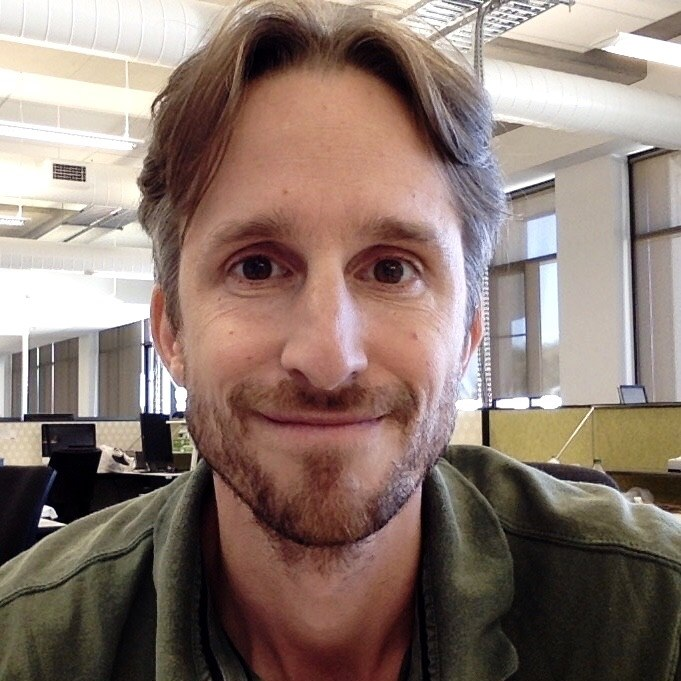

<!--"Using GitBooks to create Open course materials"-->

# About this GitBook {#about}

{width = "400"}

This GitBook contains workflows for students who want to get started with sequencing microbial amplicons on a Miseq instrument and then process and analyse ASV-based data. It is a compilation of workflows that I have gotten accustomed to during my PhD at La Trobe University with help of many amazing students and colleagues over the years. But it is by no means comprehensive.

One of the biggest hurdles for students that embark on sequencing environmental DNA for the first time, is the effort that is required to understand the various coding languages, file types and formats, packages or platforms that are involved (think Unix, Linux, Slurm, Qiime, R, RMarkdown, python, conda, ggplot, docker, GitHub, data instances...) before they even can start looking at exploring the data for biological meaning and producing publishable output.

For example, this GitBook is made in [Rstudio](https://rstudio.com){target="_blank"}, using the [`rmarkdown` markup language](https://rmarkdown.rstudio.com/){target="_blank"}, rendered using the [`bookdown` package](https://bookdown.org/yihui/bookdown/get-started.html){target="_blank"}, and hosted on [GitHub](https://github.com/){target="_blank"}. It took me at least five years before I was ready to create and host this content for students. And even then I needed this awesome [Bookdown template](https://cjvanlissa.github.io/gitbook-demo/index.html){target="_blank"} from Dr. Caspar van Lissa to get started with Bookdown. So it is really helpful to have something to start with.

It was not easy to get over the initial hurdles for me too, so I thought I'd try to compile my workflows. This may help students to get a head start but also helps to scrutinise my approach in the hope that others can point me to better ways of doing things.

**Browse to your level**

Everyone is at a different level in the journey to exploring microbial diversity. Some have absolutely no idea where to start and others have created their first phylogentic trees with ggtree or similar. The most important prerequisites are patience and persistence... :). Just explore the different chapters and see where it takes you. In fact you will be amazed how much you can achieve with mininal coding knowledge.

**Get in touch**

We work at the Andy Ball lab, RMIT University, Bundoora, Melbourne and are part of the Industry-led [Biosolids Training Centre](https://www.transformingbiosolids.org.au). Email me or comment on the discussion section of the [GitHub repository](https://github.com/chrismitbiz/ABlab-workflows/discussions/){target="_blank"} for this GitBook. You will need to get a GitHub account to join the discussion. Its free.  
  
More about me and my PhD research can be found here: <https://clean-dirt-digests.netlify.app>.\
Follow me on [Twitter](https://twitter.com/CleanDirtChris) or [LinkedIn](https://www.linkedin.com/in/christian-krohn-54904855). 

\ 
{width="150"}

Bio: \
Dr Chris Krohn is an early career researcher whose interests could be summed up with: “Environmental sequencing, microbial ecology, chlorinated pollutants, organic matter, wastewater, anaerobic digestion, and how everything connects".
  
In 2021 I joined the ARC Biosolids Training Centre at RMIT (www.transformingbiosolids.org.au), where we help water utilities to improve circular resource management by getting more renewable biogas and carbon/fertiliser values out of our municipal biosolids (essentially our poo). In project 1C of the Centre I develop metagenomic (DNA-based) methods to monitor the microbiome of anaerobic digestion, an important microbial treatment process for wastewater. I believe DNA-based diagnoses of wastewater sludges will help the water/biosolids sector improve resource recoveries and risk management.  
  
Before that, after a career in one of the most fast-cycled and short-sighted manufacturing industries that took me from Germany to Vietnam and Hong Kong/Shenzhen, I decided to hit the switch and start thinking long-term and circular. Ten back-to-uni years later, in 2021 I finished a PhD in Soil Science at La Trobe Uni where I sequenced soil DNA and explored if and how soil biology was involved in the degradation of extremely persistent legacy pesticides that contaminate agricultural surface soils since several decades. \
    
 This work is licensed under a <a rel="license" href="http://creativecommons.org/licenses/by/4.0/">Creative Commons Attribution 4.0 International License</a>.
